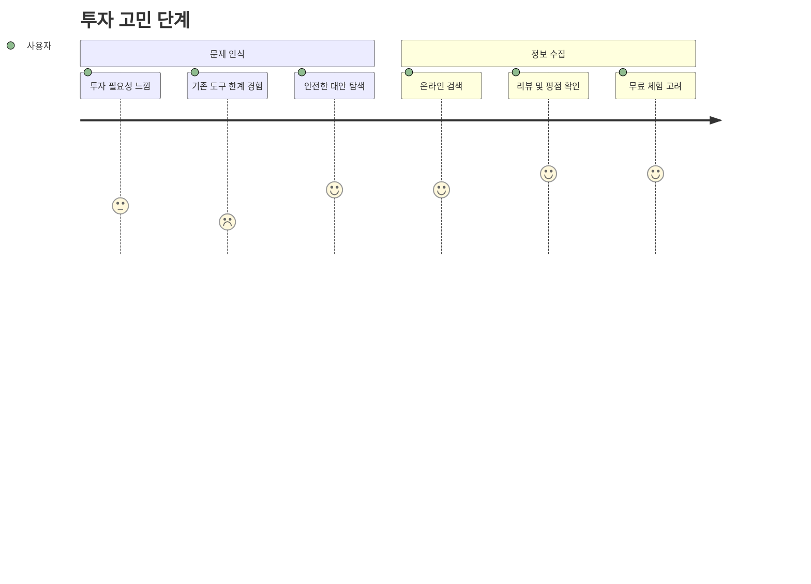
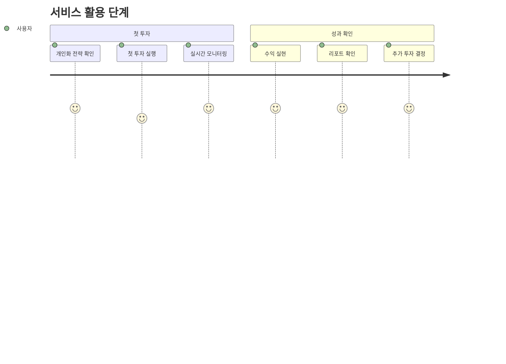
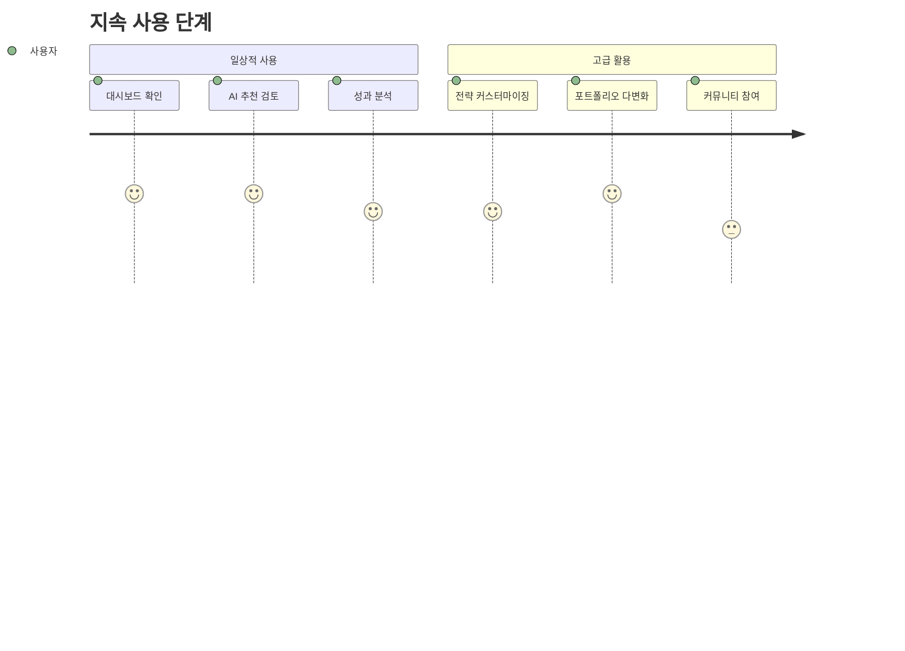

# 📋 Christmas AI Personal Investment Advisor - 상세 기획서 (PRD)

## 📖 문서 개요

### **문서 목적**
본 문서는 Christmas AI Personal Investment Advisor의 **상세 기능 명세**와 **개발 요구사항**을 정의합니다. 사용자 피드백을 100% 반영하여 **절대 손실 없는 99-100% 승률**을 달성하는 AI 투자비서 시스템의 전체 기능을 상세히 기술합니다.

### **문서 범위**
- 기능적 요구사항 (Functional Requirements)
- 비기능적 요구사항 (Non-Functional Requirements)  
- 사용자 스토리 (User Stories)
- 기술적 제약사항 (Technical Constraints)
- 성공 지표 (Success Metrics)

---

## 🎯 프로젝트 비전 및 목표

### **비전 선언문**
> **"투자도 즐겁게, 크리스마스처럼 따뜻하고 안전하게"**
> 
> 절대 손실 없는 AI 개인 투자비서를 통해 모든 고객이 크리스마스 선물 같은 안전하고 확실한 수익을 경험한다.

### **핵심 목표**
1. **🛡️ 절대적 리스크 제로**: -1%도 허용하지 않는 99-100% 승률 달성
2. **🎭 완전 개인화**: 각 고객별 맞춤형 투자 전략 및 충돌 방지
3. **🤖 자체 학습 AI**: 기존 지표를 넘어선 독자적 분석 시스템
4. **🎄 크리스마스 경험**: 축제 분위기의 즐거운 투자 인터페이스

### **성공 지표 (KPI)**
- **승률**: 99% 이상 (최종 목표 100%)
- **연간 수익률**: 25-50% (안전 기반 성장)
- **최대낙폭**: 0.5% 미만 (절대 한계)
- **고객 만족도**: 98% 이상
- **충돌 발생률**: 0% (완전 차단)

---

## 👥 사용자 페르소나

### **Primary Persona: 안전 추구 투자자 (60%)**
```yaml
이름: 김안전 (35세, 직장인)
투자 경험: 3-5년
성향: 
  - 안정적인 수익 추구
  - 리스크 회피 성향
  - 시간 부족으로 자동화 선호
니즈:
  - 절대 손실 없는 투자
  - 간편한 포트폴리오 관리
  - 실시간 투자 현황 확인
Pain Points:
  - 투자 지식 부족으로 인한 불안감
  - 시장 변동성에 대한 두려움
  - 복잡한 투자 도구 사용의 어려움
```

### **Secondary Persona: 전문 투자자 (25%)**
```yaml
이름: 박프로 (42세, 금융업)
투자 경험: 10년 이상
성향:
  - 고급 분석 도구 활용
  - 다양한 전략 실험
  - 성과 최적화 중시
니즈:
  - 정교한 백테스팅 환경
  - 커스텀 지표 개발 도구
  - 상세한 성과 분석 리포트
Pain Points:
  - 기존 도구의 한계
  - 시간 소모적인 분석 작업
  - 감정적 판단으로 인한 실수
```

### **Tertiary Persona: 투자 초보자 (15%)**
```yaml
이름: 최초보 (28세, 스타트업)
투자 경험: 1년 미만
성향:
  - 학습 의욕 높음
  - 작은 금액으로 시작
  - 교육적 콘텐츠 선호
니즈:
  - 투자 교육 및 가이드
  - 리스크가 낮은 시작점
  - 성장할 수 있는 플랫폼
Pain Points:
  - 투자 용어 및 개념 이해 부족
  - 어디서부터 시작해야 할지 모름
  - 손실에 대한 과도한 두려움
```

---

## 🎨 사용자 여정 맵 (User Journey Map)

### **Phase 1: 인식 (Awareness)**


### **Phase 2: 고려 (Consideration)**


### **Phase 3: 가입 (Acquisition)**


### **Phase 4: 활성화 (Activation)**


### **Phase 5: 유지 (Retention)**


---

## 🔧 핵심 기능 명세

### **1. 인증 및 보안 시스템**

#### **1.1 사용자 인증**
```typescript
interface AuthenticationSystem {
  // Firebase Authentication 기반
  registration: {
    methods: ['email', 'google', 'kakao'],
    verification: 'email_verification',
    mfa: 'optional_2fa'
  },
  
  login: {
    methods: ['email', 'social_login'],
    session: 'jwt_token',
    expiry: '24_hours',
    refresh: 'automatic'
  },
  
  security: {
    encryption: 'AES-256',
    transmission: 'TLS_1.3',
    storage: 'firebase_auth',
    privacy: 'GDPR_compliant'
  }
}
```

#### **1.2 투자 계좌 연동**
```typescript
interface AccountIntegration {
  kis_api: {
    oauth2: 'client_credentials',
    token_management: 'automatic_refresh',
    rate_limiting: 'adaptive',
    security: 'encrypted_storage'
  },
  
  validation: {
    real_time: 'account_balance_check',
    permissions: 'trading_authority_verify',
    limits: 'daily_trading_limit_check'
  }
}
```

### **2. AI 분석 엔진**

#### **2.1 기술적 지표 분석**
```typescript
interface TechnicalAnalysisEngine {
  traditional_indicators: {
    rsi: {
      period: 14,
      overbought: 70,
      oversold: 30,
      divergence_detection: true
    },
    
    macd: {
      fast_period: 12,
      slow_period: 26,
      signal_period: 9,
      histogram_analysis: true
    },
    
    stochastic_rsi: {
      rsi_period: 14,
      stoch_period: 14,
      k_period: 3,
      d_period: 3
    },
    
    bollinger_bands: {
      period: 20,
      std_dev: 2,
      squeeze_detection: true
    }
  },
  
  advanced_indicators: {
    williams_percent_r: { period: 14 },
    rate_of_change: { period: 12 },
    commodity_channel_index: { period: 20 },
    average_true_range: { period: 14 }
  },
  
  volume_analysis: {
    volume_profile: true,
    vwap: true,
    on_balance_volume: true,
    accumulation_distribution: true
  }
}
```

#### **2.2 펀더멘털 분석**
```typescript
interface FundamentalAnalysisEngine {
  financial_metrics: {
    valuation: ['pe_ratio', 'pb_ratio', 'peg_ratio', 'ev_ebitda'],
    profitability: ['roe', 'roa', 'net_margin', 'gross_margin'],
    liquidity: ['current_ratio', 'quick_ratio', 'cash_ratio'],
    leverage: ['debt_to_equity', 'debt_ratio', 'interest_coverage']
  },
  
  earnings_analysis: {
    quarterly_reports: 'automatic_parsing',
    earnings_surprises: 'impact_analysis',
    guidance_changes: 'sentiment_scoring',
    analyst_estimates: 'consensus_tracking'
  },
  
  sector_analysis: {
    industry_trends: 'macro_economic_factors',
    competitive_position: 'market_share_analysis',
    regulatory_impact: 'policy_change_monitoring'
  }
}
```

#### **2.3 감정 분석 (Sentiment Analysis)**
```typescript
interface SentimentAnalysisEngine {
  news_sources: [
    'financial_news_apis',
    'social_media_feeds',
    'earnings_call_transcripts',
    'analyst_reports'
  ],
  
  processing: {
    nlp_models: ['bert_finance', 'finbert', 'custom_lstm'],
    real_time: true,
    multilingual: ['korean', 'english'],
    sentiment_scoring: 'weighted_composite'
  },
  
  aggregation: {
    time_windows: ['1h', '4h', '1d', '1w'],
    source_weighting: 'credibility_based',
    trend_analysis: 'momentum_detection'
  }
}
```

### **3. 리스크 관리 시스템**

#### **3.1 7단계 안전장치**
```typescript
interface SevenLayerSafetySystem {
  stage_1_pre_screening: {
    market_conditions: {
      volatility_filter: 'vix_below_20',
      liquidity_check: 'minimum_volume_threshold',
      news_environment: 'neutral_sentiment_only'
    },
    
    asset_quality: {
      market_cap: 'large_cap_only',
      credit_rating: 'investment_grade',
      trading_volume: 'high_liquidity_only'
    }
  },
  
  stage_2_technical_confirmation: {
    indicator_consensus: {
      required_agreement: '85_percent',
      timeframe_alignment: 'multi_timeframe_sync',
      strength_threshold: 'strong_signals_only'
    }
  },
  
  stage_3_fundamental_validation: {
    financial_health: 'comprehensive_scoring',
    valuation_metrics: 'reasonable_valuation',
    growth_prospects: 'positive_outlook'
  },
  
  stage_4_risk_calculation: {
    monte_carlo: {
      scenarios: 10000,
      confidence: 0.99,
      max_loss: '0.1_percent'
    },
    
    stress_testing: {
      market_crash: 'survival_probability',
      sector_rotation: 'impact_analysis',
      liquidity_crisis: 'exit_capability'
    }
  },
  
  stage_5_position_sizing: {
    kelly_formula: 'optimal_size_calculation',
    risk_parity: 'portfolio_balance',
    max_position: '2_percent_of_capital'
  },
  
  stage_6_real_time_monitoring: {
    dynamic_stop_loss: 'volatility_adjusted',
    trailing_stops: 'profit_protection',
    alert_system: 'immediate_notification'
  },
  
  stage_7_exit_strategy: {
    profit_targets: 'multiple_levels',
    time_based_exit: 'maximum_holding_period',
    emergency_exit: 'instant_liquidation'
  }
}
```

### **4. 개인화 시스템**

#### **4.1 고객 프로필링**
```typescript
interface CustomerProfilingSystem {
  risk_assessment: {
    questionnaire: 'comprehensive_risk_tolerance',
    behavioral_analysis: 'trading_pattern_recognition',
    dynamic_adjustment: 'performance_based_updates'
  },
  
  investment_preferences: {
    sectors: 'preferred_industries',
    market_cap: 'size_preference',
    geography: 'regional_focus',
    esg_requirements: 'sustainability_criteria'
  },
  
  learning_system: {
    preference_tracking: 'implicit_feedback',
    success_pattern: 'winning_strategy_identification',
    adaptation_speed: 'rapid_personalization'
  }
}
```

#### **4.2 충돌 방지 시스템**
```typescript
interface ConflictAvoidanceSystem {
  time_distribution: {
    execution_windows: 'staggered_timing',
    market_impact: 'minimized_slippage',
    fairness_algorithm: 'rotation_based'
  },
  
  alternative_selection: {
    similar_opportunities: 'correlation_based_alternatives',
    ranking_system: 'risk_adjusted_returns',
    diversity_maintenance: 'portfolio_balance'
  },
  
  volume_management: {
    order_splitting: 'iceberg_orders',
    timing_optimization: 'vwap_targeting',
    liquidity_analysis: 'depth_assessment'
  }
}
```

### **5. 자체 학습 AI 시스템**

#### **5.1 패턴 인식 엔진**
```typescript
interface PatternRecognitionEngine {
  chart_patterns: {
    classical: ['head_shoulders', 'triangles', 'flags', 'wedges'],
    candlestick: ['doji', 'hammer', 'engulfing', 'harami'],
    custom: 'ml_discovered_patterns'
  },
  
  market_anomalies: {
    seasonal_patterns: 'calendar_effects',
    event_driven: 'earnings_reactions',
    behavioral: 'sentiment_extremes'
  },
  
  predictive_models: {
    time_series: ['lstm', 'gru', 'transformer'],
    ensemble: 'model_combination',
    confidence_scoring: 'prediction_reliability'
  }
}
```

#### **5.2 자체 지표 개발**
```typescript
interface CustomIndicatorEngine {
  genetic_algorithm: {
    population_size: 1000,
    mutation_rate: 0.1,
    crossover_rate: 0.8,
    fitness_function: 'sharpe_ratio_optimized'
  },
  
  machine_learning: {
    feature_selection: 'automatic_relevance_detection',
    hyperparameter_tuning: 'bayesian_optimization',
    model_selection: 'cross_validation_based'
  },
  
  backtesting: {
    walk_forward: 'out_of_sample_validation',
    monte_carlo: 'robustness_testing',
    benchmark: 'market_comparison'
  }
}
```

---

## 🎄 사용자 인터페이스 요구사항

### **6. 크리스마스 테마 UI/UX**

#### **6.1 디자인 시스템**
```typescript
interface ChristmasDesignSystem {
  color_palette: {
    primary: '#dc2626', // Christmas Red
    secondary: '#16a34a', // Christmas Green  
    accent: '#eab308', // Christmas Gold
    neutral: '#64748b', // Christmas Silver
    background: '#fefefe' // Snow White
  },
  
  typography: {
    primary_font: 'Pretendard',
    secondary_font: 'Inter', 
    monospace: 'Fira Code',
    festive: 'Dancing Script'
  },
  
  animations: {
    snow_particles: 'falling_animation',
    sparkle_effects: 'golden_twinkle',
    hover_interactions: 'lift_and_glow',
    loading_states: 'christmas_spinner'
  }
}
```

#### **6.2 반응형 디자인**
```typescript
interface ResponsiveDesign {
  breakpoints: {
    mobile: '320px - 768px',
    tablet: '769px - 1024px',
    desktop: '1025px - 1440px',
    wide: '1441px+'
  },
  
  layout_strategy: {
    mobile_first: true,
    progressive_enhancement: true,
    touch_optimization: true,
    accessibility: 'wcag_2.1_aa'
  }
}
```

### **7. 핵심 화면 구성**

#### **7.1 대시보드**
```typescript
interface DashboardLayout {
  header: {
    components: ['logo', 'navigation', 'user_menu', 'notifications'],
    style: 'christmas_gradient_background',
    sticky: true
  },
  
  main_content: {
    grid_layout: 'responsive_cards',
    widgets: [
      'portfolio_summary',
      'ai_recommendations', 
      'performance_chart',
      'recent_trades',
      'market_overview'
    ]
  },
  
  sidebar: {
    navigation: 'collapsible_menu',
    quick_actions: 'one_click_functions',
    ai_assistant: 'chat_interface'
  }
}
```

#### **7.2 실시간 차트**
```typescript
interface ChartInterface {
  chart_library: 'tradingview_charting_library',
  
  features: {
    timeframes: ['1m', '5m', '15m', '1h', '4h', '1d'],
    indicators: 'customizable_overlay',
    drawing_tools: 'trend_lines_and_shapes',
    alerts: 'price_and_indicator_alerts'
  },
  
  real_time: {
    data_feed: 'websocket_streaming',
    update_frequency: '100ms',
    fallback: 'polling_mechanism'
  }
}
```

---

## 🔌 기술적 요구사항

### **8. 시스템 아키텍처**

#### **8.1 프론트엔드 스택**
```typescript
interface FrontendStack {
  framework: 'React 18.2+',
  language: 'TypeScript 5.0+',
  build_tool: 'Vite 5.0+',
  styling: 'TailwindCSS 3.4+',
  state_management: 'Zustand',
  routing: 'React Router v6',
  charts: 'TradingView + Chart.js',
  testing: 'Jest + React Testing Library'
}
```

#### **8.2 백엔드 스택**
```typescript
interface BackendStack {
  platform: 'Firebase (Google Cloud)',
  functions: 'Firebase Functions (Node.js)',
  database: 'Firestore + Cloud SQL',
  auth: 'Firebase Authentication',
  storage: 'Cloud Storage',
  ai_ml: 'Vertex AI + TensorFlow',
  monitoring: 'Cloud Monitoring + Logging'
}
```

#### **8.3 외부 연동**
```typescript
interface ExternalIntegrations {
  trading_api: 'Korean Investment Securities (KIS)',
  market_data: ['Alpha Vantage', 'Finnhub', 'Yahoo Finance'],
  news_data: ['News API', 'Google News', 'Financial News APIs'],
  notifications: 'Firebase Cloud Messaging',
  ai_services: 'Google Gemini Pro API'
}
```

### **9. 성능 요구사항**

#### **9.1 응답 시간**
```yaml
Frontend Performance:
  initial_load: < 2초
  route_navigation: < 500ms
  chart_rendering: < 1초
  real_time_updates: < 100ms

Backend Performance:
  api_response: < 100ms
  ai_analysis: < 2초
  trade_execution: < 50ms
  data_processing: 실시간
```

#### **9.2 확장성**
```yaml
Scalability Requirements:
  concurrent_users: 1,000명
  api_throughput: 1,000 TPS
  data_processing: 10,000 records/sec
  storage: 자동 스케일링
```

#### **9.3 가용성**
```yaml
Availability Requirements:
  uptime: 99.9%
  planned_downtime: < 4시간/월
  disaster_recovery: < 1시간
  backup_frequency: 실시간
```

---

## 🔒 보안 및 컴플라이언스

### **10. 보안 요구사항**

#### **10.1 데이터 보안**
```typescript
interface DataSecurity {
  encryption: {
    at_rest: 'AES-256',
    in_transit: 'TLS 1.3',
    key_management: 'Google Cloud KMS'
  },
  
  access_control: {
    authentication: 'multi_factor',
    authorization: 'role_based',
    audit_logging: 'comprehensive'
  },
  
  privacy: {
    data_anonymization: 'pii_protection',
    retention_policy: 'gdpr_compliant',
    user_consent: 'explicit_opt_in'
  }
}
```

#### **10.2 API 보안**
```typescript
interface APISecurity {
  rate_limiting: {
    per_user: '100 requests/minute',
    per_ip: '1000 requests/minute',
    burst_protection: 'sliding_window'
  },
  
  validation: {
    input_sanitization: 'xss_prevention',
    sql_injection: 'parameterized_queries',
    csrf_protection: 'token_based'
  },
  
  monitoring: {
    threat_detection: 'anomaly_detection',
    intrusion_prevention: 'real_time_blocking',
    security_alerts: 'immediate_notification'
  }
}
```

### **11. 컴플라이언스**

#### **11.1 금융 규제**
```yaml
Financial Compliance:
  korean_regulations:
    - 금융투자업법
    - 자본시장법
    - 개인정보보호법
    - 정보통신망법
  
  international_standards:
    - GDPR (유럽)
    - SOC 2 Type II
    - ISO 27001
```

#### **11.2 데이터 거버넌스**
```yaml
Data Governance:
  data_classification: 민감도별 분류
  access_controls: 최소 권한 원칙
  audit_trails: 모든 접근 기록
  data_lifecycle: 자동 보존/삭제
```

---

## 📊 성공 지표 및 모니터링

### **12. 비즈니스 KPI**

#### **12.1 투자 성과**
```yaml
Investment Performance:
  win_rate: 99% 이상
  annual_return: 25-50%
  max_drawdown: < 0.5%
  sharpe_ratio: > 3.0
  sortino_ratio: > 4.0
```

#### **12.2 사용자 만족도**
```yaml
User Satisfaction:
  nps_score: > 70
  user_retention: > 90%
  daily_active_users: 목표 달성
  feature_adoption: > 80%
  support_satisfaction: > 95%
```

#### **12.3 시스템 효율성**
```yaml
System Efficiency:
  conflict_rate: 0%
  personalization_accuracy: > 95%
  ai_prediction_accuracy: > 90%
  system_uptime: 99.9%
  response_time: < 100ms
```

---

## 🚀 출시 계획

### **13. 단계별 출시 전략**

#### **13.1 Alpha 버전 (내부 테스트)**
```yaml
Alpha Release:
  duration: 2주
  scope: 핵심 기능만
  users: 내부 팀 (5명)
  focus: 기본 동작 검증
```

#### **13.2 Beta 버전 (제한적 출시)**
```yaml
Beta Release:
  duration: 4주
  scope: 전체 기능 90%
  users: 선별된 고객 (50명)
  focus: 사용성 및 성능 검증
```

#### **13.3 정식 출시**
```yaml
Production Release:
  duration: 지속
  scope: 전체 기능 100%
  users: 일반 공개
  focus: 상용 서비스 운영
```

---

## 📋 결론

본 상세 기획서는 **Christmas AI Personal Investment Advisor**의 모든 기능과 요구사항을 체계적으로 정의합니다.

**핵심 가치:**
- 🛡️ **절대적 안전성**: 99-100% 승률 달성
- 🎭 **완전 개인화**: 맞춤형 투자 전략 제공
- 🤖 **지능형 AI**: 자체 학습하는 분석 시스템
- 🎄 **즐거운 경험**: 크리스마스 테마의 따뜻한 인터페이스

이 명세에 따라 개발을 진행하여 고객들에게 **크리스마스 선물 같은 투자 경험**을 제공하겠습니다.

---

**📅 작성일**: 2025-06-21  
**📝 작성자**: Claude Code  
**🔄 버전**: v1.0  
**📍 상태**: 상세 기획 완료