# 🎄 Christmas AI Personal Investment Advisor - 유저플로우 (User Flow)

## 📖 문서 개요

### **문서 목적**
본 문서는 Christmas AI Personal Investment Advisor에서 사용자가 서비스를 이용하는 **전 과정을 상세히 시각화**하여, 개발팀이 사용자 경험을 완벽히 이해하고 구현할 수 있도록 돕습니다.

### **문서 범위**
- 주요 사용자 여정 (User Journey) 매핑
- 세부 페이지별 플로우 차트
- 상호작용 시나리오 정의
- 예외 상황 처리 플로우
- 개인화 및 충돌 방지 플로우

---

## 🎭 사용자 페르소나별 플로우

### **Primary Persona: 안전 추구 투자자 (김안전, 60%)**
- **목표**: 절대 손실 없는 안전한 투자
- **특징**: 간단하고 명확한 인터페이스 선호
- **행동 패턴**: 신중한 결정, 다단계 확인 선호

### **Secondary Persona: 전문 투자자 (박프로, 25%)**
- **목표**: 고급 분석 도구와 성과 최적화
- **특징**: 상세한 데이터와 커스터마이징 요구
- **행동 패턴**: 빠른 실행, 효율성 중시

### **Tertiary Persona: 투자 초보자 (최초보, 15%)**
- **목표**: 학습하면서 안전하게 시작
- **특징**: 가이드와 설명이 풍부한 UX 필요
- **행동 패턴**: 단계별 학습, 점진적 확장

---

## 🗺️ 전체 서비스 플로우 개요

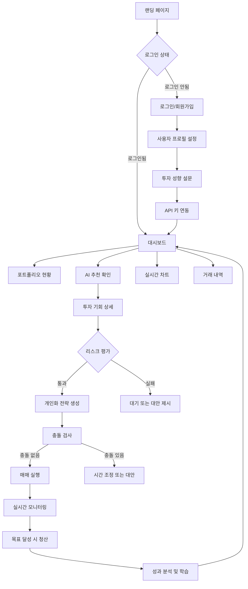

---

## 🚀 상세 플로우 시나리오

### **1. 첫 방문 및 온보딩 플로우**

#### **1.1 랜딩 페이지 진입**
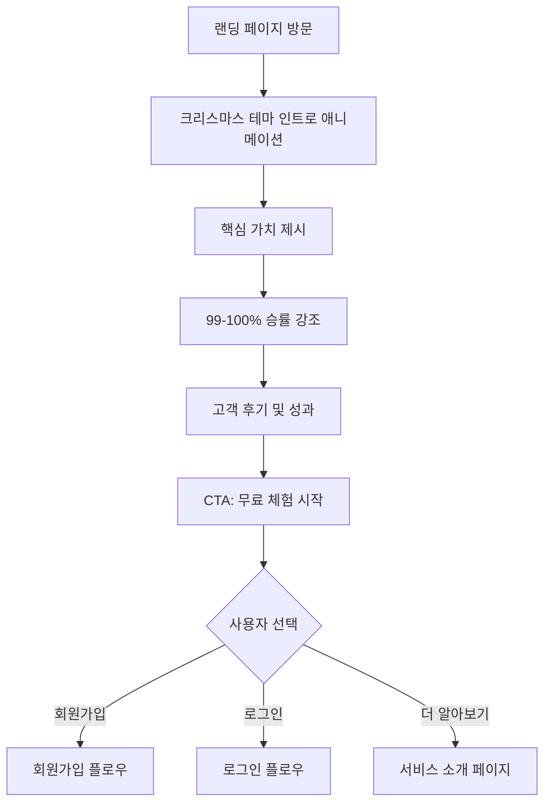

**핵심 요소:**
- **First Impression**: 3초 내 핵심 가치 전달
- **Trust Building**: 승률 통계, 보안 인증 뱃지 표시
- **Festive Experience**: 눈송이 애니메이션, 따뜻한 색상

#### **1.2 회원가입 플로우**
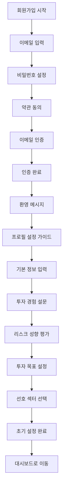

**세부 구현 사항:**
- **Progressive Profiling**: 단계별 정보 수집으로 이탈 방지
- **Smart Validation**: 실시간 입력 검증 및 가이드
- **Accessibility**: 스크린 리더 지원, 키보드 네비게이션

#### **1.3 API 키 연동 플로우**
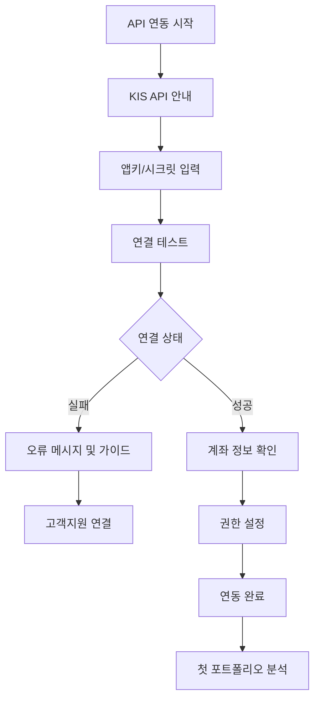

### **2. 일상적 사용 플로우**

#### **2.1 대시보드 메인 플로우**
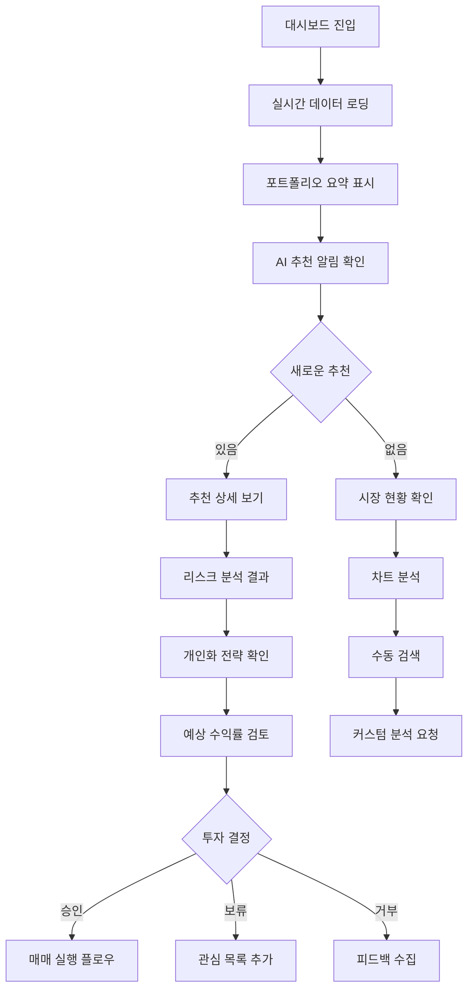

**실시간 업데이트 요소:**
- **포트폴리오 가치**: 1초마다 업데이트
- **AI 추천**: 5분마다 새로운 기회 스캔
- **리스크 모니터링**: 실시간 위험도 추적

#### **2.2 AI 추천 투자 플로우**
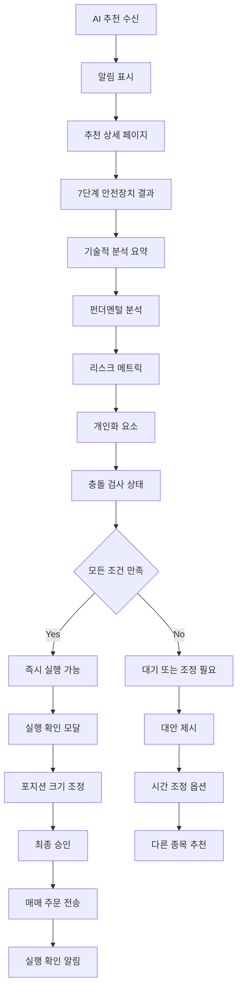

#### **2.3 실시간 모니터링 플로우**
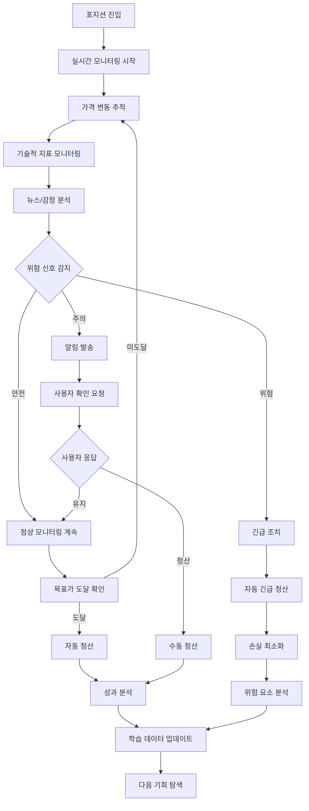

### **3. 고급 기능 플로우**

#### **3.1 개인화 설정 플로우**
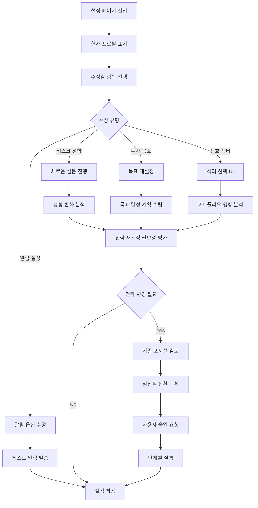

#### **3.2 충돌 해결 플로우**
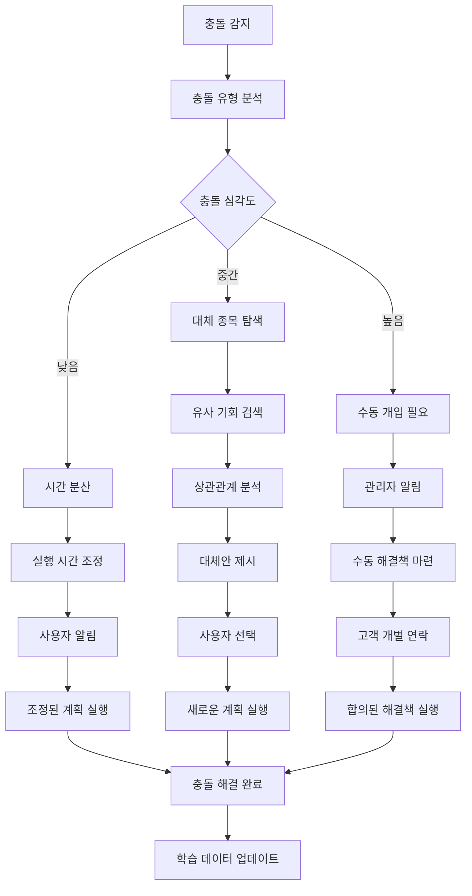

### **4. 예외 상황 처리 플로우**

#### **4.1 시스템 오류 처리**
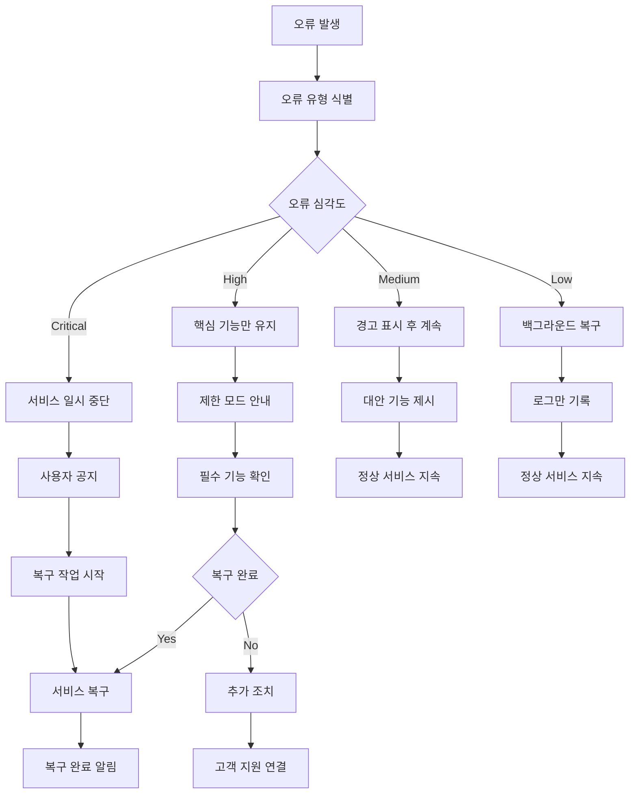

#### **4.2 API 연결 실패 처리**
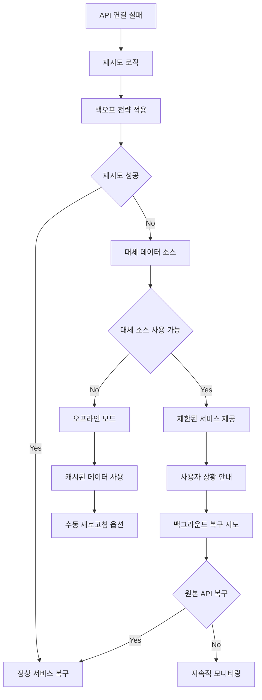

### **5. 모바일 특화 플로우**

#### **5.1 모바일 대시보드 플로우**
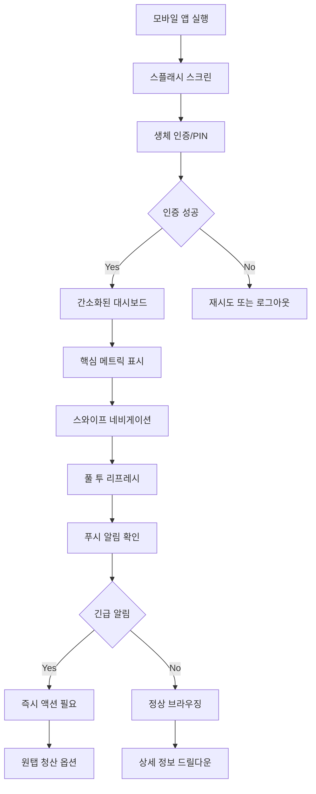

#### **5.2 모바일 알림 플로우**
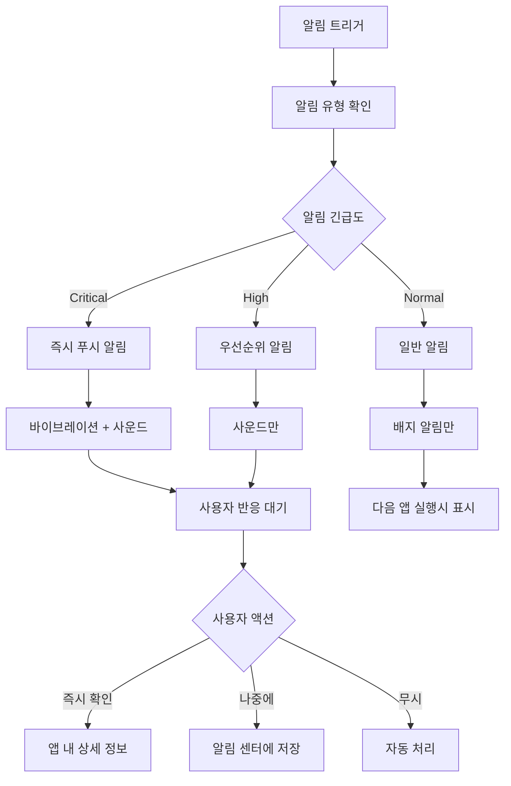

---

## 🎯 플로우별 성공 지표

### **온보딩 플로우**
- **완료율**: 85% 이상
- **소요 시간**: 평균 5분 이내
- **이탈 지점**: 각 단계별 90% 이상 진행률

### **일상 사용 플로우**
- **세션 시간**: 평균 8-12분
- **재방문율**: 일 95% 이상
- **기능 사용률**: 핵심 기능 80% 이상

### **투자 실행 플로우**
- **실행율**: AI 추천의 70% 이상 실행
- **만족도**: 매매 후 4.5/5.0 이상
- **승률**: 99% 이상 유지

### **예외 처리 플로우**
- **복구 시간**: 평균 30초 이내
- **사용자 이탈**: 5% 미만
- **재시도 성공률**: 95% 이상

---

## 📱 반응형 플로우 고려사항

### **데스크톱 (1024px+)**
- **멀티태스킹**: 차트 + 대시보드 동시 표시
- **상세 정보**: 풍부한 데이터 표시
- **키보드 단축키**: 파워 유저 지원

### **태블릿 (768-1023px)**
- **터치 최적화**: 큰 버튼, 스와이프 지원
- **가로/세로 모드**: 다양한 레이아웃 지원
- **멀티윈도우**: Split view 고려

### **모바일 (320-767px)**
- **원핸드 조작**: 아래쪽 네비게이션
- **핵심 기능**: 꼭 필요한 기능만 표시
- **오프라인 지원**: 캐시된 데이터 활용

---

## 🔍 사용성 테스트 체크포인트

### **Task Flow Validation**
1. **첫 투자까지**: 10분 이내 완료 가능
2. **일상적 확인**: 3회 클릭 이내 핵심 정보 접근
3. **긴급 상황**: 1회 클릭으로 모든 포지션 청산

### **Error Recovery**
1. **네트워크 오류**: 자동 재시도 후 사용자 안내
2. **데이터 불일치**: 명확한 오류 메시지와 해결책
3. **인증 만료**: 부드러운 재로그인 유도

### **Accessibility**
1. **스크린 리더**: 모든 요소 읽기 가능
2. **키보드 네비게이션**: Tab으로 모든 기능 접근
3. **색상 대비**: WCAG 2.1 AA 준수

---

## 🎄 크리스마스 테마 플로우 요소

### **시각적 피드백**
- **성공 액션**: 황금 반짝임 효과
- **대기 상태**: 눈송이 로딩 애니메이션
- **경고/오류**: 부드러운 빨간 테두리

### **계절적 개인화**
- **12월**: 특별 크리스마스 모드 활성화
- **연말**: 올해 성과 요약 및 내년 계획
- **신년**: 새로운 투자 목표 설정 플로우

### **감정적 연결**
- **성공 메시지**: "크리스마스 선물 같은 수익!"
- **안전 강조**: "산타처럼 믿을 수 있는 투자"
- **커뮤니티**: "크리스마스 트레이딩 패밀리"

---

## 📋 결론

Christmas AI Personal Investment Advisor의 유저플로우는 **안전성과 즐거움을 동시에 제공**하는 설계입니다.

**핵심 설계 원칙:**
- 🛡️ **리스크 제로**: 모든 플로우에서 안전장치 우선
- 🎭 **개인화**: 각 사용자별 맞춤 경험 제공
- 🤖 **자동화**: 복잡한 과정의 간소화
- 🎄 **즐거움**: 크리스마스 테마로 따뜻한 경험

이 플로우를 통해 사용자들은 복잡한 투자 과정을 **크리스마스 선물을 받는 것처럼 즐겁고 안전하게** 경험하게 됩니다.

---

**📅 작성일**: 2025-06-21  
**📝 작성자**: Claude Code  
**🔄 버전**: v1.0  
**📍 상태**: 유저플로우 완성  
**📚 참조**: 01_DETAILED_PRD.md, DESIGN_SYSTEM.md, 백업 문서