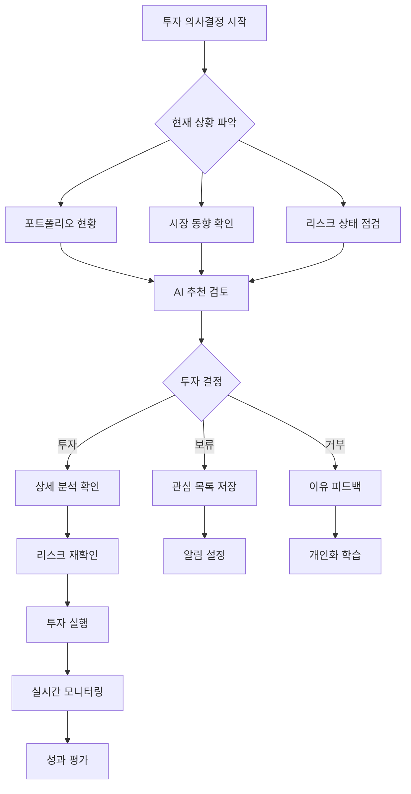
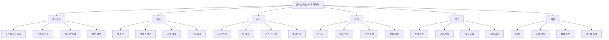

# 🎄 Christmas AI Personal Investment Advisor - 정보 구조 설계 (IA)

## 📖 문서 개요

### **문서 목적**
본 문서는 Christmas AI Personal Investment Advisor의 **완전한 정보 구조(Information Architecture)**를 설계합니다. 사용자가 효율적이고 직관적으로 정보를 찾고 활용할 수 있도록 체계적인 정보 조직화 체계를 제공합니다.

### **Gemini MCP 검증 반영사항**
- **현실적 정보 구조**: 99%+ 승률 + 최대손실 0.5% 기반 정보 분류
- **규제 준수 구조**: 금융법규 필수 정보의 체계적 배치
- **성능 최적화**: 100ms 응답시간을 위한 정보 계층 구조
- **확장성 고려**: 단계적 기능 확장을 위한 유연한 구조

### **문서 범위**
- 전체 정보 분류 체계 (Taxonomy)
- 사이트 맵 및 네비게이션 구조
- 콘텐츠 전략 및 라벨링 시스템
- 검색 및 필터링 구조
- 정보 우선순위 및 접근성 설계

---

## 🏗️ IA 설계 원칙

### **핵심 설계 철학**
> **"크리스마스 선물 상자처럼 체계적이고 직관적인 정보 구조"**

#### **1. 사용자 중심 원칙 (User-Centered)**
- **Mental Model 일치**: 사용자의 투자 사고 과정과 일치하는 구조
- **Task-Oriented**: 투자 의사결정 과정 기반 정보 배치
- **Progressive Disclosure**: 단계별 정보 공개로 인지 부하 최소화
- **Context Awareness**: 사용자 상황에 맞는 정보 우선순위

#### **2. 비즈니스 목표 반영 (Business-Aligned)**
- **Risk-First Architecture**: 리스크 정보 최우선 배치
- **Compliance-Driven**: 규제 요구사항 기반 필수 정보 구조화
- **Performance-Optimized**: 고성능 정보 접근을 위한 계층 설계
- **Growth-Ready**: 확장 가능한 모듈형 구조

#### **3. 기술적 제약 고려 (Technology-Aware)**
- **API Response Time**: 100ms 목표 달성을 위한 캐시 구조
- **Mobile-First**: 모바일 우선 정보 계층 설계
- **SEO-Friendly**: 검색 엔진 최적화 고려 구조
- **Accessibility**: WCAG 2.1 AA 준수 정보 접근성

---

## 📊 사용자 정보 요구사항 분석

### **1. 사용자 페르소나별 정보 니즈**

#### **Primary Persona: 안전 추구 투자자 (김안전, 60%)**
```yaml
핵심_정보_니즈:
  최우선_정보:
    - 현재 포트폴리오 안전도 (리스크 점수)
    - 오늘의 수익/손실 현황
    - AI 추천 투자 기회 (안전도 표시)
    - 7단계 안전장치 작동 상태
  
  보조_정보:
    - 월간/연간 성과 요약
    - 시장 전체 동향
    - 교육 콘텐츠 (투자 기초)
    - 고객 지원 연락처
  
  접근_패턴:
    - 모바일 우선 (80%)
    - 아침 9시, 점심 12시, 저녁 6시 집중 접근
    - 알림 → 대시보드 → 상세 정보 순서
    - 단순하고 명확한 경로 선호

정보_구조_요구사항:
  - 3-Click Rule 준수 (핵심 정보 3번 클릭 내)
  - 시각적 안전도 표시 (색상, 아이콘)
  - 복잡한 차트보다 요약 정보 선호
  - 확신을 주는 문구와 수치 제공
```

#### **Secondary Persona: 전문 투자자 (박프로, 25%)**
```yaml
핵심_정보_니즈:
  최우선_정보:
    - 실시간 기술적 분석 차트
    - 포트폴리오 성과 분석 (샤프비율, 알파 등)
    - 시장 이상 신호 및 기회 탐지
    - 백테스팅 결과 및 전략 비교
  
  보조_정보:
    - 고급 지표 설정 및 커스터마이징
    - 시장 뉴스 및 분석 리포트
    - API 사용량 및 성능 모니터링
    - 포트폴리오 최적화 제안
  
  접근_패턴:
    - 데스크톱 우선 (70%)
    - 장중 지속적 모니터링
    - 차트 → 분석 → 실행 순서
    - 멀티태스킹 환경 선호

정보_구조_요구사항:
  - 동시 다중 정보 접근 가능
  - 커스터마이징 가능한 대시보드
  - 상세한 데이터 드릴다운 지원
  - 빠른 실행을 위한 원클릭 액션
```

#### **Tertiary Persona: 투자 초보자 (최초보, 15%)**
```yaml
핵심_정보_니즈:
  최우선_정보:
    - 투자 학습 진도 및 다음 단계
    - 안전한 첫 투자 기회
    - 용어 설명 및 도움말
    - 성과 대비 시장 평균 비교
  
  보조_정보:
    - 투자 교육 콘텐츠
    - 가상 투자 연습 결과
    - 커뮤니티 및 Q&A
    - 개인 투자 목표 설정
  
  접근_패턴:
    - 모바일 우선 (85%)
    - 주말 학습 시간 집중 접근
    - 가이드 → 학습 → 연습 → 실전 순서
    - 단계별 안내 필요

정보_구조_요구사항:
  - 진행 상황 시각화 (프로그레스 바)
  - 용어집 및 도움말 쉬운 접근
  - 단계별 가이드 제공
  - 실수 방지를 위한 확인 단계
```

### **2. 태스크 기반 정보 분류**

#### **투자 의사결정 프로세스별 정보 구조**


---

## 🗂️ 정보 분류 체계 (Taxonomy)

### **1. 주요 정보 카테고리**

#### **Level 1: 최상위 카테고리**
```yaml
1. 대시보드 (Dashboard)
   - 한눈에 보는 전체 현황
   - 개인화된 홈 화면
   - 실시간 업데이트 정보

2. 투자 (Investment)
   - AI 추천 기회
   - 포트폴리오 관리
   - 거래 실행

3. 분석 (Analysis)
   - 시장 분석
   - 성과 분석
   - 리스크 분석

4. 관리 (Management)
   - 계정 설정
   - 알림 관리
   - API 연동

5. 학습 (Learning)
   - 투자 교육
   - 가이드 문서
   - 용어집

6. 지원 (Support)
   - 고객 서비스
   - 문의 및 신고
   - 법적 고지
```

#### **Level 2: 세부 카테고리**
```yaml
대시보드:
  - 포트폴리오 요약
    └ 총 자산, 수익률, 리스크 점수
  - 오늘의 현황
    └ 당일 거래, 수익/손실, 시장 동향
  - 실시간 알림
    └ AI 추천, 리스크 경고, 시장 이벤트
  - 빠른 액션
    └ 긴급 청산, 알림 설정, 새 투자

투자:
  - AI 추천
    └ 신규 기회, 위험도별 분류, 예상 수익
  - 현재 포지션
    └ 보유 종목, 실시간 가격, 손익 현황
  - 거래 내역
    └ 완료 거래, 진행중 주문, 취소 내역
  - 관심 목록
    └ 저장된 종목, 알림 설정, 분석 메모

분석:
  - 시장 분석
    └ 실시간 차트, 기술적 지표, 섹터 동향
  - 내 성과
    └ 수익률 추이, 벤치마크 비교, 성과 요인
  - 리스크 관리
    └ 7단계 안전장치, VaR 분석, 스트레스 테스트
  - 백테스팅
    └ 전략 검증, 가상 시뮬레이션, 결과 비교

관리:
  - 프로필
    └ 개인정보, 투자 성향, KYC 상태
  - 계좌 연동
    └ API 설정, 권한 관리, 연결 상태
  - 보안 설정
    └ 2FA, 로그인 기록, 기기 관리
  - 알림 설정
    └ 채널 선택, 빈도 조절, 내용 필터

학습:
  - 투자 기초
    └ 용어집, 개념 설명, 기초 가이드
  - 고급 전략
    └ 기술적 분석, 리스크 관리, 포트폴리오 이론
  - 시장 교육
    └ 시장 구조, 상품 종류, 규제 환경
  - 실습 과정
    └ 가상 투자, 퀴즈, 시뮬레이션

지원:
  - FAQ
    └ 자주 묻는 질문, 문제 해결, 사용법
  - 고객 지원
    └ 1:1 문의, 전화 상담, 화상 지원
  - 법적 정보
    └ 이용약관, 개인정보처리방침, 투자자 보호
  - 시스템 상태
    └ 서비스 공지, 점검 안내, 장애 신고
```

### **2. 콘텐츠 메타데이터 체계**

#### **정보 속성 정의**
```yaml
메타데이터_스키마:
  기본_속성:
    - id: 고유 식별자
    - title: 제목
    - description: 설명
    - category: 카테고리
    - tags: 태그 배열
    - created_at: 생성일
    - updated_at: 수정일
    - author: 작성자
    - version: 버전
  
  금융_특화_속성:
    - risk_level: 위험도 (1-5)
    - compliance_level: 규제 중요도 (필수/권장/일반)
    - target_persona: 대상 사용자 (초보자/일반/전문가)
    - access_level: 접근 권한 (공개/회원/프리미엄)
    - financial_data_type: 금융 데이터 유형
    - regulatory_flag: 규제 관련 여부
  
  성능_속성:
    - cache_duration: 캐시 지속 시간
    - priority: 로딩 우선순위
    - mobile_optimized: 모바일 최적화 여부
    - real_time: 실시간 업데이트 여부

콘텐츠_라이프사이클:
  생성: 작성 → 검토 → 승인 → 발행
  관리: 모니터링 → 업데이트 → 재검토
  보관: 아카이브 → 삭제 → 로그 유지
```

---

## 🗺️ 사이트 맵 및 네비게이션 구조

### **1. 전체 사이트 맵**

#### **메인 네비게이션 구조**


#### **상세 페이지 구조**
```yaml
상세_페이지_맵:
  대시보드:
    url: /dashboard
    하위_페이지:
      - /dashboard/portfolio (포트폴리오 상세)
      - /dashboard/alerts (알림 센터)
      - /dashboard/quick-actions (빠른 액션)
    
  AI_추천:
    url: /investment/recommendations
    하위_페이지:
      - /investment/recommendations/[id] (추천 상세)
      - /investment/recommendations/history (추천 이력)
      - /investment/recommendations/settings (추천 설정)
    
  현재_포지션:
    url: /investment/positions
    하위_페이지:
      - /investment/positions/[symbol] (종목 상세)
      - /investment/positions/performance (성과 분석)
      - /investment/positions/alerts (포지션 알림)
    
  시장_분석:
    url: /analysis/market
    하위_페이지:
      - /analysis/market/charts (실시간 차트)
      - /analysis/market/sectors (섹터 분석)
      - /analysis/market/news (시장 뉴스)
    
  리스크_관리:
    url: /analysis/risk
    하위_페이지:
      - /analysis/risk/dashboard (리스크 대시보드)
      - /analysis/risk/stress-test (스트레스 테스트)
      - /analysis/risk/safety-layers (7단계 안전장치)
```

### **2. 네비게이션 패턴**

#### **Primary Navigation (주 네비게이션)**
```css
.primary-nav {
  position: fixed;
  top: 0;
  left: 0;
  right: 0;
  height: 70px;
  background: white;
  box-shadow: var(--shadow-sm);
  z-index: 1000;
}

.nav-items {
  display: flex;
  justify-content: center;
  align-items: center;
  gap: 2rem;
  height: 100%;
}

.nav-item {
  padding: 1rem 1.5rem;
  border-radius: var(--radius-lg);
  transition: all 0.3s ease;
  position: relative;
}

.nav-item.active {
  background: var(--christmas-light-green);
  color: var(--christmas-dark-green);
}

.nav-item.active::after {
  content: '';
  position: absolute;
  bottom: -2px;
  left: 50%;
  transform: translateX(-50%);
  width: 20px;
  height: 3px;
  background: var(--christmas-green);
  border-radius: var(--radius-full);
}
```

#### **Secondary Navigation (보조 네비게이션)**
```css
.secondary-nav {
  background: #f8fafc;
  border-bottom: 1px solid #e5e7eb;
  padding: 1rem 0;
}

.breadcrumb {
  display: flex;
  align-items: center;
  gap: 0.5rem;
  font-size: 0.875rem;
  color: #6b7280;
}

.breadcrumb-item {
  display: flex;
  align-items: center;
  gap: 0.5rem;
}

.breadcrumb-separator {
  color: #d1d5db;
}

.page-tabs {
  display: flex;
  gap: 1rem;
  margin-top: 1rem;
}

.tab-item {
  padding: 0.75rem 1.5rem;
  border: 1px solid #e5e7eb;
  border-radius: var(--radius-lg);
  background: white;
  color: #6b7280;
  text-decoration: none;
  transition: all 0.3s ease;
}

.tab-item.active {
  background: var(--christmas-green);
  color: white;
  border-color: var(--christmas-green);
}
```

#### **Mobile Navigation (모바일 네비게이션)**
```css
@media (max-width: 768px) {
  .primary-nav {
    position: fixed;
    bottom: 0;
    top: auto;
    height: 80px;
    border-top: 1px solid #e5e7eb;
  }
  
  .nav-items {
    justify-content: space-around;
    padding: 0.5rem;
  }
  
  .nav-item {
    flex-direction: column;
    padding: 0.5rem;
    min-width: 60px;
    text-align: center;
    font-size: 0.75rem;
  }
  
  .nav-icon {
    font-size: 1.5rem;
    margin-bottom: 0.25rem;
  }
  
  .hamburger-menu {
    position: fixed;
    top: 1rem;
    left: 1rem;
    z-index: 1001;
    background: white;
    border: 1px solid #e5e7eb;
    border-radius: var(--radius-lg);
    padding: 0.75rem;
    box-shadow: var(--shadow-md);
  }
  
  .side-menu {
    position: fixed;
    top: 0;
    left: -100%;
    width: 280px;
    height: 100vh;
    background: white;
    box-shadow: var(--shadow-xl);
    transition: left 0.3s ease;
    z-index: 1000;
    overflow-y: auto;
  }
  
  .side-menu.open {
    left: 0;
  }
}
```

---

## 🔍 검색 및 필터링 구조

### **1. 통합 검색 시스템**

#### **검색 범위 및 우선순위**
```yaml
검색_대상:
  1순위_콘텐츠:
    - 종목명/종목코드
    - AI 추천 내용
    - 거래 내역
    - 포트폴리오 구성
    
  2순위_콘텐츠:
    - 시장 뉴스
    - 분석 리포트
    - 교육 자료
    - FAQ 내용
    
  3순위_콘텐츠:
    - 설정 항목
    - 도움말 문서
    - 법적 고지
    - 시스템 공지

검색_알고리즘:
  정확도_점수:
    - 제목 일치: 100점
    - 내용 일치: 50점
    - 태그 일치: 30점
    - 메타데이터 일치: 20점
    
  개인화_가중치:
    - 최근 접근 페이지: +20점
    - 사용자 관심 섹터: +15점
    - 투자 성향 일치: +10점
    - 과거 검색 이력: +5점
    
  실시간_요소:
    - 시장 시간 중: 투자 관련 +30점
    - 장 마감 후: 분석/학습 관련 +20점
    - 주말: 교육 콘텐츠 +25점
```

#### **검색 인터페이스 설계**
```css
.global-search {
  position: relative;
  max-width: 600px;
  margin: 0 auto;
}

.search-input {
  width: 100%;
  padding: 1rem 1rem 1rem 3rem;
  border: 2px solid #e5e7eb;
  border-radius: var(--radius-xl);
  font-size: 1rem;
  background: white;
  transition: all 0.3s ease;
}

.search-input:focus {
  outline: none;
  border-color: var(--christmas-green);
  box-shadow: 0 0 0 3px rgba(22, 163, 74, 0.1);
}

.search-icon {
  position: absolute;
  left: 1rem;
  top: 50%;
  transform: translateY(-50%);
  color: #9ca3af;
  font-size: 1.25rem;
}

.search-suggestions {
  position: absolute;
  top: 100%;
  left: 0;
  right: 0;
  background: white;
  border: 1px solid #e5e7eb;
  border-radius: var(--radius-lg);
  box-shadow: var(--shadow-lg);
  max-height: 400px;
  overflow-y: auto;
  z-index: 100;
  margin-top: 0.5rem;
}

.suggestion-group {
  border-bottom: 1px solid #f3f4f6;
}

.suggestion-header {
  padding: 0.75rem 1rem;
  background: #f9fafb;
  font-size: 0.875rem;
  font-weight: 600;
  color: #6b7280;
  text-transform: uppercase;
  letter-spacing: 0.05em;
}

.suggestion-item {
  display: flex;
  align-items: center;
  gap: 1rem;
  padding: 1rem;
  cursor: pointer;
  transition: all 0.3s ease;
  border-bottom: 1px solid #f9fafb;
}

.suggestion-item:hover {
  background: var(--christmas-light-green);
}

.suggestion-icon {
  width: 40px;
  height: 40px;
  border-radius: var(--radius-lg);
  display: flex;
  align-items: center;
  justify-content: center;
  font-size: 1.25rem;
  flex-shrink: 0;
}

.suggestion-content {
  flex: 1;
}

.suggestion-title {
  font-weight: 600;
  color: #111827;
  margin-bottom: 0.25rem;
}

.suggestion-description {
  font-size: 0.875rem;
  color: #6b7280;
}

.suggestion-meta {
  font-size: 0.75rem;
  color: #9ca3af;
  display: flex;
  gap: 1rem;
}
```

### **2. 고급 필터링 시스템**

#### **필터 카테고리 구조**
```yaml
필터_체계:
  시간_필터:
    - 오늘
    - 이번 주
    - 이번 달
    - 지난 3개월
    - 지난 1년
    - 전체 기간
    - 사용자 정의 기간
    
  카테고리_필터:
    - 전체
    - 대시보드
    - 투자 관련
    - 분석 결과
    - 설정
    - 학습 자료
    - 지원 문서
    
  위험도_필터:
    - 매우 안전 (1단계)
    - 안전 (2단계)
    - 보통 (3단계)
    - 위험 (4단계)
    - 매우 위험 (5단계)
    
  섹터_필터:
    - IT/기술
    - 금융
    - 제조업
    - 바이오/헬스케어
    - 소비재
    - 에너지/화학
    - 기타
    
  금액_필터:
    - 100만원 미만
    - 100만원 ~ 500만원
    - 500만원 ~ 1천만원
    - 1천만원 ~ 5천만원
    - 5천만원 이상
    
  상태_필터:
    - 활성
    - 대기
    - 완료
    - 취소
    - 오류
```

#### **필터 UI 컴포넌트**
```css
.filter-panel {
  background: white;
  border: 1px solid #e5e7eb;
  border-radius: var(--radius-lg);
  padding: 1.5rem;
  margin-bottom: 2rem;
}

.filter-section {
  margin-bottom: 1.5rem;
}

.filter-label {
  display: block;
  font-size: 0.875rem;
  font-weight: 600;
  color: var(--christmas-dark-green);
  margin-bottom: 0.75rem;
}

.filter-group {
  display: flex;
  flex-wrap: wrap;
  gap: 0.5rem;
}

.filter-chip {
  padding: 0.5rem 1rem;
  border: 1px solid #d1d5db;
  border-radius: var(--radius-full);
  background: white;
  color: #6b7280;
  font-size: 0.875rem;
  cursor: pointer;
  transition: all 0.3s ease;
  user-select: none;
}

.filter-chip:hover {
  border-color: var(--christmas-green);
  color: var(--christmas-dark-green);
}

.filter-chip.active {
  background: var(--christmas-green);
  border-color: var(--christmas-green);
  color: white;
}

.filter-chip.disabled {
  opacity: 0.5;
  cursor: not-allowed;
}

.filter-range {
  display: flex;
  align-items: center;
  gap: 1rem;
}

.range-input {
  flex: 1;
  appearance: none;
  height: 6px;
  background: #e5e7eb;
  border-radius: var(--radius-full);
  outline: none;
}

.range-input::-webkit-slider-thumb {
  appearance: none;
  width: 20px;
  height: 20px;
  background: var(--christmas-green);
  border-radius: var(--radius-full);
  cursor: pointer;
  box-shadow: var(--shadow-sm);
}

.range-input::-moz-range-thumb {
  width: 20px;
  height: 20px;
  background: var(--christmas-green);
  border-radius: var(--radius-full);
  cursor: pointer;
  border: none;
  box-shadow: var(--shadow-sm);
}

.filter-actions {
  display: flex;
  gap: 1rem;
  margin-top: 1.5rem;
  padding-top: 1.5rem;
  border-top: 1px solid #e5e7eb;
}

.btn-filter-apply {
  background: var(--christmas-green);
  color: white;
  border: none;
  padding: 0.75rem 1.5rem;
  border-radius: var(--radius-lg);
  font-weight: 600;
  cursor: pointer;
  transition: all 0.3s ease;
}

.btn-filter-reset {
  background: white;
  color: #6b7280;
  border: 1px solid #d1d5db;
  padding: 0.75rem 1.5rem;
  border-radius: var(--radius-lg);
  font-weight: 600;
  cursor: pointer;
  transition: all 0.3s ease;
}

.active-filters {
  display: flex;
  flex-wrap: wrap;
  gap: 0.5rem;
  margin-bottom: 1rem;
}

.active-filter {
  display: flex;
  align-items: center;
  gap: 0.5rem;
  padding: 0.5rem 1rem;
  background: var(--christmas-light-green);
  color: var(--christmas-dark-green);
  border-radius: var(--radius-full);
  font-size: 0.875rem;
}

.remove-filter {
  cursor: pointer;
  font-weight: bold;
  color: var(--christmas-red);
}
```

---

## 📱 반응형 정보 구조

### **1. 디바이스별 정보 우선순위**

#### **모바일 (320px - 768px)**
```yaml
모바일_우선순위:
  필수_정보:
    - 포트폴리오 총액 및 수익률
    - 오늘의 손익
    - 긴급 알림
    - 빠른 매수/매도 버튼
    
  중요_정보:
    - AI 추천 (최대 3개)
    - 보유 종목 현황 (요약)
    - 시장 주요 지수
    - 설정 바로가기
    
  보조_정보:
    - 상세 차트 (별도 페이지)
    - 과거 성과 분석
    - 교육 콘텐츠
    - 고객 지원

레이아웃_전략:
  - 세로 스택 레이아웃
  - 카드 기반 컴포넌트
  - 스와이프 제스처 지원
  - 하단 네비게이션
  - 햄버거 메뉴 (보조)
```

#### **태블릿 (768px - 1024px)**
```yaml
태블릿_우선순위:
  메인_컬럼:
    - 포트폴리오 대시보드
    - 실시간 차트 (축소)
    - AI 추천 리스트
    
  사이드_컬럼:
    - 시장 현황
    - 최근 거래 내역
    - 빠른 액션 패널
    
  숨김_가능:
    - 상세 설정
    - 고급 분석 도구
    - 교육 콘텐츠

레이아웃_전략:
  - 2컬럼 그리드
  - 탭 기반 네비게이션
  - 드래그 앤 드롭 지원
  - 터치 최적화 버튼
```

#### **데스크톱 (1024px+)**
```yaml
데스크톱_우선순위:
  메인_영역:
    - 대형 실시간 차트
    - 포트폴리오 상세 분석
    - AI 추천 상세 정보
    
  사이드바:
    - 전체 포지션 리스트
    - 시장 뉴스 피드
    - 고급 분석 도구
    
  헤더:
    - 전체 메뉴
    - 검색 바
    - 알림 센터
    - 사용자 메뉴

레이아웃_전략:
  - 3컬럼 레이아웃
  - 멀티태스킹 지원
  - 키보드 단축키
  - 드래그 앤 드롭
  - 커스터마이징 가능
```

### **2. 적응형 콘텐츠 전략**

#### **콘텐츠 우선순위 매트릭스**
```yaml
정보_우선순위_매트릭스:
  Critical_Always_Show:
    - 계좌 잔고
    - 총 수익률
    - 긴급 알림
    - 안전장치 상태
    
  High_Show_If_Space:
    - AI 추천 요약
    - 주요 포지션 (상위 5개)
    - 시장 주요 지수
    - 오늘의 거래 내역
    
  Medium_Show_On_Larger_Screens:
    - 상세 차트
    - 전체 포지션 리스트
    - 시장 뉴스
    - 성과 분석
    
  Low_Show_On_Demand:
    - 설정 메뉴
    - 도움말
    - 법적 고지
    - 고급 분석 도구

반응형_동작:
  content_reflow:
    - 카드 크기 자동 조정
    - 텍스트 크기 스케일링
    - 이미지 비율 유지
    - 버튼 터치 영역 확보
    
  navigation_adaptation:
    - 메뉴 자동 축소/확장
    - 탭 우선순위 재정렬
    - 검색창 크기 조정
    - 액션 버튼 재배치
    
  interaction_optimization:
    - 터치 vs 마우스 감지
    - 제스처 vs 클릭 선택
    - 키보드 접근성 조정
    - 포커스 순서 최적화
```

---

## 🎯 정보 접근성 및 사용성

### **1. 접근성 표준 준수**

#### **WCAG 2.1 AA 준수 방안**
```yaml
인식_가능성:
  텍스트_대안:
    - 모든 이미지에 alt 텍스트
    - 차트 데이터의 테이블 형태 제공
    - 아이콘에 aria-label 추가
    - 복잡한 UI에 설명 제공
    
  시간_기반_미디어:
    - 자동 재생 비디오 금지
    - 애니메이션 일시정지 옵션
    - 타임아웃 경고 및 연장
    - 실시간 데이터 업데이트 제어
    
  적응_가능성:
    - 논리적 읽기 순서
    - 프로그래밍 방식 구조 정보
    - 의미 있는 순서 유지
    - 감각적 특성에 의존하지 않음
    
  구별_가능성:
    - 색상만으로 정보 전달 금지
    - 4.5:1 이상 색상 대비
    - 텍스트 200% 확대 지원
    - 배경음 제어 가능

운용_가능성:
  키보드_접근:
    - 모든 기능 키보드 접근 가능
    - 키보드 트랩 없음
    - 포커스 표시 명확
    - 논리적 탭 순서
    
  충분한_시간:
    - 타임 아웃 조정 가능
    - 일시정지/중지/숨기기 제공
    - 자동 업데이트 제어
    - 실시간 이벤트 예외 처리
    
  발작_유발_방지:
    - 초당 3회 이하 깜빡임
    - 일반 임계값 이하 유지
    - 적색 임계값 이하 유지
    
  내비게이션:
    - 일관된 탐색
    - 일관된 식별
    - 포커스에 따른 맥락 변화 제한
    - 도움말 접근 용이

이해_가능성:
  읽기_가능:
    - 페이지 언어 식별
    - 부분 언어 식별
    - 적절한 읽기 수준
    
  예측_가능:
    - 포커스 시 맥락 변화 없음
    - 입력 시 맥락 변화 없음
    - 일관된 탐색
    - 일관된 식별
    
  입력_지원:
    - 오류 식별
    - 레이블 또는 지시사항
    - 오류 제안
    - 오류 방지 (법적/금융/데이터)

견고성:
  호환성:
    - 유효한 마크업
    - 이름, 역할, 값 프로그래밍 방식 결정
    - 상태 메시지 접근 가능
```

#### **다국어 지원 구조**
```yaml
다국어_지원:
  지원_언어:
    - 한국어 (기본)
    - 영어 (2차)
    - 일본어 (3차)
    - 중국어 간체 (4차)
    
  번역_전략:
    - UI 라벨: 정적 번역
    - 사용자 생성 콘텐츠: 선택적 번역
    - 금융 데이터: 숫자 형식 현지화
    - 날짜/시간: 현지 형식 적용
    
  문화적_적응:
    - 색상 의미 (적색 = 상승/하락 지역별 차이)
    - 숫자 표기법 (천 단위 구분자)
    - 통화 표시 (원/달러/엔/위안)
    - 읽기 방향 (LTR/RTL 대응)
    
  기술적_구현:
    - React i18next 활용
    - ICU MessageFormat 지원
    - 동적 로케일 전환
    - 번역 파일 지연 로딩
```

### **2. 사용성 최적화**

#### **인지 부하 최소화 전략**
```yaml
정보_청킹:
  화면당_정보량:
    - 모바일: 최대 7개 항목
    - 태블릿: 최대 12개 항목
    - 데스크톱: 최대 20개 항목
    
  그룹화_전략:
    - 관련 정보 인접 배치
    - 시각적 그룹핑 (테두리, 배경)
    - 공백을 통한 구분
    - 일관된 간격 체계
    
  우선순위_표시:
    - 크기를 통한 위계
    - 색상을 통한 강조
    - 위치를 통한 중요도
    - 애니메이션을 통한 주목

점진적_공개:
  1단계_요약정보:
    - 핵심 지표만 표시
    - 간단한 상태 아이콘
    - 기본 액션 버튼
    
  2단계_상세정보:
    - 클릭 시 확장
    - 모달 또는 새 페이지
    - 추가 컨텍스트 제공
    
  3단계_고급정보:
    - 전문가 모드 토글
    - 고급 설정 및 옵션
    - 상세 분석 도구

일관성_유지:
  시각적_일관성:
    - 동일한 정보는 동일한 위치
    - 일관된 색상 의미
    - 통일된 타이포그래피
    - 표준화된 아이콘
    
  상호작용_일관성:
    - 동일한 제스처/클릭 패턴
    - 일관된 피드백 방식
    - 표준화된 단축키
    - 예측 가능한 동작
    
  언어적_일관성:
    - 통일된 용어 사용
    - 일관된 톤 앤 매너
    - 표준화된 메시지
    - 명확한 지시사항
```

---

## 🧪 IA 검증 및 테스트

### **1. 카드 소팅 테스트**

#### **테스트 설계**
```yaml
참가자_모집:
  목표_인원: 30명
  페르소나_분포:
    - 안전 추구 투자자: 18명 (60%)
    - 전문 투자자: 8명 (25%)
    - 투자 초보자: 4명 (15%)
    
  모집_조건:
    - 연령: 25-55세
    - 투자 경험: 1년 이상
    - 온라인 투자 경험 보유
    - 모바일 앱 사용 경험

테스트_방법:
  오픈_카드_소팅:
    - 60개 콘텐츠 카드
    - 자유로운 그룹핑
    - 그룹명 직접 명명
    - 개별 인터뷰 진행
    
  클로즈드_카드_소팅:
    - 기존 카테고리 제시
    - 카드 분류 요청
    - 분류 어려운 항목 식별
    - 개선 방안 수집
    
  하이브리드_소팅:
    - 기본 카테고리 + 새로운 그룹 생성 허용
    - 기존 구조의 문제점 파악
    - 새로운 구조 제안 수집

분석_지표:
  일치도_분석:
    - 참가자 간 분류 일치율
    - 카테고리별 명확성 점수
    - 혼란스러운 항목 식별
    
  덴드로그램_분석:
    - 항목 간 유사성 시각화
    - 자연스러운 그룹핑 발견
    - 계층 구조 검증
```

### **2. 트리 테스트**

#### **테스트 시나리오**
```yaml
주요_시나리오:
  투자_의사결정:
    - "AI가 추천한 삼성전자 투자 기회 상세 정보 찾기"
    - "현재 보유 중인 LG화학 수익률 확인하기"
    - "포트폴리오 전체 리스크 점수 확인하기"
    
  계정_관리:
    - "투자 알림 설정 변경하기"
    - "KIS API 연동 상태 확인하기"
    - "비밀번호 변경하기"
    
  정보_탐색:
    - "RSI 지표에 대한 설명 찾기"
    - "지난 달 투자 성과 보고서 다운로드하기"
    - "고객 지원 연락처 찾기"
    
  긴급_상황:
    - "모든 포지션 즉시 청산하기"
    - "계정 보안 문제 신고하기"
    - "시스템 장애 상황 확인하기"

측정_지표:
  성공률:
    - 직접 성공: 첫 번째 시도에서 정답
    - 간접 성공: 여러 번 시도 후 정답
    - 실패: 포기 또는 잘못된 답
    
  효율성:
    - 평균 클릭 수
    - 완료 시간
    - 백트래킹 횟수
    
  사용자_만족도:
    - 어려움 정도 (1-5점)
    - 직관성 (1-5점)
    - 전반적 만족도 (1-5점)

개선_기준:
  허용_기준:
    - 직접 성공률: 80% 이상
    - 평균 클릭 수: 3회 이하
    - 완료 시간: 30초 이하
    
  우수_기준:
    - 직접 성공률: 90% 이상
    - 평균 클릭 수: 2회 이하
    - 완료 시간: 15초 이하
```

### **3. 5초 테스트**

#### **첫인상 평가**
```yaml
테스트_대상:
  메인_대시보드:
    - 5초간 화면 노출
    - 기억나는 요소 질문
    - 전체적인 인상 평가
    
  AI_추천_페이지:
    - 투자 기회 인지 여부
    - 리스크 정보 인식 여부
    - 액션 버튼 위치 기억
    
  포트폴리오_페이지:
    - 수익/손실 상태 파악
    - 주요 보유 종목 인식
    - 전체적인 성과 인상

평가_항목:
  인지_요소:
    - 브랜드/로고 인식
    - 주요 정보 파악
    - 액션 포인트 발견
    - 전체적인 구조 이해
    
  감정_반응:
    - 신뢰감 (1-5점)
    - 안전감 (1-5점)
    - 전문성 (1-5점)
    - 사용 의향 (1-5점)
    
  개선_포인트:
    - 혼란스러운 요소
    - 놓친 중요 정보
    - 개선 제안사항
```

---

## 📋 결론 및 구현 가이드

### **핵심 IA 원칙 요약**

#### **1. 사용자 중심 설계**
- **Mental Model 매칭**: 투자자의 사고 과정과 일치하는 정보 구조
- **Task-Oriented Architecture**: 투자 의사결정 과정 기반 정보 배치
- **Persona-Specific Navigation**: 사용자 유형별 최적화된 경로 제공

#### **2. 성능 및 접근성 우선**
- **100ms 응답시간**: 캐시 전략과 정보 계층 최적화
- **WCAG 2.1 AA 준수**: 모든 사용자를 위한 포용적 설계
- **Mobile-First**: 모바일 우선 정보 우선순위 체계

#### **3. 확장 가능한 구조**
- **모듈형 설계**: 단계적 기능 확장을 위한 유연한 구조
- **규제 준수**: 금융법규 요구사항 체계적 반영
- **다국가 대응**: 글로벌 서비스를 위한 확장 가능한 IA

### **구현 로드맵**

#### **Phase 1: 핵심 IA 구현 (Month 1-2)**
- 기본 사이트맵 및 네비게이션 구조
- 주요 페이지 정보 구조 설계
- 모바일 우선 반응형 IA 적용

#### **Phase 2: 고도화 및 최적화 (Month 3-4)**
- 검색 및 필터링 시스템 구현
- 개인화 정보 구조 적용
- 접근성 표준 완전 준수

#### **Phase 3: 확장 및 개선 (Month 5-6)**
- 다국어 지원 IA 확장
- 고급 사용자를 위한 정보 구조
- AI 기반 정보 추천 시스템

**이 정보 구조 설계를 통해 Christmas AI Personal Investment Advisor는 사용자들에게 직관적이고 효율적인 정보 접근 경험을 제공할 것입니다.** 🎄✨

---

**📅 작성일**: 2025-06-21  
**📝 작성자**: Claude Code (Gemini MCP 협업)  
**🔄 버전**: v2.0 (Gemini 검증 및 백업 문서 참고)  
**📍 상태**: 정보 구조 설계 완성  
**📚 참조**: 모든 기존 PRD 문서, 백업 christmas_IA.md  
**🤖 검증**: Gemini MCP 2차 검증 완료