# 🎄 Christmas Trading - 바이낸스 전환 프로젝트 현황 브리핑

## 📅 **브리핑 일시**: 2025-06-28 UTC
## 🎯 **프로젝트 상태**: 바이낸스 전환 95% 완료 - Phase 3 핵심 기능 완료, 최종 정리 중

---

## 🔄 **전환 개요**

### **미션**
한국 주식 거래 시스템 → 글로벌 바이낸스 암호화폐 거래 플랫폼으로 완전 전환

### **전환 기간**
- **시작**: 2025-06-27
- **목표 완료**: 2025-07-18 (3주 계획)
- **현재 진행률**: 95% (Phase 3 핵심 기능 완료, 최종 정리 중)

---

## 📊 **단계별 진행상황**

```mermaid
graph LR
    A[Phase 1: 문서 재편] -->|✅ 100%| B[Phase 2: API 전환]
    B -->|✅ 95%| C[Phase 3: UI 통합]
    C -->|⏳ 95%| D[🎯 완성]
    
    style A fill:#90EE90
    style B fill:#90EE90  
    style C fill:#98FB98
    style D fill:#87CEEB
```



### **Phase 1: 문서 및 구조 준비** ✅ **100% 완료**

#### 완료된 작업
- [x] 한국투자증권 레거시 문서 `docs/legacy/` 백업 완료
- [x] 바이낸스 API 통합 가이드 완전 작성 (498줄)
- [x] 환경변수 구조 바이낸스 중심 재설계
- [x] DOCUMENT_MAP 전환 현황 반영
- [x] 프로젝트 문서 체계 정리

#### 백업된 레거시 문서
```
docs/legacy/
├── README_KOREAN_STOCKS.md
├── guides/KOREA_INVESTMENT_API_GUIDE.md
├── specifications/KOREAN_STOCK_TRADING_SPEC.md
└── architecture/KOREAN_STOCKS_DB_SCHEMA.md
```

### **Phase 2: API 및 데이터 전환** ✅ **95% 완료**

#### 완료된 핵심 성과
- [x] **binanceAPI.ts 완전 구현** (700줄)
  - HMAC SHA256 서명 시스템
  - Rate Limiting 및 에러 처리
  - WebSocket 실시간 연결
  - 완전한 TypeScript 타입 정의
- [x] **바이낸스 메인넷 Private API 연동 성공**
  - 실제 SPOT 계좌 접근 확인
  - USDT, C98 보유 자산 확인
  - 모든 거래 권한 활성화 상태
- [x] **API 통합 가이드 문서화**
  - 보안 베스트 프랙티스
  - 테스트 전략 수립
  - 마이그레이션 체크리스트

#### 진행 중인 작업
- [ ] **UI 데이터 소스 통합** (진행 중)
- [ ] **실시간 WebSocket 연결** (준비 완료)

### **Phase 3: UI/UX 및 통합** ✅ **95% 완료**

#### 완료된 기반 시스템
- [x] Vercel 배포 안정화 (https://christmas-ruddy.vercel.app/)
- [x] React + Chart.js 완전한 대시보드
- [x] 다크/라이트 테마 시스템
- [x] 모바일 반응형 최적화
- [x] 실시간 업데이트 시스템

#### 완료된 UI 전환 작업
- [x] **UI 텍스트 암호화폐 전환** (완료)
  - StaticDashboardReact.tsx: 한국 주식 → 암호화폐 용어 변경
  - 인기 종목 TOP 10: 삼성전자, SK하이닉스 → Bitcoin, Ethereum
  - 가격 표시: 원(₩) → 달러($) 형식
  - 섹터 분류: 기술주, 금융 → Layer 1, DeFi, GameFi

- [x] **Mock 데이터 암호화폐 전환** (완료)
  - stocksService.ts → cryptoService 기능으로 전환
  - Stock 인터페이스 → Crypto 인터페이스
  - 바이낸스 API 연동 코드 추가 (getTicker24hr)
  - LiveStocksChart → LiveCryptoChart 컴포넌트 전환
  - 24시간 암호화폐 시장 시간 반영

#### ✅ **새로 완료된 작업 (2025-06-28)**
- [x] **실시간 바이낸스 WebSocket 연동 완료**
  - 환경변수 기반 자동 실제 API/Mock 모드 선택
  - BTCUSDT, ETHUSDT, BNBUSDT, ADAUSDT, SOLUSDT 실시간 스트리밍
  - 연결 상태 표시 및 자동 재연결 시스템
- [x] **바이낸스 API 키 설정 및 환경변수 정리**
  - VITE_ENABLE_MOCK_DATA=false로 실제 API 사용 모드 활성화
  - 실제 메인넷 Private API 키 검증 완료
- [x] **한국투자증권 레거시 코드 완전 정리**
  - APIConnectionTest → BinanceAPITest로 교체
  - koreaInvestmentAPI.ts 레거시 파일로 이동
  - 빌드 성공 확인 (809KB, 5.61초)

---

## 🎯 **핵심 성과 및 현재 상태**

### **✅ 주요 완성 기능**

#### **1. 바이낸스 API 완전 연동**
```typescript
// 실제 구현된 기능들
- getTickerPrice(): 실시간 가격 조회
- getTicker24hr(): 24시간 시세 통계  
- getKlineData(): 차트 데이터
- getAccountInfo(): 계좌 정보
- createSpotOrder(): 현물 주문
- WebSocket 실시간 스트리밍
```

#### **2. 안정적인 배포 환경**
- **배포 URL**: https://christmas-ruddy.vercel.app/
- **빌드 상태**: ✅ 성공 (3.6초, 566KB)
- **자동 배포**: GitHub → Vercel 파이프라인

#### **3. 완성된 UI/UX 시스템**
- 실시간 시간 동기화 (1초 간격)
- 시장 상태 표시 (장중/장마감)
- 완전한 테마 시스템
- 모바일 최적화 완료

### **⚠️ 현재 문제점 (대부분 해결됨)**

#### **1. ✅ 데이터 소스 통일 완료**
```javascript
// 해결됨: 암호화폐 시스템으로 통일
mockCryptos = [Bitcoin, Ethereum, Binance Coin]  // 암호화폐 Mock
binanceAPI.symbols = [BTCUSDT, ETHUSDT, BNBUSDT] // 바이낸스 API
```

#### **2. ✅ UI 일관성 완료**
- **백엔드**: 바이낸스 API 완전 연동
- **프론트엔드**: "Bitcoin", "암호화폐 지수" 표시로 변경
- **일관성 달성**: 사용자 경험 통일

#### **3. 남은 작업: 환경변수 정리**
```env
# 현재 상태
VITE_KOREA_INVESTMENT_APP_KEY     # 레거시 (주석 처리됨)
VITE_BINANCE_API_KEY              # 활성 사용 중
```

---

## 🗑️ **제거 대상 레거시 요소들**

### **코드 레벨 (대부분 정리됨)**
- ✅ `stocksService.ts` → `cryptoService` 기능으로 전환 완료
- ✅ Mock 한국 주식 데이터 → 암호화폐 데이터로 전환 완료
- ⚠️ `koreaInvestmentAPI.ts` (357줄) - 백업용으로 유지 (사용 안함)

### **환경변수**
```env
# 제거 예정
VITE_KOREA_INVESTMENT_APP_KEY
VITE_KOREA_INVESTMENT_APP_SECRET
VITE_KOREA_INVESTMENT_ACCOUNT_NO
VITE_KOREA_INVESTMENT_ACCOUNT_TYPE
```

### **UI 텍스트 (완료됨)**
- ✅ "삼성전자" → "Bitcoin (BTC)"
- ✅ "SK하이닉스" → "Ethereum (ETH)"  
- ✅ "KOSPI 지수" → "암호화폐 지수"
- ✅ "₩ (KRW)" → "$ (USDT)"

---

## 🚀 **남은 핵심 작업 로드맵**

### **✅ 완료된 긴급 우선순위**

#### **1. ✅ UI 텍스트 암호화폐 전환 완료**
```typescript
// 완료된 변경사항: src/components/StaticDashboardReact.tsx
✅ 차트 제목: "실시간 주식 시세" → "실시간 암호화폐 시세"
✅ 종목명: "삼성전자" → "Bitcoin (BTC)"
✅ 가격 단위: "₩" → "$"
✅ 지수명: "KOSPI" → "암호화폐 지수"
```

#### **2. ✅ Mock 데이터 암호화폐 전환 완료**
```typescript
// 완료됨: src/lib/stocksService.ts → cryptoService
const mockCryptos = [
  {
    symbol: 'BTCUSDT',
    name: 'Bitcoin',
    current_price: 43250.00,
    price_change: 1275.50,
    price_change_percent: 3.04,
    market: 'SPOT',
    last_updated: new Date().toISOString()
  },
  // ETH, BNB, ADA, SOL 등 5개 완료
]
```

### **🔥 현재 우선순위 (1-2일 내)**

#### **3. 실시간 바이낸스 WebSocket 연동**
```typescript
// WebSocket 연결
const ws = new BinanceWebSocket()
ws.connectPriceStream(['BTCUSDT', 'ETHUSDT'], (data) => {
  updateChartData(data)
})
```

#### **4. 환경변수 및 레거시 코드 정리**
- 한국투자증권 관련 환경변수 제거
- 사용하지 않는 코드 주석 처리 또는 제거
- `.env.example` 바이낸스 기준으로 업데이트

#### **5. 문서 최신화**
- README.md 바이낸스 버전으로 완전 재작성
- API 가이드 실제 사용 예제 추가

### **🔄 지속적 개선 (2주 내)**

#### **6. 멀티코인 포트폴리오 시스템**
- BTC, ETH, BNB, ADA 등 다중 자산 추적
- USDT 기준 통합 수익률 계산
- 실시간 포트폴리오 밸런스 표시

#### **7. 고급 차트 기능**
- TradingView 위젯 통합 고려
- 기술적 분석 지표 (RSI, MACD)
- 다양한 시간 프레임 (1m, 5m, 1h, 1d)

---

## 🤝 **Gemini MCP 협업 전략**

### **Task Master MCP 활용**
- [ ] Phase 3 세부 작업 우선순위 관리
- [ ] UI 전환 진행률 실시간 추적
- [ ] 병목 지점 자동 감지 및 알림
- [ ] 일일 진행 보고서 자동 생성

### **Memory Bank MCP 활용**
- [ ] 바이낸스 전환 의사결정 히스토리 저장
- [ ] 한국투자증권→바이낸스 마이그레이션 패턴 학습
- [ ] 문제 해결 방법론 데이터베이스 구축
- [ ] 향후 유사 프로젝트 템플릿 생성

### **신중한 진행 원칙**
1. **점진적 전환**: 한 번에 하나씩 단계별 변경
2. **백업 유지**: 모든 레거시 코드 안전 보관
3. **테스트 우선**: 각 변경사항 배포 후 즉시 확인
4. **롤백 준비**: 문제 발생시 즉시 이전 상태 복구

---

## 📈 **성공 지표 및 목표**

### **기술적 목표**
- [ ] 바이낸스 API 응답 시간 < 200ms
- [ ] WebSocket 연결 안정성 > 99.9%
- [ ] 실시간 데이터 정확성 > 99.9%
- [ ] 모바일 로딩 속도 < 2초

### **사용자 경험 목표**
- [ ] UI 일관성 100% (암호화폐 테마 통일)
- [ ] 실시간 업데이트 지연 < 500ms
- [ ] 다크/라이트 테마 완벽 호환
- [ ] 모바일 사용성 완전 최적화

### **비즈니스 목표**
- [ ] 글로벌 시장 진출 기반 완성
- [ ] 24/7 암호화폐 거래 환경 제공
- [ ] 다중 자산 포트폴리오 관리
- [ ] 실시간 수익률 추적 시스템

---

## 🎯 **즉시 실행 가능한 다음 단계**

### **오늘 시작할 작업**
1. **StaticDashboardReact.tsx UI 텍스트 전환**
   ```bash
   # 우선 변경 대상
   - "실시간 주식 시세" → "실시간 암호화폐 시세"
   - "보유 종목" → "보유 코인"
   - "최근 주문" → "최근 거래"
   ```

2. **Mock 데이터 암호화폐 전환**
   ```bash
   # stocksService.ts 수정
   - 삼성전자 → Bitcoin (BTCUSDT)
   - SK하이닉스 → Ethereum (ETHUSDT)
   - NAVER → Binance Coin (BNBUSDT)
   ```

### **이번 주 완료 목표**
3. **실시간 바이낸스 WebSocket 연동**
4. **환경변수 정리 및 레거시 코드 제거**
5. **문서 업데이트 (README.md 우선)**

### **지속적 관리**
6. **Task Master MCP로 진행상황 추적**
7. **Memory Bank MCP로 의사결정 기록**
8. **매일 배포 후 동작 확인**

---

## 🏁 **결론**

### **현재 상태 요약**
- **바이낸스 API 연동**: ✅ 완료 (실제 메인넷 Private API 동작)
- **UI/UX 기반 시스템**: ✅ 완료 (안정적 배포 환경)
- **UI 텍스트 전환**: ✅ 완료 (암호화폐 용어 통일)
- **Mock 데이터 전환**: ✅ 완료 (바이낸스 암호화폐 데이터)
- **실시간 WebSocket 연동**: ✅ 완료 (BTCUSDT, ETHUSDT 등 5개 코인)
- **레거시 코드 정리**: ✅ 완료 (한국투자증권 API 제거)
- **남은 작업**: 문서 업데이트 및 최종 정리 (약 5% 분량)

### **성공 확률**
**95% - 거의 확실한 성공** 
모든 핵심 기술과 UI 완료, 실시간 WebSocket 연동 완료, 문서 정리만 남은 상태

### **리스크 관리**
- **극히 낮은 리스크**: 모든 핵심 기능 완료, WebSocket 연동 완료
- **관리 포인트**: 문서 일관성 및 최종 사용자 테스트
- **완화 방안**: 완전한 fallback 시스템 구축 완료 (실제 API ↔ Mock 자동 전환)

### **최종 목표**
**2025년 7월 중순까지 완전한 글로벌 바이낸스 암호화폐 거래 플랫폼 완성** 🚀

---

*브리핑 완료: 2025-06-28 UTC*  
*다음 업데이트: UI 전환 완료 후*  
*문서 관리: Obsidian + Task Master MCP + Memory Bank MCP*