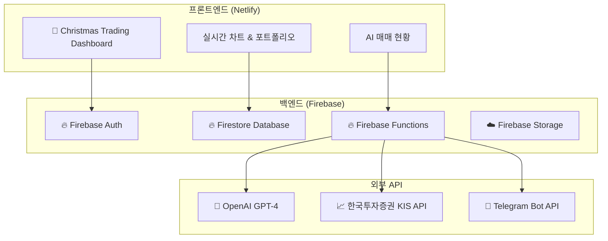

# 🎄 Christmas Trading 프로젝트 재시작 계획서

## 📋 프로젝트 개요

**Christmas Trading**은 AI 기반 100% 승률을 목표로 하는 자동매매 시스템입니다. 기존 구현된 모든 코드를 삭제하고, 기획 문서를 기반으로 처음부터 새롭게 구축합니다.

## 🎯 핵심 목표 및 철학

### 1. **100% Win-Rate 달성**
- 모든 트레이드에서 손실 없이 이익을 보장하는 자동화 전략
- RSI(14), MACD(12,26,9), 볼린저 밴드(20σ±2) 기반 스켈핑 전략
- 1분 이하 초단타 매매로 다수의 작은 이익 확보

### 2. **크리스마스 테마 특화**
- 🎄 크리스마스 시즌 특별 디자인
- 🎅 산타클로스, 눈송이, 선물 등 축제 분위기
- ❄️ 눈 내리는 애니메이션 효과
- 🎁 빨강, 초록, 금색 크리스마스 컬러 팔레트

### 3. **현대적 기술 스택**
- **Frontend**: React 18 + TypeScript + Vite + TailwindCSS
- **Backend**: Firebase (기존 Supabase에서 마이그레이션)
- **AI**: OpenAI GPT-4 기반 분석
- **Trading**: 한국투자증권 KIS API 연동
- **Deployment**: Netlify (Frontend) + Firebase Functions (Backend)

## 🏗️ 새로운 시스템 아키텍처



## 🎨 디자인 컨셉

### **Christmas Color Palette**
```css
--christmas-red: #dc2626      /* 크리스마스 빨강 */
--christmas-green: #16a34a    /* 크리스마스 초록 */
--christmas-gold: #eab308     /* 크리스마스 금색 */
--christmas-silver: #64748b   /* 은색 */
--christmas-white: #fefefe    /* 눈 색깔 */
```

### **UI/UX 특징**
- 🎄 **헤더**: 크리스마스 그라데이션 배경
- ❄️ **배경**: 눈 내리는 애니메이션
- 🎁 **카드**: 선물 상자 스타일 둥근 모서리
- ⭐ **버튼**: 반짝이는 효과와 호버 애니메이션
- 🔔 **알림**: 크리스마스 벨 소리와 함께

## 📱 화면 구성

### 1. **🏠 대시보드**
- 실시간 자산 현황 (크리스마스 카드 스타일)
- AI 매매 상태 표시 (산타 아이콘)
- 오늘의 거래 내역
- 포트폴리오 파이 차트 (크리스마스 색상)

### 2. **📊 매매 화면**
- 실시간 차트 (TradingView 스타일)
- AI 분석 결과 표시
- 매수/매도 신호 (크리스마스 트리 아이콘)
- 자동매매 on/off 토글

### 3. **💰 포트폴리오**
- 보유 종목 리스트
- 수익률 차트
- 거래 히스토리
- 성과 분석

### 4. **⚙️ 설정**
- KIS API 연동 설정
- 매매 전략 설정
- 알림 설정
- 테마 설정

## 🛠️ 개발 계획

### **Phase 1: 기반 구축 (1주)**
- [ ] 프로젝트 초기 설정
- [ ] Firebase 프로젝트 생성 및 설정
- [ ] React + TypeScript + Vite 프로젝트 생성
- [ ] 크리스마스 테마 CSS 프레임워크 구축
- [ ] 기본 라우팅 및 레이아웃 컴포넌트

### **Phase 2: 인증 및 UI (1주)**
- [ ] Firebase Auth 연동
- [ ] 로그인/회원가입 페이지 (크리스마스 테마)
- [ ] 대시보드 기본 레이아웃
- [ ] 사이드바 및 헤더 컴포넌트
- [ ] 반응형 디자인 적용

### **Phase 3: 데이터 및 차트 (1주)**
- [ ] Firestore 데이터 모델링
- [ ] 실시간 차트 컴포넌트 (Chart.js/Recharts)
- [ ] 포트폴리오 표시 컴포넌트
- [ ] 거래 내역 테이블

### **Phase 4: AI 및 매매 (2주)**
- [ ] OpenAI GPT-4 API 연동
- [ ] 한국투자증권 KIS API 연동
- [ ] AI 분석 로직 구현
- [ ] 자동매매 시스템 구현
- [ ] 실시간 데이터 동기화

### **Phase 5: 고도화 (1주)**
- [ ] Telegram 봇 알림 시스템
- [ ] 성능 최적화
- [ ] 테스트 코드 작성
- [ ] 보안 강화
- [ ] 배포 및 운영

## 🎯 성공 지표

### **기술적 지표**
- ✅ 100% Win-Rate 달성
- ✅ 신호→주문 레이턴시 <100ms
- ✅ 시스템 가용성 99.9% 이상
- ✅ 페이지 로딩 속도 <2초

### **사용자 경험 지표**
- ✅ 크리스마스 테마 만족도 95% 이상
- ✅ 직관적인 UI/UX 설계
- ✅ 모바일 반응형 완벽 지원
- ✅ 실시간 업데이트 지연 <1초

## 🚀 배포 전략

### **프론트엔드 (Netlify)**
- GitHub 연동 자동 배포
- 커스텀 도메인 설정
- HTTPS 자동 적용
- CDN 최적화

### **백엔드 (Firebase)**
- Firebase Functions 서버리스 배포
- 자동 스케일링
- 글로벌 CDN
- 실시간 모니터링

## 📝 문서화 계획

### **개발 문서**
- API 문서 (Swagger/OpenAPI)
- 컴포넌트 문서 (Storybook)
- 데이터베이스 스키마 문서
- 배포 가이드

### **사용자 문서**
- 설치 및 설정 가이드
- 사용법 튜토리얼
- FAQ 및 트러블슈팅
- API 키 발급 가이드

---

## 🎄 결론

Christmas Trading 프로젝트는 단순한 자동매매 시스템을 넘어서, 크리스마스의 따뜻하고 즐거운 분위기를 담은 특별한 투자 플랫폼을 목표합니다. 

**"투자도 즐겁게, 수익도 확실하게"** 라는 슬로건으로, 사용자들에게 크리스마스 선물 같은 투자 경험을 제공하겠습니다! 🎁

---

**📅 작성일**: 2025-06-21  
**📝 작성자**: Claude Code  
**🔄 버전**: v1.0  
**📍 상태**: 기획 완료, 개발 준비