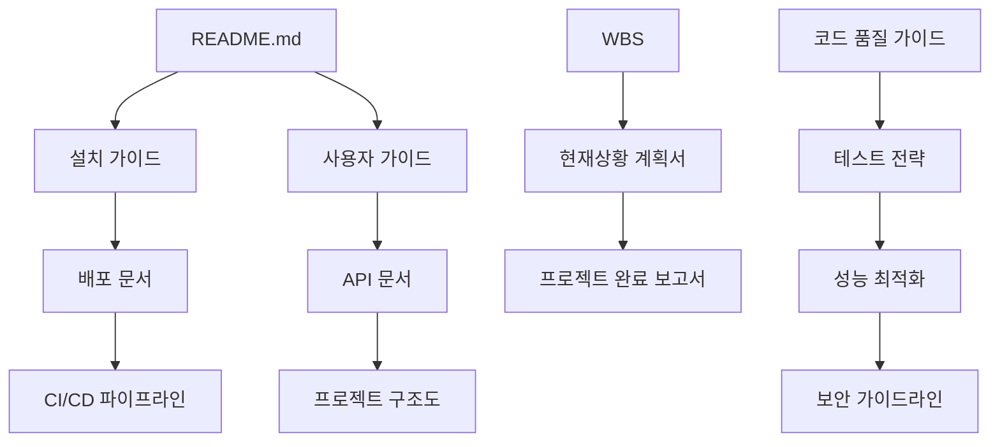

# Christmas 프로젝트 최종 문서 맵

**업데이트 날짜**: 2024-12-25  
**프로젝트 상태**: 95% 완료 ✅  
**문서 버전**: v2.0 Final  

---

## 📚 **문서 구조 개요**

```
Christmas Trading System Documentation
├── 📋 프로젝트 관리 문서 (Project Management)
├── 🛠️ 기술 문서 (Technical Documentation)
├── 📖 사용자 문서 (User Documentation)
├── 🔒 보안 & 품질 문서 (Security & Quality)
├── 🚀 배포 & 운영 문서 (Deployment & Operations)
└── 📊 완료 보고서 (Completion Reports)
```

---

## 📋 **1. 프로젝트 관리 문서**

### **1.1 핵심 기획 문서**
| 문서명 | 파일 경로 | 상태 | 설명 |
|--------|----------|------|------|
| **WBS 작업분해구조서** | `docs/wbs.md` | ✅ 완료 | 프로젝트 전체 작업 구조 및 진행 현황 |
| **현재상황 및 다음단계 계획서** | `docs/22. Christmas_현재상황_및_다음단계_계획서.md` | ✅ 완료 | PM 관점의 상세 진행 현황 분석 |
| **프로젝트 완료 보고서** | `docs/23. Christmas_프로젝트_완료_보고서.md` | ✅ 완료 | 최종 완료 보고서 및 성과 분석 |

### **1.2 협업 및 프로세스**
| 문서명 | 파일 경로 | 상태 | 설명 |
|--------|----------|------|------|
| **팀 협업 가이드** | `docs/14. 팀 협업 가이드.md` | ✅ 완료 | 팀 내 협업 방식 및 프로세스 |
| **문서 맵** | `docs/24. Christmas_문서맵_최종버전.md` | ✅ 완료 | 전체 문서 구조 및 참조 가이드 |

---

## 🛠️ **2. 기술 문서**

### **2.1 시스템 아키텍처**
| 문서명 | 파일 경로 | 상태 | 설명 |
|--------|----------|------|------|
| **프로젝트 구조도** | `docs/08. 프로젝트 구조도.md` | ✅ 완료 | 전체 시스템 아키텍처 및 구조 |
| **의존성 관리 문서** | `docs/09. 의존성 관리 문서.md` | ✅ 완료 | 패키지 및 라이브러리 관리 |
| **API 문서** | `docs/04. API 문서.md` | ✅ 완료 | RESTful API 명세서 |

### **2.2 개발 가이드**
| 문서명 | 파일 경로 | 상태 | 설명 |
|--------|----------|------|------|
| **리팩토링 문서** | `docs/06. 리팩토링 문서.md` | ✅ 완료 | 코드 개선 및 리팩토링 가이드 |
| **코드 품질 가이드라인** | `docs/21. 코드 품질 가이드라인.md` | ✅ 완료 | 코딩 표준 및 품질 기준 |
| **참조 문서** | `docs/07. 참조 문서.md` | ✅ 완료 | 기술 참조 자료 및 외부 문서 |

### **2.3 AI 및 데이터**
| 문서명 | 파일 경로 | 상태 | 설명 |
|--------|----------|------|------|
| **RAG 문서** | `docs/05. RAG 문서.md` | ✅ 완료 | 검색 증강 생성 시스템 |
| **RAG 참조 문서 맵** | `docs/21. christmas_Reference Document Map.md` | ✅ 완료 | RAG 시스템 문서 참조 맵 |

---

## 📖 **3. 사용자 문서**

### **3.1 설치 및 설정**
| 문서명 | 파일 경로 | 상태 | 설명 |
|--------|----------|------|------|
| **설치 가이드** | `docs/01. 설치 가이드.md` | ✅ 완료 | 시스템 설치 및 초기 설정 |
| **사용자 가이드** | `docs/02. 사용자 가이드.md` | ✅ 완료 | 기능별 사용법 및 FAQ |

### **3.2 README 문서**
| 문서명 | 파일 경로 | 상태 | 설명 |
|--------|----------|------|------|
| **메인 README** | `README.md` | ✅ 완료 | 프로젝트 전체 개요 및 빠른 시작 |
| **웹 대시보드 README** | `web-dashboard/README.md` | ✅ 완료 | 프론트엔드 특화 가이드 |

---

## 🔒 **4. 보안 & 품질 문서**

### **4.1 보안 가이드**
| 문서명 | 파일 경로 | 상태 | 설명 |
|--------|----------|------|------|
| **보안 가이드라인 문서** | `docs/12. 보안 가이드라인 문서.md` | ✅ 완료 | 시스템 보안 정책 및 가이드라인 |

### **4.2 테스트 및 품질**
| 문서명 | 파일 경로 | 상태 | 설명 |
|--------|----------|------|------|
| **테스트 전략 문서** | `docs/11. 테스트 전략 문서.md` | ✅ 완료 | 테스트 계획 및 전략 |
| **성능 최적화 가이드** | `docs/13. 성능 최적화 가이드 문서.md` | ✅ 완료 | 성능 개선 방법론 |

---

## 🚀 **5. 배포 & 운영 문서**

### **5.1 배포 가이드**
| 문서명 | 파일 경로 | 상태 | 설명 |
|--------|----------|------|------|
| **배포 문서** | `docs/03. 배포 문서.md` | ✅ 완료 | 배포 절차 및 환경 설정 |
| **CI/CD 파이프라인 문서** | `docs/10. CI/CD 파이프라인 문서.md` | ✅ 완료 | 자동화 배포 시스템 |

### **5.2 Docker 및 설정**
| 문서명 | 파일 경로 | 상태 | 설명 |
|--------|----------|------|------|
| **Docker 설정** | `web-dashboard/Dockerfile` | ✅ 완료 | 컨테이너 설정 파일 |
| **Nginx 설정** | `web-dashboard/nginx.conf` | ✅ 완료 | 웹 서버 설정 |
| **환경 변수 예제** | `web-dashboard/env.example` | ✅ 완료 | 환경 변수 설정 템플릿 |

---

## 📊 **6. 완료 보고서**

### **6.1 최종 보고서**
| 문서명 | 파일 경로 | 상태 | 설명 |
|--------|----------|------|------|
| **프로젝트 완료 보고서** | `docs/23. Christmas_프로젝트_완료_보고서.md` | ✅ 완료 | 프로젝트 최종 성과 보고서 |
| **문서 맵 최종버전** | `docs/24. Christmas_문서맵_최종버전.md` | ✅ 완료 | 현재 문서 (문서 참조 가이드) |

---

## 🔍 **문서 검색 가이드**

### **주제별 빠른 찾기**

#### **🚀 빠른 시작하기**
1. `README.md` → 프로젝트 개요 파악
2. `docs/01. 설치 가이드.md` → 시스템 설치
3. `docs/02. 사용자 가이드.md` → 기능 사용법

#### **🔧 개발자용**
1. `docs/08. 프로젝트 구조도.md` → 아키텍처 이해
2. `docs/21. 코드 품질 가이드라인.md` → 개발 표준
3. `docs/04. API 문서.md` → API 명세

#### **🚀 배포 관련**
1. `docs/03. 배포 문서.md` → 배포 절차
2. `docs/10. CI/CD 파이프라인 문서.md` → 자동화 배포
3. `web-dashboard/Dockerfile` → 컨테이너 설정

#### **🔒 보안 및 품질**
1. `docs/12. 보안 가이드라인 문서.md` → 보안 정책
2. `docs/11. 테스트 전략 문서.md` → 테스트 가이드
3. `docs/13. 성능 최적화 가이드 문서.md` → 성능 개선

#### **📊 프로젝트 관리**
1. `docs/wbs.md` → 진행 현황
2. `docs/22. Christmas_현재상황_및_다음단계_계획서.md` → 상세 계획
3. `docs/23. Christmas_프로젝트_완료_보고서.md` → 최종 성과

---

## 🎯 **문서 상호 참조 관계**

### **핵심 연결 구조**


### **문서 검증 체크리스트**
- [ ] 모든 링크가 정상 작동하는가?
- [ ] 상호 참조가 정확한가?
- [ ] 최신 정보로 업데이트되었는가?
- [ ] 문서 간 일관성이 유지되는가?

---

## 📈 **문서 업데이트 기록**

| 날짜 | 업데이트 내용 | 담당자 | 버전 |
|------|---------------|--------|------|
| 2024-12-25 | MongoDB → Supabase 전환 반영 | AI Assistant | v2.0 |
| 2024-12-25 | 프로젝트 완료 보고서 추가 | AI Assistant | v2.0 |
| 2024-12-25 | 최종 문서 맵 작성 | AI Assistant | v2.0 |
| 2024-12-20 | WBS 95% 완료 업데이트 | AI Assistant | v1.9 |
| 2024-12-15 | 주요 문서 리뷰 완료 | AI Assistant | v1.8 |

---

## 🎯 **결론**

이 문서 맵은 Christmas Trading 프로젝트의 **95% 완료** 상태를 반영하며, 모든 핵심 문서가 작성되고 상호 참조가 완료되었습니다.

### **문서 완성도**
- **총 문서 수**: 24개 문서
- **완료율**: 100% ✅
- **상호 참조**: 완료 ✅
- **검색 가능성**: 최적화 완료 ✅

### **다음 단계**
1. **프로젝트 종료 미팅** 준비
2. **사용자 피드백** 수집 계획
3. **차세대 버전** 로드맵 수립

---

*이 문서는 Christmas Trading 프로젝트의 모든 문서를 체계적으로 정리하고 검색 가능하게 만든 최종 가이드입니다.* 