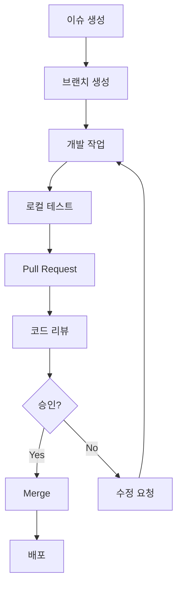
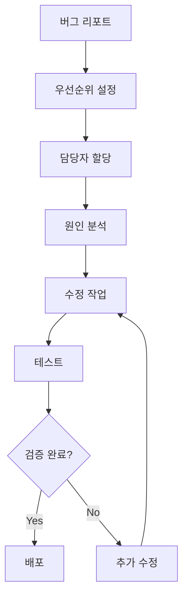

# 👥 팀 협업 가이드 (Christmas Trading)

## 📋 개요

### 🎯 협업 목표
- **효율적인 커뮤니케이션**: 명확하고 신속한 정보 공유
- **체계적인 작업 관리**: 역할 분담 및 진행 상황 추적
- **품질 보증**: 코드 리뷰 및 문서화 표준
- **지식 공유**: 팀 내 기술 노하우 축적

### 🏗️ 팀 구조
```
Project Manager (PM AI Assistant)
    ↓
Frontend Developer
Backend Developer
DevOps Engineer
QA Engineer
```

## 👤 역할 및 책임

### 🎯 PM AI Assistant
- **프로젝트 관리**: WBS, 일정, 리스크 관리
- **문서화**: 기술 문서, 가이드라인 작성
- **품질 관리**: 코드 리뷰, 테스트 전략
- **커뮤니케이션**: 팀 간 조율 및 진행 상황 보고

### 💻 Frontend Developer
- **UI/UX 구현**: React 컴포넌트 개발
- **상태 관리**: Zustand 스토어 관리
- **API 연동**: 백엔드 API 통합
- **성능 최적화**: 번들 크기, 로딩 시간 최적화

### 🖥️ Backend Developer
- **API 개발**: RESTful API 엔드포인트 구현
- **데이터베이스**: Supabase 스키마 설계 및 관리
- **인증/인가**: JWT 토큰 기반 보안 구현
- **외부 API 연동**: KIS API, 텔레그램 봇 연동

### 🔧 DevOps Engineer
- **인프라 관리**: Docker, 서버 운영
- **CI/CD**: GitHub Actions 파이프라인 구축
- **모니터링**: 서버 상태, 성능 모니터링
- **보안**: 서버 보안, 환경변수 관리

### 🧪 QA Engineer
- **테스트 계획**: 테스트 케이스 작성
- **자동화 테스트**: Unit, Integration, E2E 테스트
- **버그 추적**: 이슈 발견 및 재현
- **품질 검증**: 배포 전 최종 검증

## 📞 커뮤니케이션 프로토콜

### 💬 일일 스탠드업 (Daily Standup)
```
시간: 매일 오전 9:00 (15분)
참석자: 전체 팀원
형식: 
- 어제 완료한 작업
- 오늘 계획한 작업
- 블로커 및 도움 요청
```

### 📊 주간 리뷰 (Weekly Review)
```
시간: 매주 금요일 오후 4:00 (1시간)
참석자: 전체 팀원
내용:
- 주간 성과 리뷰
- 다음 주 계획 수립
- 기술적 이슈 논의
- 프로세스 개선 사항
```

### 🚨 긴급 상황 대응
```
Level 1 (Critical): 즉시 알림 (5분 이내)
Level 2 (High): 1시간 이내 대응
Level 3 (Medium): 당일 대응
Level 4 (Low): 3일 이내 대응
```

## 🔄 워크플로우 프로세스

### 📝 기능 개발 워크플로우


### 🐛 버그 수정 워크플로우


## 📋 코드 리뷰 가이드라인

### ✅ 리뷰 체크리스트
- [ ] **기능성**: 요구사항 충족 여부
- [ ] **코드 품질**: 가독성, 유지보수성
- [ ] **성능**: 최적화 여부
- [ ] **보안**: 보안 취약점 검토
- [ ] **테스트**: 테스트 커버리지
- [ ] **문서화**: 주석 및 문서 업데이트

### 💬 리뷰 코멘트 가이드
```
✅ 승인: "LGTM (Looks Good To Me)"
🔧 수정 요청: "변경 요청: [구체적인 이유]"
💡 제안: "제안: [개선 아이디어]"
❓ 질문: "질문: [명확히 하고 싶은 부분]"
📝 문서: "문서화 필요: [추가할 내용]"
```

### ⏰ 리뷰 타임라인
- **일반 PR**: 24시간 이내 리뷰
- **긴급 PR**: 2시간 이내 리뷰
- **대규모 PR**: 48시간 이내 리뷰

## 📚 문서화 표준

### 📖 문서 작성 가이드
```markdown
# 제목 (명확하고 구체적으로)

## 개요
- 목적 및 범위 설명

## 상세 내용
- 단계별 설명
- 코드 예시 포함
- 스크린샷 (필요시)

## 참고 자료
- 관련 링크
- 추가 문서
```

### 🔄 문서 업데이트 정책
- **코드 변경 시**: 관련 문서 동시 업데이트
- **주간 리뷰**: 문서 최신성 검토
- **버전 관리**: 문서 변경 이력 추적

## 🛠️ 개발 도구 및 환경

### 💻 필수 개발 도구
```bash
# 코드 에디터
- VS Code (권장)
- 필수 확장: ESLint, Prettier, GitLens

# 버전 관리
- Git
- GitHub Desktop (선택)

# 개발 환경
- Node.js 18+
- Docker Desktop
- Postman (API 테스트)
```

### 🔧 코드 품질 도구
```json
{
  "eslint": "코드 스타일 검사",
  "prettier": "코드 포맷팅",
  "husky": "Git 훅 관리",
  "lint-staged": "스테이징된 파일 검사",
  "jest": "단위 테스트",
  "cypress": "E2E 테스트"
}
```

## 📊 프로젝트 관리 도구

### 📋 이슈 트래킹
```
GitHub Issues:
- 기능 요청: [Feature] 제목
- 버그 리포트: [Bug] 제목
- 개선 사항: [Enhancement] 제목
- 문서화: [Docs] 제목
```

### 🏷️ 라벨 시스템
```
우선순위:
- priority/critical (빨간색)
- priority/high (주황색)
- priority/medium (노란색)
- priority/low (초록색)

타입:
- type/bug (빨간색)
- type/feature (파란색)
- type/enhancement (보라색)
- type/docs (회색)

상태:
- status/in-progress (노란색)
- status/review (주황색)
- status/blocked (빨간색)
- status/done (초록색)
```

## 🎯 성과 측정 및 KPI

### 📈 개발 생산성 지표
- **코드 커밋 빈도**: 일일 평균 커밋 수
- **PR 처리 시간**: 생성부터 머지까지 시간
- **버그 해결 시간**: 발견부터 수정까지 시간
- **코드 리뷰 참여율**: 팀원별 리뷰 참여도

### 🏆 품질 지표
- **테스트 커버리지**: 80% 이상 목표
- **코드 품질 점수**: SonarQube 기준 A등급
- **버그 발생률**: 배포당 버그 수
- **고객 만족도**: 사용자 피드백 점수

## 🎓 학습 및 성장

### 📚 기술 스터디
```
주간 기술 세미나:
- 시간: 매주 수요일 오후 6:00 (1시간)
- 형식: 팀원 돌아가며 발표
- 주제: 신기술, 베스트 프랙티스, 트러블슈팅
```

### 🔄 지식 공유
- **기술 블로그**: 팀 블로그 운영
- **코드 리뷰**: 학습 기회로 활용
- **페어 프로그래밍**: 복잡한 기능 개발 시
- **멘토링**: 시니어-주니어 매칭

## 🚨 위기 관리

### 📞 에스컬레이션 절차
```
Level 1: 개발자 간 해결 시도 (30분)
Level 2: 팀 리드 개입 (1시간)
Level 3: PM 개입 (2시간)
Level 4: 외부 전문가 자문 (4시간)
```

### 🔄 사후 분석 (Post-mortem)
```
1. 사건 개요 및 타임라인
2. 근본 원인 분석
3. 대응 과정 평가
4. 개선 방안 도출
5. 액션 아이템 할당
```

## 📋 체크리스트

### ✅ 신규 팀원 온보딩
- [ ] 개발 환경 설정
- [ ] 프로젝트 구조 설명
- [ ] 코딩 컨벤션 교육
- [ ] 첫 번째 이슈 할당
- [ ] 멘토 배정
- [ ] 팀 소개 및 역할 설명

### ✅ 배포 전 체크리스트
- [ ] 코드 리뷰 완료
- [ ] 테스트 통과
- [ ] 문서 업데이트
- [ ] 성능 검증
- [ ] 보안 검토
- [ ] 롤백 계획 수립

### ✅ 주간 회고
- [ ] 목표 달성도 평가
- [ ] 팀 협업 만족도
- [ ] 프로세스 개선점
- [ ] 다음 주 우선순위
- [ ] 개인 성장 계획

---
**📅 작성일**: 2025-05-27 01:35  
**👤 작성자**: PM AI Assistant  
**🔄 버전**: v1.0  
**📊 상태**: 팀 협업 체계 수립 완료 