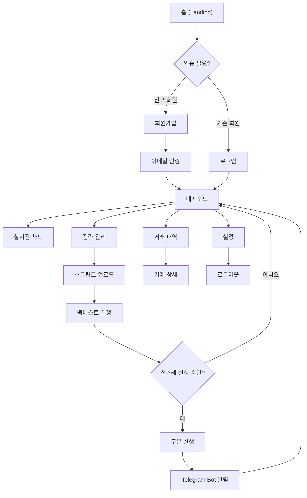

## 요약

이 문서는 “Christmas” 플랫폼의 **정보 구조(Information Architecture, IA)**를 상세히 설계합니다. 사용자 목표·비즈니스 요구사항·콘텐츠 분류·네비게이션 패턴을 기반으로 **Top-Down** 및 **Bottom-Up** 접근법을 결합하여, 신규 참여자가 즉시 시스템을 이해하고 기능을 구현할 수 있는 **명확한 IA**를 제공합니다. 본 설계는 IA 원칙, 콘텐츠 인벤토리, 사이트 맵, 내비게이션 구조, 검색 및 카테고리 전략, 와이어프레임까지 포함합니다.

---

## 1. IA 설계 원칙

- **객체의 원칙(Principle of Objects)**: 콘텐츠를 고유한 생명체로 보고, 수명주기·속성·행동을 정의합니다 ([Make:Iterate](https://makeiterate.com/8-useful-principles-for-a-better-information-architecture/?utm_source=chatgpt.com "8 Useful Principles for a Better Information Architecture - Make:Iterate")).
    
- **선택의 원칙(Principle of Choices)**: 페이지마다 사용자의 의사결정을 돕는 **의미 있는 선택지**만 제공하여 인지 부하를 최소화합니다 ([Make:Iterate](https://makeiterate.com/8-useful-principles-for-a-better-information-architecture/?utm_source=chatgpt.com "8 Useful Principles for a Better Information Architecture - Make:Iterate")).
    
- **구조 중심(Structure over Hierarchy)**: 계층에 집착하지 않고, 정보 간 **연결성**과 **논리적 흐름**에 집중합니다 ([Talent Connect](https://www.toptal.com/designers/ia/guide-to-information-architecture?utm_source=chatgpt.com "The UX Process for Information Architecture - Toptal")).
    
- **논리적 일관성(Logical Processes)**: 각 IA 설계 과정은 사용자 여정과 일치하도록 **논리적인 흐름**을 유지해야 합니다 ([Talent Connect](https://www.toptal.com/designers/ia/guide-to-information-architecture?utm_source=chatgpt.com "The UX Process for Information Architecture - Toptal")).
    
- **성장성(Growth Principle)**: 서비스 확장에 따라 IA가 유지·관리될 수 있도록 **유연한 구조**를 설계합니다 ([WebFX](https://www.webfx.com/blog/web-design/information-architecture-101-techniques-and-best-practices/?utm_source=chatgpt.com "Information Architecture 101: Techniques and Best Practices - WebFX")).
    

---

## 2. 사용자 및 비즈니스 목표

- **사용자 페르소나**:
    
    1. 초보 투자자: 단순·직관적 UI로 매매 흐름 이해
        
    2. 퀀트 트레이더: 스크립트 업로드·백테스트 중심 환경
        
    3. 운영 관리자: 시스템 전반 모니터링·비상 대응
        
- **비즈니스 목표**:
    
    - 100% Win-Rate 구현
        
    - 자동 매매 서비스 확장성 확보
        
    - 낮은 운영 비용 · 높은 배포 속도
        

---

## 3. 콘텐츠 인벤토리

1. **랜딩 페이지**: 서비스 소개, CTA(로그인/회원가입), 주요 기능
    
2. **회원 기능**: 로그인, 회원가입, 프로필 설정
    
3. **대시보드**: 실시간 차트, 포지션 현황, 알림
    
4. **전략 관리**: 스크립트 업로드, 백테스트 결과, 실행 기록
    
5. **거래 내역**: 필터·검색, 상세 로그
    
6. **설정**: API Key 관리, Bot 설정, 알림 옵션
    
7. **문서/지원**: FAQ, 고객 지원, 이용 약관 등
    

---

## 4. 사이트 맵 & 네비게이션

- **글로벌 내비게이션**: 상단 바(홈, 문서/지원) + 사용자 메뉴(프로필, 로그아웃) ([Nielsen Norman Group](https://www.nngroup.com/articles/ia-study-guide/?utm_source=chatgpt.com "Information Architecture: Study Guide - NN/g")).
    
- **사이드 내비게이션**: 대시보드 하위 메뉴(차트, 전략, 거래, 설정) ([Nielsen Norman Group](https://www.nngroup.com/articles/ia-study-guide/?utm_source=chatgpt.com "Information Architecture: Study Guide - NN/g")).
    

---

## 5. 검색 및 필터링 전략

- **사이트 검색**: 전체 콘텐츠(전략, 거래 내역, 문서) 대상으로 **인덱스 기반 검색** 제공 ([WebFX](https://www.webfx.com/blog/web-design/information-architecture-101-techniques-and-best-practices/?utm_source=chatgpt.com "Information Architecture 101: Techniques and Best Practices - WebFX")).
    
- **거래 내역 필터**: 날짜 범위, 종목, 전략별 필터링 UI 제공 ([WebFX](https://www.webfx.com/blog/web-design/information-architecture-101-techniques-and-best-practices/?utm_source=chatgpt.com "Information Architecture 101: Techniques and Best Practices - WebFX")).
    
- **자동완성 · 추천**: 태그·키워드 기반 추천 검색어 제안
    

---

## 6. Top-Down vs Bottom-Up 접근

- **Top-Down**: 홈 → 카테고리 → 세부 기능으로 사용자를 **의도된 여정**으로 안내 ([Wikipedia – Die freie Enzyklopädie](https://de.wikipedia.org/wiki/Informationsarchitektur?utm_source=chatgpt.com "Informationsarchitektur")).
    
- **Bottom-Up**: 검색·추천 → 세부 콘텐츠 → 상위 카테고리로 **다양한 진입점** 지원 ([Wikipedia – Die freie Enzyklopädie](https://de.wikipedia.org/wiki/Informationsarchitektur?utm_source=chatgpt.com "Informationsarchitektur")).
    

---

## 7. 와이어프레임 개요

1. **홈**: Hero 섹션, 기능 요약, 로그인/가입 CTA
    
2. **대시보드**:
    
    - 상단: 요약 카드(P&L, 오픈 포지션)
        
    - 중앙: 실시간 차트 컴포넌트(Recharts)
        
    - 하단: 최근 알림·버튼(전략 업로드, 백테스트)
        
3. **전략 관리**: 파일 업로드 폼, 파라미터 입력, 실행 버튼
    
4. **거래 내역**: 테이블 뷰 + 필터 사이드바
    
5. **설정**: 탭(프로필, API Key, 알림)
    

---

## 8. 검증 및 테스트 포인트

- IA 설계가 `christmas_uiux.md` 디자인 시스템과 일치하는지 확인 ([Nielsen Norman Group](https://www.nngroup.com/articles/ia-study-guide/?utm_source=chatgpt.com "Information Architecture: Study Guide - NN/g")).
    
- 와이어프레임을 통한 **카드 소팅(Card Sorting)** 테스트로 정보 그룹핑 검증 ([Wikipedia – Die freie Enzyklopädie](https://de.wikipedia.org/wiki/Informationsarchitektur?utm_source=chatgpt.com "Informationsarchitektur")).
    
- 사용자 테스트(5명 이상)로 **길찾기(Findability)** 지표 측정 ([CareerFoundry](https://careerfoundry.com/en/blog/ux-design/a-beginners-guide-to-information-architecture/?utm_source=chatgpt.com "A Beginner's Guide To Information Architecture in UX [2025]")).
    

---