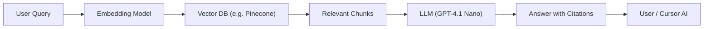

## 요약

Retrieval-Augmented Generation(RAG)은 사전 학습된 LLM이 갖고 있는 지식의 한계를 극복하고, 최신 문서·프로젝트 내 문서를 실시간으로 참조하여 응답의 **정확성**, **일관성**, **전문성**을 높이는 기법입니다. “Christmas” 프로젝트에 도입 시, 프로젝트 문서(`christmas_plan.md` 등)를 **지식 소스**로 사용하고, Vector DB를 통해 **벡터 검색**을 수행한 후, LLM에 관련 맥락을 제공함으로써 **문서 기반 답변**, **코드 자동 생성**, **문서 간 링크 제안** 등 다양한 기능을 자동화할 수 있습니다.

---

## 1. RAG 시스템 개요

RAG는 크게 **탐색(Retrieval)** 단계와 **생성(Generation)** 단계로 구성됩니다. 먼저 사용자의 쿼리나 코드 변경 요청을 Vector DB에서 유사한 문서 청크(chunk)를 검색하고, 이어서 해당 청크를 LLM 프롬프트에 포함시켜 정확하고 근거 있는 응답을 생성합니다 ([arXiv](https://arxiv.org/abs/2407.01219?utm_source=chatgpt.com "Searching for Best Practices in Retrieval-Augmented Generation")).

---

## 2. 시스템 아키텍처



- **Embedding Model**: `text-embedding-ada-002` 등 고성능 임베딩 API 사용 ([OpenAI Help Center](https://help.openai.com/en/articles/8868588-retrieval-augmented-generation-rag-and-semantic-search-for-gpts?utm_source=chatgpt.com "Retrieval Augmented Generation (RAG) and Semantic Search for ..."))
    
- **Vector DB**: Pinecone·Weaviate·Qdrant 중 선택, 문서 청크 색인 ([스택 오버플로 블로그](https://stackoverflow.blog/2024/08/15/practical-tips-for-retrieval-augmented-generation-rag/?utm_source=chatgpt.com "Practical tips for retrieval-augmented generation (RAG)"))
    
- **LLM**: 기본 GPT-4.1 Nano; 필요시 Claude Sonnet·DeepSeek 옵션 ([kapa.ai](https://www.kapa.ai/blog/rag-best-practices?utm_source=chatgpt.com "RAG Best Practices: Lessons from 100+ Technical Teams - Kapa.ai"))
    

---

## 3. 데이터 준비 및 색인화

1. **문서 분할**: 모든 `.md` 파일을 500-token 청크로 분할하여 페이로드 메타데이터(문서명, 버전, 섹션)와 함께 저장 ([스택 오버플로 블로그](https://stackoverflow.blog/2024/08/15/practical-tips-for-retrieval-augmented-generation-rag/?utm_source=chatgpt.com "Practical tips for retrieval-augmented generation (RAG)")).
    
2. **임베딩 생성**: 각 청크에 대해 Embedding API 호출(`openai.embeddings.create`)을 수행 ([Medium](https://scalexi.medium.com/implementing-a-retrieval-augmented-generation-rag-system-with-openais-api-using-langchain-ab39b60b4d9f?utm_source=chatgpt.com "Implementing a Retrieval-Augmented Generation (RAG) System ...")).
    
3. **인덱싱**: Vector DB에 `"project:christmas", "doc":filename, "chunk_id":i` 태그와 함께 벡터 데이터 저장 ([Google Cloud](https://cloud.google.com/blog/products/ai-machine-learning/optimizing-rag-retrieval?utm_source=chatgpt.com "RAG systems: Best practices to master evaluation for ... - Google Cloud")).
    

---

## 4. Retrieval 모듈

- **쿼리 임베딩**: 사용자의 자연어 질문을 임베딩 모델에 전달.
    
- **유사도 검색**: `cosine similarity`를 이용해 상위 `k`개 청크를 반환 (기준 `k=5`) ([Humanloop](https://humanloop.com/blog/rag-architectures?utm_source=chatgpt.com "8 Retrieval Augmented Generation (RAG) Architectures You Should ...")).
    
- **결과 후처리**: 청크 간 중복 제거 및 문서 버전 일치 여부 검증 ([Introduction | 🦜️🔗 LangChain](https://python.langchain.com/docs/tutorials/rag/?utm_source=chatgpt.com "Build a Retrieval Augmented Generation (RAG) App: Part 1")).
    

---

## 5. Generation 모듈

- **컨텍스트 구성**: 검색된 청크를 “Document A: …” 형태로 LLM 프롬프트에 삽입.
    
- **프롬프트 템플릿**:
    
    ````
    You are a project expert. Based on the following documents:
    {chunk1}
    {chunk2}
    …
    Answer the question: {user_query}
    Provide citations in format (Document:Section).
    ``` :contentReference[oaicite:9]{index=9}.  
    ````
    
- **LLM 호출**: OpenAI ChatCompletion API로 `gpt-4.1-nano` 모델 사용 ([Introduction | 🦜️🔗 LangChain](https://python.langchain.com/docs/tutorials/rag/?utm_source=chatgpt.com "Build a Retrieval Augmented Generation (RAG) App: Part 1")).
    

---

## 6. 평가 및 모니터링

- **정확성 검증**: 업계 표준 벤치마크(HotpotQA, ELI5) 스코어 측정 ([Galileo AI](https://www.galileo.ai/blog/mastering-rag-how-to-architect-an-enterprise-rag-system?utm_source=chatgpt.com "Mastering RAG: How To Architect An Enterprise RAG System")).
    
- **응답 속도**: p95 Latency < 500ms 목표 ([Google Cloud](https://cloud.google.com/blog/products/ai-machine-learning/optimizing-rag-retrieval?utm_source=chatgpt.com "RAG systems: Best practices to master evaluation for ... - Google Cloud")).
    
- **Hallucination Rate**: 인간 검토 평가로 월간 2% 미만 유지 ([WIRED](https://www.wired.com/story/reduce-ai-hallucinations-with-rag?utm_source=chatgpt.com "Reduce AI Hallucinations With This Neat Software Trick")).
    
- **사용자 피드백 루프**: 잘못된 응답에 대해 사용자 태그→Re-retrieval 수행 ([Galileo AI](https://www.galileo.ai/blog/mastering-rag-how-to-architect-an-enterprise-rag-system?utm_source=chatgpt.com "Mastering RAG: How To Architect An Enterprise RAG System")).
    

---

## 7. 통합 및 거버넌스

- **Cursor AI 연동**: `.cursor/rules` 에 RAG 검증 규칙 추가
    
    - 모든 대답에 **`source`** 필드 포함
        
    - 탐색 단계 실패 시 경고 ⚠️ ([Introduction | 🦜️🔗 LangChain](https://python.langchain.com/docs/tutorials/qa_chat_history/?utm_source=chatgpt.com "Build a Retrieval Augmented Generation (RAG) App: Part 2")).
        
- **문서 업데이트 반영**: `christmas_reference.md` 버전 변동 시 재인덱싱 자동화
    
- **보안**: API 키는 Vault 관리, Vector DB TLS 암호화 활성화 ([learn.microsoft.com](https://learn.microsoft.com/en-us/training/modules/use-own-data-azure-openai/?utm_source=chatgpt.com "Implement Retrieval Augmented Generation (RAG) with Azure ...")).
    

---

> **다음 단계**: 본 RAG 시스템 정의를 바탕으로, **리팩토링**(`christmas_rag.md` Refactoring Governance) 및 **참조 문서**(`christmas_reference.md`)를 순차적으로 작성·최신화합시다.