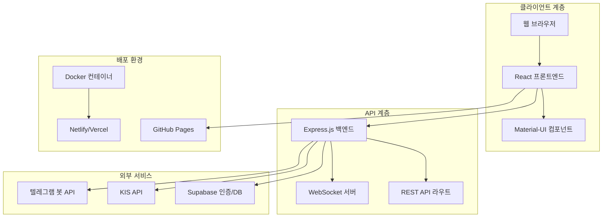
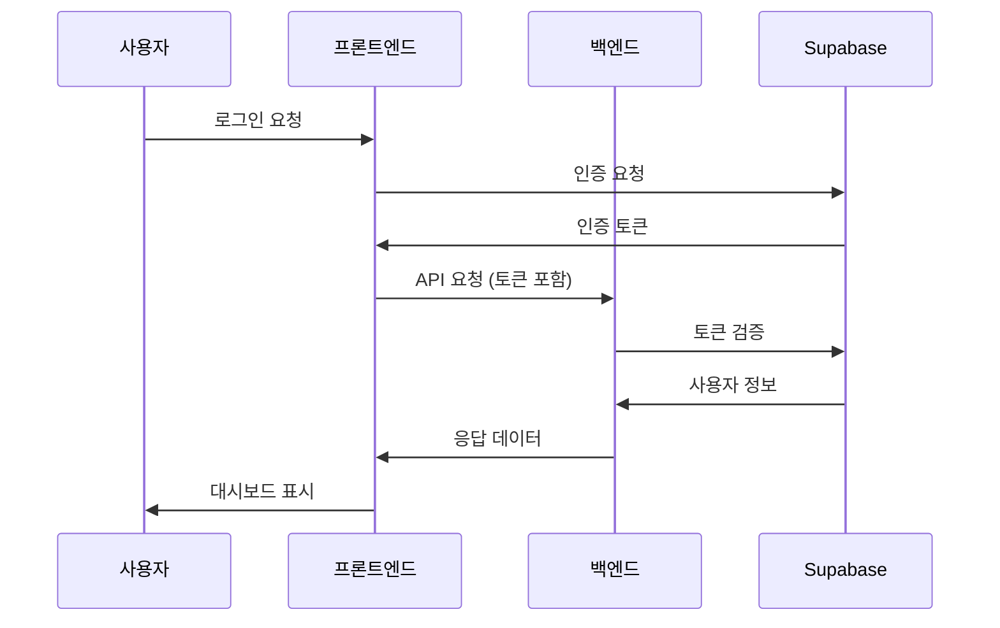
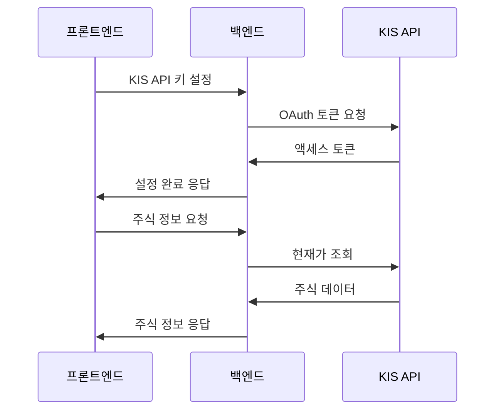
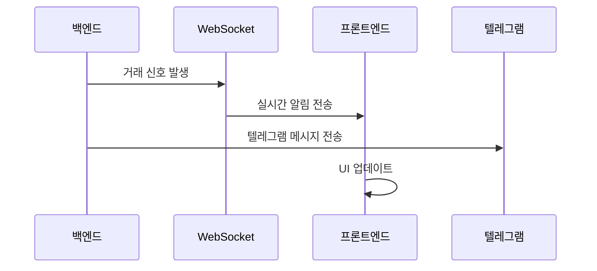
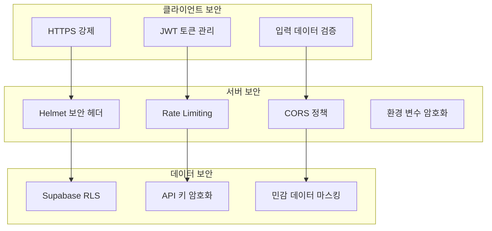
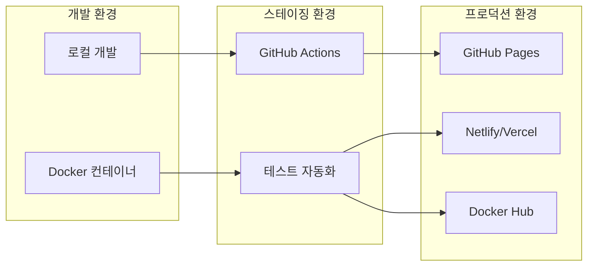

# Christmas Trading 프로젝트 구조도

## 📋 문서 개요
이 문서는 Christmas Trading 프로젝트의 전체 아키텍처와 컴포넌트 간의 관계를 시각적으로 표현합니다.

## 🏗️ 전체 시스템 아키텍처



## 📁 디렉토리 구조 상세

### 루트 디렉토리
```
christmas/
├── 📂 backend/                 # 백엔드 서버 (Node.js + Express)
├── 📂 web-dashboard/           # 프론트엔드 (React + Vite)
├── 📂 docs/                    # 프로젝트 문서
├── 📂 scripts/                 # 배포 및 관리 스크립트
├── 📂 monitoring/              # 모니터링 설정
├── 📂 nginx/                   # Nginx 설정
├── 📂 supabase/                # Supabase 설정
├── 📂 config/                  # 설정 파일
├── 📂 logs/                    # 로그 파일
├── 📂 backups/                 # 백업 파일
├── 📂 tests/                   # 테스트 파일
├── 📄 docker-compose.yml       # Docker 컨테이너 설정
├── 📄 package.json             # 루트 의존성
├── 📄 README.md                # 프로젝트 개요
└── 📄 .gitignore               # Git 무시 파일
```

### 백엔드 구조 (`backend/`)
```
backend/
├── 📄 server.js                # 메인 서버 파일
├── 📄 package.json             # 백엔드 의존성
├── 📄 .env                     # 환경 변수
├── 📄 env.txt                  # 환경 변수 예시
├── 📂 routes/                  # API 라우트
│   ├── 📄 auth.js             # 인증 API
│   ├── 📄 kis.js              # KIS API 연동
│   ├── 📄 telegram.js         # 텔레그램 봇 API
│   ├── 📄 users.js            # 사용자 관리 API
│   └── 📄 websocket.js        # WebSocket 핸들러
├── 📂 middleware/              # 미들웨어
│   ├── 📄 auth.js             # 인증 미들웨어
│   ├── 📄 cors.js             # CORS 설정
│   ├── 📄 rateLimit.js        # 요청 제한
│   └── 📄 security.js         # 보안 미들웨어
├── 📂 services/                # 비즈니스 로직
│   ├── 📄 kisService.js       # KIS API 서비스
│   ├── 📄 telegramService.js  # 텔레그램 서비스
│   └── 📄 supabaseService.js  # Supabase 서비스
├── 📂 utils/                   # 유틸리티
│   ├── 📄 logger.js           # 로깅 유틸리티
│   ├── 📄 validator.js        # 데이터 검증
│   └── 📄 encryption.js       # 암호화 유틸리티
└── 📂 logs/                    # 로그 파일
    ├── 📄 access.log          # 접근 로그
    ├── 📄 error.log           # 에러 로그
    └── 📄 app.log             # 애플리케이션 로그
```

### 프론트엔드 구조 (`web-dashboard/`)
```
web-dashboard/
├── 📄 package.json             # 프론트엔드 의존성
├── 📄 vite.config.js           # Vite 설정
├── 📄 .env                     # 환경 변수
├── 📄 index.html               # HTML 템플릿
├── 📂 src/                     # 소스 코드
│   ├── 📄 App.jsx             # 메인 앱 컴포넌트
│   ├── 📄 main.jsx            # 앱 진입점
│   ├── 📂 components/          # React 컴포넌트
│   │   ├── 📄 Dashboard.jsx   # 대시보드
│   │   ├── 📄 Login.jsx       # 로그인
│   │   ├── 📄 Signup.jsx      # 회원가입
│   │   ├── 📄 KISApiSettings.jsx # KIS API 설정
│   │   ├── 📄 TradingStrategy.jsx # 거래 전략
│   │   ├── 📄 Portfolio.jsx   # 포트폴리오
│   │   ├── 📄 AdminPanel.jsx  # 관리자 패널
│   │   └── 📄 Notifications.jsx # 알림
│   ├── 📂 lib/                 # 라이브러리 및 서비스
│   │   ├── 📄 supabase.js     # Supabase 클라이언트
│   │   ├── 📄 apiService.js   # API 서비스
│   │   ├── 📄 websocket.js    # WebSocket 클라이언트
│   │   └── 📄 utils.js        # 유틸리티 함수
│   ├── 📂 hooks/               # React 훅
│   │   ├── 📄 useAuth.js      # 인증 훅
│   │   ├── 📄 useWebSocket.js # WebSocket 훅
│   │   └── 📄 useApi.js       # API 훅
│   ├── 📂 styles/              # 스타일 파일
│   │   ├── 📄 globals.css     # 전역 스타일
│   │   └── 📄 components.css  # 컴포넌트 스타일
│   └── 📂 assets/              # 정적 자산
│       ├── 📄 logo.png        # 로고
│       └── 📄 icons/          # 아이콘
├── 📂 public/                  # 공개 파일
│   ├── 📄 favicon.ico         # 파비콘
│   └── 📄 manifest.json       # PWA 매니페스트
└── 📂 dist/                    # 빌드 결과물
```

## 🔗 컴포넌트 간 데이터 흐름

### 인증 플로우


### KIS API 연동 플로우


### 실시간 알림 플로우


## 🔧 기술 스택 매핑

### 프론트엔드 기술 스택
```
React 18.2.0
├── Vite (빌드 도구)
├── Material-UI (UI 컴포넌트)
├── React Router (라우팅)
├── Recharts (차트)
├── Axios (HTTP 클라이언트)
└── Supabase JS (인증/DB)
```

### 백엔드 기술 스택
```
Node.js 18.20.5
├── Express.js (웹 프레임워크)
├── WebSocket (실시간 통신)
├── Supabase JS (데이터베이스)
├── Axios (HTTP 클라이언트)
├── Helmet (보안)
├── CORS (교차 출처 요청)
└── Rate Limiting (요청 제한)
```

### 외부 서비스 연동
```
외부 서비스
├── Supabase (인증/데이터베이스)
├── KIS API (주식 거래)
├── 텔레그램 Bot API (알림)
├── GitHub Pages (배포)
└── Docker Hub (컨테이너)
```

## 📊 데이터베이스 스키마

### Supabase 테이블 구조
```sql
-- 사용자 테이블
users (
  id UUID PRIMARY KEY,
  email VARCHAR UNIQUE,
  created_at TIMESTAMP,
  subscription_type VARCHAR,
  kis_api_key VARCHAR ENCRYPTED,
  telegram_chat_id VARCHAR
)

-- 거래 내역 테이블
trades (
  id UUID PRIMARY KEY,
  user_id UUID REFERENCES users(id),
  symbol VARCHAR,
  action VARCHAR, -- 'BUY' or 'SELL'
  quantity INTEGER,
  price DECIMAL,
  timestamp TIMESTAMP
)

-- 포트폴리오 테이블
portfolios (
  id UUID PRIMARY KEY,
  user_id UUID REFERENCES users(id),
  symbol VARCHAR,
  quantity INTEGER,
  avg_price DECIMAL,
  updated_at TIMESTAMP
)

-- 설정 테이블
settings (
  id UUID PRIMARY KEY,
  user_id UUID REFERENCES users(id),
  strategy_type VARCHAR,
  risk_level INTEGER,
  investment_amount DECIMAL,
  telegram_enabled BOOLEAN
)
```

## 🔐 보안 아키텍처

### 보안 계층


## 📱 배포 아키텍처

### 배포 환경


## 🔄 CI/CD 파이프라인

### 자동화 워크플로우
```yaml
# .github/workflows/deploy.yml
name: Deploy Christmas Trading
on:
  push:
    branches: [main]
jobs:
  test:
    runs-on: ubuntu-latest
    steps:
      - uses: actions/checkout@v3
      - name: Setup Node.js
        uses: actions/setup-node@v3
      - name: Install dependencies
        run: npm install
      - name: Run tests
        run: npm test
  
  deploy:
    needs: test
    runs-on: ubuntu-latest
    steps:
      - name: Deploy to GitHub Pages
        uses: peaceiris/actions-gh-pages@v3
```

## 📚 관련 문서 링크
- [프로젝트 관리 가이드](./46.%20프로젝트%20관리%20및%20서버%20이전%20가이드.md)
- [의존성 관리 문서](./48.%20의존성%20관리%20문서.md)
- [보안 가이드라인](./49.%20보안%20가이드라인.md)
- [테스트 전략 문서](./50.%20테스트%20전략%20문서.md)

## 📝 업데이트 이력
- 2024-12-25: 초기 문서 생성
- 향후 업데이트 예정

---
**⚠️ 중요**: 이 구조도는 프로젝트의 전체 아키텍처를 나타냅니다. 새로운 컴포넌트 추가 시 반드시 이 문서를 업데이트해야 합니다. 