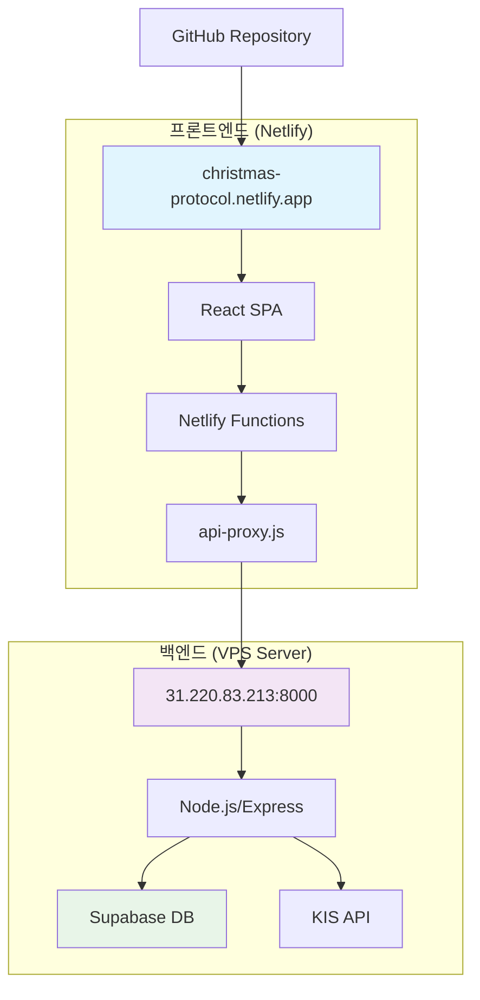
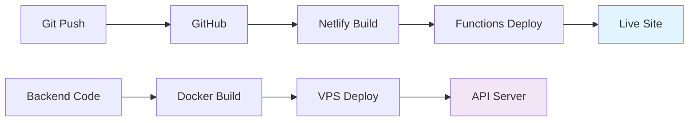

# 🏗️ Christmas Trading System - 프로젝트 구조도

## 📋 **전체 아키텍처**



## 📁 **디렉토리 구조**

```
christmas/
├── 📂 web-dashboard/           # 프론트엔드 (React + Vite)
│   ├── 📂 src/
│   │   ├── 📂 components/      # UI 컴포넌트
│   │   ├── 📂 pages/          # 페이지 컴포넌트
│   │   ├── 📂 hooks/          # 커스텀 훅
│   │   ├── 📂 utils/          # 유틸리티 함수
│   │   └── 📂 assets/         # 정적 리소스
│   ├── 📄 package.json        # 의존성 관리
│   ├── 📄 vite.config.js      # 빌드 설정
│   ├── 📄 .env                # 환경변수 (개발)
│   ├── 📄 .env.production     # 환경변수 (프로덕션)
│   └── 📄 env.txt             # 환경변수 백업
│
├── 📂 backend/                 # 백엔드 서버 코드
│   ├── 📂 routes/             # API 라우트
│   ├── 📂 middleware/         # 미들웨어
│   ├── 📂 models/             # 데이터 모델
│   ├── 📂 services/           # 비즈니스 로직
│   └── 📄 server.js           # 서버 엔트리포인트
│
├── 📂 netlify/                 # Netlify 설정
│   └── 📂 functions/          # 서버리스 함수
│       ├── 📄 api-proxy.js    # API 프록시
│       ├── 📄 portfolio.js    # 포트폴리오 API
│       └── 📄 test.js         # 테스트 함수
│
├── 📂 docs/                    # 프로젝트 문서
│   ├── 📄 PM_ACTION_PLAN.md           # PM 액션 플랜
│   ├── 📄 PHASE_1A_COMPLETION_REPORT.md # 완료 보고서
│   ├── 📄 PROJECT_STRUCTURE.md        # 프로젝트 구조도
│   ├── 📄 API_DOCUMENTATION.md        # API 문서
│   ├── 📄 SECURITY_GUIDELINES.md      # 보안 가이드라인
│   └── 📄 DEPLOYMENT_GUIDE.md         # 배포 가이드
│
├── 📂 scripts/                 # 자동화 스크립트
├── 📄 netlify.toml            # Netlify 배포 설정
├── 📄 WBS_PROJECT_MANAGEMENT.md # WBS 문서
└── 📄 README.md               # 프로젝트 개요
```

## 🔄 **데이터 플로우**

### **1. 사용자 인증 플로우**
```
브라우저 → Netlify Functions → 백엔드 API → Supabase → 응답 체인
```

### **2. AI 거래 신호 플로우**
```
KIS API → 백엔드 처리 → AI 분석 → WebSocket → 프론트엔드 업데이트
```

### **3. 결제 처리 플로우**
```
프론트엔드 → Netlify Functions → 백엔드 → 토스페이먼츠 → 결과 반환
```

## 🛡️ **보안 아키텍처**

### **계층별 보안**
1. **프론트엔드 (Netlify)**
   - ✅ HTTPS 강제
   - ✅ CSP 헤더 설정
   - ✅ 민감한 키 제거

2. **Netlify Functions**
   - ✅ CORS 제한
   - ✅ 요청 검증
   - ✅ 로깅 시스템

3. **백엔드 (VPS)**
   - ✅ JWT 인증
   - ✅ Rate Limiting
   - ✅ 환경변수 암호화

4. **데이터베이스 (Supabase)**
   - ✅ RLS 정책
   - ✅ 연결 암호화
   - ✅ 백업 정책

## 🚀 **배포 파이프라인**



## 📊 **모니터링 포인트**

### **프론트엔드 모니터링**
- ✅ Netlify Build Status
- ✅ Functions Execution Logs
- ✅ Core Web Vitals
- ✅ 사용자 오류 리포트

### **백엔드 모니터링**
- ✅ API 응답 시간
- ✅ 서버 리소스 사용률
- ✅ 데이터베이스 성능
- ✅ KIS API 연결 상태

## 🔧 **개발 환경**

### **로컬 개발**
```bash
# 프론트엔드 개발 서버
cd web-dashboard
npm run dev

# 백엔드 개발 서버
cd backend
npm run dev

# Functions 로컬 테스트
netlify dev
```

### **프로덕션 환경**
- **프론트엔드**: https://christmas-protocol.netlify.app/
- **백엔드**: http://31.220.83.213:8000
- **데이터베이스**: Supabase (자동 백업)

---

**📝 작성자**: PM Claude Sonnet 4  
**📅 작성일**: 2025-05-31  
**🔄 업데이트**: 매주 월요일  
**📊 현재 상태**: Phase 1-B 진행중 