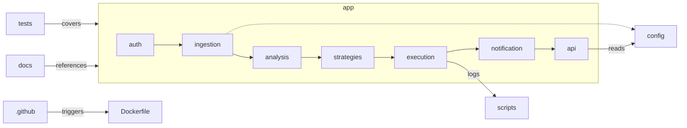

---

## 1. 12-Factor App 기반 구조

Christmas 프로젝트는 **12-Factor App** 방법론을 준수하여 다음과 같은 기준으로 구조화합니다:

- 단일 코드베이스(팩터 I) ([Wikipedia](https://en.wikipedia.org/wiki/Twelve-Factor_App_methodology?utm_source=chatgpt.com "Twelve-Factor App methodology"))
    
- 명시적 의존성 관리(팩터 II) ([Wikipedia](https://en.wikipedia.org/wiki/Twelve-Factor_App_methodology?utm_source=chatgpt.com "Twelve-Factor App methodology"))
    
- 환경 설정 분리(팩터 III) ([Wikipedia](https://en.wikipedia.org/wiki/Twelve-Factor_App_methodology?utm_source=chatgpt.com "Twelve-Factor App methodology"))
    
- 백엔드 서비스 분리(팩터 IV) ([Wikipedia](https://en.wikipedia.org/wiki/Twelve-Factor_App_methodology?utm_source=chatgpt.com "Twelve-Factor App methodology"))
    

---

## 2. 최상위 디렉토리

```text
.
├── .github/                 # CI/CD 워크플로우
│   └── workflows/
│       └── ci.yml
├── .cursor/                 # Cursor AI 규칙
│   └── rules/
│       └── christmas_rules.mdc
├── app/                     # 주요 애플리케이션 코드
│   ├── auth/                # 인증 모듈
│   ├── ingestion/           # 시장 데이터 수집 (REST, WebSocket)
│   ├── analysis/            # 기술·심리 분석 엔진
│   ├── strategies/          # 스켈핑 전략 구현
│   ├── execution/           # 주문 실행 모듈
│   ├── notification/        # Telegram Bot 연동
│   └── api/                 # FastAPI 라우터 및 서버리스 핸들러
├── config/                  # 환경별 설정 (YAML/JSON)
├── scripts/                 # 운영 스크립트(Docker, DB 마이그레이션)
├── tests/                   # pytest 테스트 케이스
│   ├── unit/
│   └── integration/
├── docs/                    # 프로젝트 문서(.md)
├── docker-compose.yml       # 로컬 개발용 Compose 정의
├── Dockerfile               # 멀티스테이지 이미지 빌드
├── requirements.txt         # Python dependencies
└── README.md                # 프로젝트 개요 및 시작 가이드
```

---

## 3. 모듈별 책임

### 3.1 `app/auth`

- **책임**: OAuth2 토큰 발급·검증, 사용자 세션 관리
    
- **주요 파일**: `auth_service.py`, `models.py`, `schemas.py`
    
- **패턴**: 서비스 당 단일 책임 원칙(SRP) ([GeeksforGeeks](https://www.geeksforgeeks.org/best-practices-for-microservices-architecture/?utm_source=chatgpt.com "10 Best Practices for Microservices Architecture in 2025"))
    

### 3.2 `app/ingestion`

- **책임**: KIS Developers API(REST/WebSocket) 연동, 틱·봉 데이터 수집
    
- **구성**:
    
    - `market_api.py`: REST 클라이언트
        
    - `websocket_client.py`: WebSocket 구독 및 Redis 적재
        
- **베스트 프랙티스**: Database per service 패턴 적용 ([Medium](https://medium.com/capital-one-tech/10-microservices-design-patterns-for-better-architecture-befa810ca44e?utm_source=chatgpt.com "10 microservices design patterns for better architecture - Medium"))
    

### 3.3 `app/analysis`

- **책임**: RSI, MACD, Bollinger, Sentiment 분석
    
- **구성**:
    
    - `indicator_engine.py`
        
    - `sentiment_engine.py`
        
- **패턴**: 분산 복잡성 관리(사가 패턴 등) ([Medium](https://medium.com/capital-one-tech/10-microservices-design-patterns-for-better-architecture-befa810ca44e?utm_source=chatgpt.com "10 microservices design patterns for better architecture - Medium"))
    

### 3.4 `app/strategies`

- **책임**: 스켈핑 전략 로직, 신호 생성
    
- **구성**: `scalping_strategy.py`
    
- **원칙**: Domain-Driven Design 바운디드 컨텍스트 ([GeeksforGeeks](https://www.geeksforgeeks.org/best-practices-for-microservices-architecture/?utm_source=chatgpt.com "10 Best Practices for Microservices Architecture in 2025"))
    

### 3.5 `app/execution`

- **책임**: 주문 API 호출, 재시도·리스크 관리
    
- **구성**: `order_executor.py`
    
- **패턴**: API Gateway 패턴, 프로듀서-컨슈머 아키텍처 ([Medium](https://medium.com/capital-one-tech/10-microservices-design-patterns-for-better-architecture-befa810ca44e?utm_source=chatgpt.com "10 microservices design patterns for better architecture - Medium"))
    

### 3.6 `app/notification`

- **책임**: Telegram Bot 메시지 전송
    
- **구성**: `telegram_bot.py`
    
- **원칙**: 비동기 이벤트 기반 통신 ([vFunction](https://vfunction.com/blog/microservices-architecture-guide/?utm_source=chatgpt.com "Microservices architecture and design: A complete overview"))
    

### 3.7 `app/api`

- **책임**: FastAPI 엔드포인트 정의, 인증 미들웨어
    
- **구성**: `routes.py`, `main.py`
    
- **패턴**: Backend-for-Frontend 패턴 ([vFunction](https://vfunction.com/blog/microservices-architecture-guide/?utm_source=chatgpt.com "Microservices architecture and design: A complete overview"))
    

### 3.8 `tests`

- **책임**: 프로젝트 품질 보증 및 테스트 케이스 관리
    
- **구성**:
    
    - `unit/`: 단위 테스트 (개별 모듈 테스트)
    - `integration/`: 통합 테스트 (모듈 간 연동, 데이터 흐름 테스트)
    - `conftest.py`: pytest 공통 설정 및 픽스처

- **테스트 전략**: 
    - 단위 테스트: 각 모듈의 개별 기능에 대한 격리된 테스트
    - 통합 테스트: REST API 및 모듈 간 상호작용 테스트
    - Docker 기반 테스트 환경: `docker-compose.test.yml` 활용

---

## 4. 프로젝트 구조 다이어그램



---

## 5. 의존성 관리

- **Python**: `requirements.txt`에 모든 라이브러리 명시(팩터 II) ([Wikipedia](https://en.wikipedia.org/wiki/Twelve-Factor_App_methodology?utm_source=chatgpt.com "Twelve-Factor App methodology"))
    
- **자동화**: Dependabot/GitHub Actions로 정기적 보안 업데이트 ([Software Engineering Stack Exchange](https://softwareengineering.stackexchange.com/questions/385334/where-should-business-logic-sit-in-microservice-architecture?utm_source=chatgpt.com "Where should business logic sit in microservice architecture?"))
    
- **버전 고정**: `pip-tools` 활용, `requirements.in` → `requirements.txt` 빌드
    

---

## 6. 개발 가이드라인

1. **코딩 스타일**: PEP8, Black, isort ([DEV Community](https://dev.to/yanev/effective-project-structuring-for-microservices-with-quarkus-1lf0?utm_source=chatgpt.com "Effective Project Structuring for Microservices with Quarkus"))
    
2. **코드 리뷰**: 최소 2인 승인, RAG 체크리스트 준수 ([Software Engineering Stack Exchange](https://softwareengineering.stackexchange.com/questions/386066/how-to-structure-microservices-in-your-repository?utm_source=chatgpt.com "How to structure microservices in your repository"))
    
3. **테스트 커버리지**: ≥90% 목표, pytest-cov 활용
    
4. **문서화**: Docstrings + Sphinx + MkDocs 변환 ([Wikipedia](https://en.wikipedia.org/wiki/Twelve-Factor_App_methodology?utm_source=chatgpt.com "Twelve-Factor App methodology"))
    

---

> **참고**: 새 파일/디렉토리 추가 시 반드시 `README.md` 및 `docs/doc-map.md`에 반영하고, `christmas_reference.md`를 업데이트하세요.

---