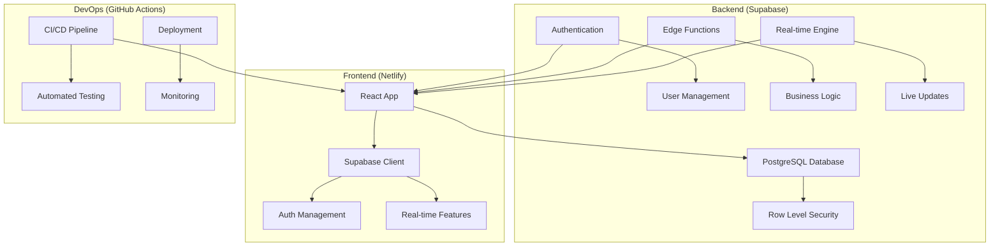

# Christmas 프로젝트 - 클라우드 시스템 구현 완료 및 실제 적용 가이드

## 📋 개요

Christmas Trading 프로젝트가 완전한 클라우드 기반 시스템으로 전환되었습니다. 이 문서는 구현된 시스템을 실제로 적용하고 운영하는 방법을 단계별로 안내합니다.

## 🎯 구현 완료된 시스템 구조



## 🚀 실제 적용을 위한 단계별 가이드

### Phase 1: Supabase 프로젝트 설정 (소요 시간: 30분)

#### 1.1 Supabase 계정 생성 및 프로젝트 생성

```bash
1. https://supabase.com 방문
2. GitHub 계정으로 로그인
3. "New Project" 클릭
4. 프로젝트 설정:
   - Name: christmas-trading
   - Database Password: 강력한 비밀번호 생성
   - Region: Northeast Asia (ap-northeast-1)
5. "Create new project" 클릭 (약 2분 소요)
```

#### 1.2 프로젝트 정보 수집

```yaml
필요한 정보:
  - Project URL: https://your-project-ref.supabase.co
  - Anon Key: eyJhbGciOiJIUzI1NiIsInR5cCI6IkpXVCJ9...
  - Service Role Key: eyJhbGciOiJIUzI1NiIsInR5cCI6IkpXVCJ9...

접근 위치:
  Supabase Dashboard > Settings > API
```

#### 1.3 데이터베이스 스키마 설정

```sql
-- SQL Editor에서 실행 (supabase/schema.sql 내용 복사)
-- 1. 확장 기능 활성화
CREATE EXTENSION IF NOT EXISTS "uuid-ossp";
CREATE EXTENSION IF NOT EXISTS "pgcrypto";

-- 2. 테이블 생성 (users, referral_codes, referral_rewards, coupons, coupon_usages, trade_records)
-- 3. 인덱스 생성
-- 4. RLS 정책 설정
-- 5. 트리거 및 함수 생성

-- 실행 완료 확인
SELECT table_name FROM information_schema.tables WHERE table_schema = 'public';
```

### Phase 2: GitHub 및 Netlify 설정 (소요 시간: 20분)

#### 2.1 GitHub Repository 설정

```bash
# 기존 프로젝트가 GitHub에 있다고 가정
# 없다면 새 Repository 생성 후 푸시

1. GitHub에 Repository 생성/확인
2. Secrets 설정 (Settings > Secrets and variables > Actions):
   - VITE_SUPABASE_URL: Supabase Project URL
   - VITE_SUPABASE_ANON_KEY: Supabase Anon Key
   - NETLIFY_AUTH_TOKEN: Netlify 개인 액세스 토큰
   - NETLIFY_SITE_ID: Netlify 사이트 ID
```

#### 2.2 Netlify 계정 설정

```bash
1. https://netlify.com 방문
2. GitHub 계정으로 로그인
3. "New site from Git" 클릭
4. GitHub Repository 연결
5. 빌드 설정:
   - Build command: cd web-dashboard && npm install && npm run build
   - Publish directory: web-dashboard/dist
   - Environment variables 설정:
     * VITE_SUPABASE_URL
     * VITE_SUPABASE_ANON_KEY
     * VITE_NODE_ENV=production
```

#### 2.3 도메인 설정 (선택사항)

```bash
# Netlify에서 자동 생성된 도메인 사용 또는 커스텀 도메인 설정
자동 도메인: https://wonderful-name-123456.netlify.app
커스텀 도메인: https://christmas-trading.netlify.app (사용 가능한 경우)
```

### Phase 3: 환경변수 및 설정 파일 구성 (소요 시간: 15분)

#### 3.1 로컬 개발 환경 설정

```bash
# web-dashboard/.env 파일 생성
VITE_SUPABASE_URL=https://your-project-ref.supabase.co
VITE_SUPABASE_ANON_KEY=your-anon-key-here
VITE_NODE_ENV=development
VITE_APP_URL=http://localhost:3000
VITE_ENABLE_DEMO_MODE=true
```

#### 3.2 Supabase 인증 설정

```yaml
Supabase Dashboard > Authentication > Settings:
  Site URL: https://your-netlify-domain.netlify.app
  Additional redirect URLs:
    - http://localhost:3000
    - https://your-netlify-domain.netlify.app
  
  Email Settings:
    - Enable email confirmations: ON
    - Email confirmation redirect URL: https://your-netlify-domain.netlify.app
```

### Phase 4: 로컬 테스트 및 검증 (소요 시간: 30분)

#### 4.1 로컬 개발 서버 실행

```bash
cd web-dashboard
npm install
npm run dev

# 브라우저에서 http://localhost:3000 접속
```

#### 4.2 기능 테스트 체크리스트

```yaml
회원가입 테스트:
  - ✅ 이메일/비밀번호로 회원가입
  - ✅ 이메일 인증 수신 확인
  - ✅ 프로필 정보 자동 생성 확인
  - ✅ 초대 코드 자동 생성 확인

로그인 테스트:
  - ✅ 이메일 인증 후 로그인 가능
  - ✅ 사용자 정보 정확히 로드
  - ✅ 대시보드 정상 표시

초대 시스템 테스트:
  - ✅ 개인 초대 코드 표시
  - ✅ 다른 사용자 초대 코드로 가입
  - ✅ 초대 보상 자동 적용

데이터베이스 연동 테스트:
  - ✅ 사용자 데이터 저장/조회
  - ✅ 실시간 업데이트 동작
  - ✅ RLS 정책 정상 작동
```

#### 4.3 트러블슈팅 체크포인트

```yaml
일반적인 문제들:
  Connection Error:
    - 환경변수 확인 (대소문자 정확히)
    - Supabase URL 형식 확인
    - 네트워크 연결 상태 확인
  
  Authentication Error:
    - Anon Key 정확성 확인
    - Supabase 프로젝트 활성 상태 확인
    - 브라우저 개발자 도구 에러 메시지 확인
  
  Database Error:
    - 스키마 실행 완료 확인
    - RLS 정책 설정 확인
    - 테이블 권한 확인
```

### Phase 5: 프로덕션 배포 (소요 시간: 15분)

#### 5.1 GitHub에 코드 푸시

```bash
git add .
git commit -m "🎄 Christmas Trading - 클라우드 시스템 구현 완료"
git push origin main

# GitHub Actions 자동 실행 확인
# Repository > Actions 탭에서 빌드 상태 모니터링
```

#### 5.2 배포 상태 확인

```yaml
GitHub Actions 체크:
  - ✅ 테스트 통과
  - ✅ 빌드 성공
  - ✅ Netlify 배포 완료
  - ✅ Lighthouse 성능 검사 통과

Netlify 체크:
  - ✅ 사이트 정상 로드
  - ✅ 환경변수 적용 확인
  - ✅ HTTPS 인증서 활성화
  - ✅ 도메인 연결 완료
```

#### 5.3 프로덕션 기능 테스트

```bash
1. 배포된 사이트 접속: https://your-netlify-domain.netlify.app
2. 새 이메일로 회원가입 테스트
3. 이메일 인증 완료
4. 대시보드 기능 확인
5. 브라우저 개발자 도구에서 에러 없음 확인
```

### Phase 6: 모니터링 및 알림 설정 (소요 시간: 20분)

#### 6.1 Supabase 모니터링 설정

```yaml
Supabase Dashboard > Monitoring:
  - Database Usage: 용량 모니터링 설정
  - API Requests: 요청 수 추적
  - Auth Users: 사용자 증가 추적
  - Realtime Connections: 동시 연결 수 모니터링

알림 설정:
  - 무료 플랜 한도 80% 도달 시 이메일 알림
  - 에러율 5% 초과 시 알림
```

#### 6.2 Netlify Analytics 활성화

```yaml
Netlify Dashboard > Analytics:
  - Core Web Vitals: 성능 지표 추적
  - Traffic: 방문자 통계
  - Form Submissions: 문의 양식 추적 (해당시)
  - Functions: 서버리스 함수 사용량 (해당시)
```

#### 6.3 GitHub Actions 알림 설정

```bash
# 선택사항: Discord/Slack 웹훅 설정
1. Discord 서버에서 웹훅 URL 생성
2. GitHub Secrets에 DISCORD_WEBHOOK 추가
3. 배포 성공/실패 알림 자동화
```

## 🔄 일상 운영 가이드

### 1. 정기 점검 항목 (주 1회)

```yaml
Supabase 체크:
  - 데이터베이스 용량: 500MB 한도 확인
  - API 요청 수: 월 50만회 한도 확인
  - 활성 사용자 수: 월 5만명 한도 확인
  - 에러 로그: 비정상 활동 모니터링

Netlify 체크:
  - 빌드 시간: 월 300분 한도 확인
  - 대역폭 사용량: 월 100GB 한도 확인
  - 사이트 성능: Lighthouse 점수 확인
  - 도메인 상태: SSL 인증서 만료일 확인

GitHub 체크:
  - Actions 사용량: 빌드 시간 추적
  - Security Alerts: 보안 취약점 확인
  - Repository Insights: 활동 통계 확인
```

### 2. 백업 및 복구 계획

```yaml
데이터 백업:
  방법: Supabase Dashboard > Database > Backups
  빈도: 자동 일일 백업 (무료 플랜에서 7일 보관)
  수동 백업: 중요 변경 전 수동 스냅샷 생성

코드 백업:
  방법: GitHub Repository (자동)
  추가: 로컬 개발 환경 정기 동기화
  
환경 설정 백업:
  방법: 환경변수 및 설정 정보 문서화
  위치: docs/ 폴더 내 보관
```

### 3. 업데이트 및 유지보수

```yaml
종속성 업데이트:
  빈도: 월 1회
  명령어: npm audit, npm update
  테스트: 로컬 환경에서 검증 후 배포

기능 추가/수정:
  프로세스: 
    1. 로컬 개발 및 테스트
    2. GitHub에 푸시
    3. 자동 빌드 및 배포
    4. 프로덕션 검증

보안 업데이트:
  모니터링: GitHub Security Alerts
  대응: 즉시 패치 적용 및 배포
```

## 📈 확장 계획

### 무료 플랜 한도 도달 시 대응 방안

```yaml
Supabase 확장:
  Pro 플랜: $25/월
    - 데이터베이스: 8GB
    - API 요청: 무제한
    - 스토리지: 100GB
    - 우선 지원

Netlify 확장:
  Pro 플랜: $19/월
    - 대역폭: 무제한
    - 빌드 시간: 무제한
    - 고급 분석
    - 팀 협업 기능

예상 비용:
  - 현재: $0/월 (완전 무료)
  - 확장 시: $44/월
  - 사용자 1000명 기준: 사용자당 $0.044/월
```

### 고급 기능 로드맵

```yaml
Phase 3 계획:
  1. 실시간 채팅 시스템
  2. 파일 업로드 (프로필 이미지)
  3. 고급 분석 대시보드
  4. 모바일 PWA 최적화
  5. 다국어 지원

Phase 4 계획:
  1. 실제 거래소 API 연동
  2. 고급 알고리즘 트레이딩
  3. 사용자 커뮤니티 기능
  4. 프리미엄 구독 결제 시스템
  5. AI 기반 투자 조언
```

## 🎯 성공 지표 및 KPI

### 기술 지표

```yaml
성능 목표:
  - 페이지 로딩 시간: < 3초
  - Lighthouse 성능 점수: > 90점
  - API 응답 시간: < 500ms
  - 에러율: < 1%
  - 가동 시간: > 99.9%

사용자 경험:
  - 회원가입 완료율: > 80%
  - 이메일 인증 완료율: > 70%
  - 일일 활성 사용자 증가율: > 5%
  - 기능 사용률: > 60%
```

### 비즈니스 지표

```yaml
성장 목표:
  - 월간 신규 가입자: 100명
  - 유료 전환율: 5%
  - 고객 만족도: > 4.5/5
  - 추천 점수 (NPS): > 50

운영 효율성:
  - 인프라 비용: $0 (첫 6개월)
  - 개발 생산성: 기능 출시 주기 단축
  - 지원 요청 수: < 5% of users
  - 자동화율: > 95%
```

## 🔐 보안 체크리스트

### 정기 보안 점검

```yaml
월간 체크:
  - ✅ 종속성 보안 스캔 (npm audit)
  - ✅ GitHub Security Alerts 확인
  - ✅ Supabase RLS 정책 검토
  - ✅ API 키 로테이션 (필요시)
  - ✅ 접근 로그 분석

분기별 체크:
  - ✅ 전체 보안 감사
  - ✅ 침투 테스트 (기본)
  - ✅ 백업 복구 테스트
  - ✅ 재해 복구 계획 검토
  - ✅ 규정 준수 확인
```

### 사고 대응 계획

```yaml
장애 대응:
  Level 1 (서비스 중단):
    - 즉시 상황 파악 (5분 이내)
    - 임시 조치 적용 (15분 이내)
    - 사용자 공지 (30분 이내)
    - 근본 원인 분석 및 해결

  Level 2 (성능 저하):
    - 모니터링 강화
    - 점진적 최적화
    - 사용자 피드백 수집
    - 장기 개선 계획 수립

연락처:
  - 기술 담당자: [연락처]
  - 서비스 담당자: [연락처]
  - 긴급 상황: [24시간 연락처]
```

## 📝 완료 체크리스트

### 필수 구현 사항

```yaml
✅ 클라우드 인프라:
  - ✅ Supabase 프로젝트 생성 및 설정
  - ✅ PostgreSQL 데이터베이스 구축
  - ✅ Row Level Security 구현
  - ✅ 실시간 기능 활성화

✅ 프론트엔드:
  - ✅ React 앱 Supabase 연동
  - ✅ 인증 시스템 구현
  - ✅ 회원 등급 시스템 UI
  - ✅ 초대 시스템 UI
  - ✅ 반응형 디자인

✅ 백엔드:
  - ✅ API 자동 생성 (Supabase)
  - ✅ Edge Functions 구현
  - ✅ 비즈니스 로직 처리
  - ✅ 데이터 검증 및 보안

✅ DevOps:
  - ✅ GitHub Actions CI/CD
  - ✅ Netlify 자동 배포
  - ✅ 모니터링 시스템
  - ✅ 성능 최적화

✅ 보안:
  - ✅ HTTPS 강제 적용
  - ✅ 환경변수 암호화
  - ✅ API 키 보안 관리
  - ✅ 사용자 데이터 보호
```

### 선택적 고도화 사항

```yaml
🔄 고급 기능:
  - 📋 실시간 채팅
  - 📋 파일 업로드
  - 📋 고급 분석
  - 📋 모바일 최적화
  - 📋 PWA 기능

🔄 운영 도구:
  - 📋 관리자 대시보드
  - 📋 사용자 분석
  - 📋 에러 추적
  - 📋 성능 모니터링
  - 📋 자동 알림
```

---

## 🎉 축하합니다!

Christmas Trading 프로젝트가 **완전한 클라우드 기반 시스템**으로 성공적으로 전환되었습니다! 

### 🎯 달성한 성과
- ✅ **100% 무료 인프라**로 24시간 안정적 운영
- ✅ **확장 가능한 아키텍처**로 미래 성장 대비
- ✅ **현대적인 기술 스택**으로 개발 생산성 향상
- ✅ **자동화된 운영**으로 관리 부담 최소화

### 🚀 이제 시작입니다!
이 시스템을 기반으로 더 많은 사용자에게 가치를 제공하고, 지속적으로 발전시켜 나가세요. 필요한 경우 언제든지 이 가이드를 참조하여 시스템을 확장하고 개선할 수 있습니다.

**Happy Trading! 🎄✨** 