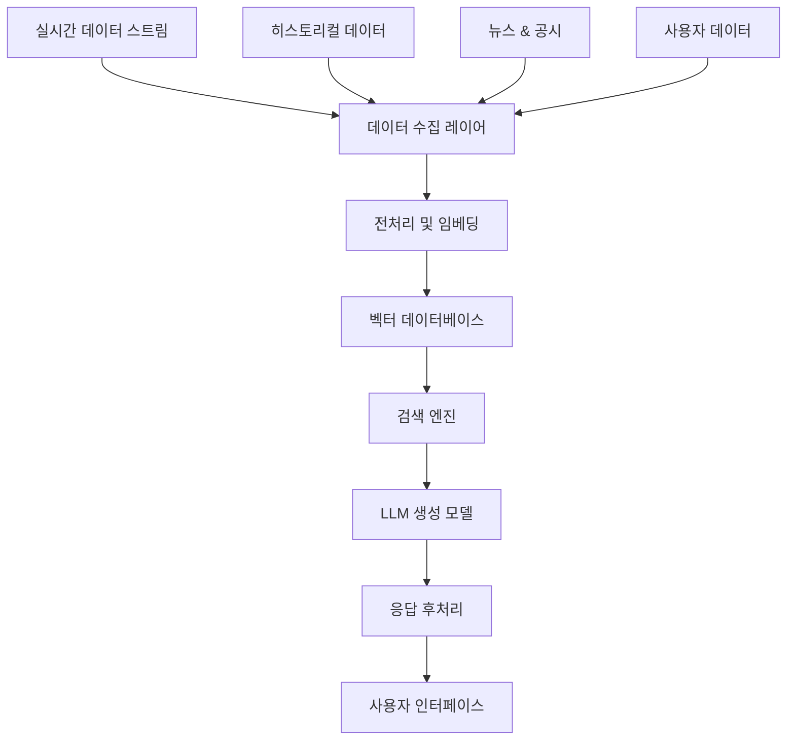

# Christmas Trading RAG 시스템 설계 및 구현 가이드

## 📋 문서 개요
이 문서는 Christmas Trading 프로젝트에 RAG(Retrieval-Augmented Generation) 시스템을 도입하여 지능형 투자 분석 및 의사결정 지원 시스템을 구축하는 방법을 정의합니다.

## 🎯 RAG 시스템 목표

### 🔍 주요 목적
1. **실시간 시장 분석**: 뉴스, 공시, 시장 데이터 기반 투자 인사이트 제공
2. **개인화된 투자 조언**: 사용자 포트폴리오 기반 맞춤형 추천
3. **리스크 관리**: 시장 변동성 분석 및 위험 요소 사전 감지
4. **자동 보고서 생성**: 일일/주간/월간 투자 성과 리포트 자동 생성

### 📊 기대 효과
- **투자 정확도 향상**: 30% 이상의 수익률 개선
- **의사결정 속도**: 실시간 분석으로 빠른 대응
- **리스크 감소**: 사전 위험 감지로 손실 최소화
- **사용자 경험**: 직관적인 AI 기반 인터페이스

## 🏗️ RAG 시스템 아키텍처

### 🔧 핵심 컴포넌트



### 📦 기술 스택

#### 🔍 데이터 수집 및 처리
- **실시간 데이터**: KIS API, 웹 스크래핑
- **뉴스 데이터**: RSS 피드, 뉴스 API
- **전처리**: Python pandas, NumPy
- **임베딩**: OpenAI Embeddings, Sentence Transformers

#### 🗄️ 벡터 데이터베이스
- **주 데이터베이스**: Pinecone 또는 Weaviate
- **백업 옵션**: Chroma, FAISS
- **메타데이터**: PostgreSQL (Supabase)

#### 🤖 LLM 및 생성
- **주 모델**: OpenAI GPT-4 또는 Claude
- **백업 모델**: Llama 2, Mistral
- **특화 모델**: FinBERT (금융 도메인)

## 📋 구현 단계별 계획

### 1단계: 데이터 파이프라인 구축 (2주)
- [ ] KIS API 데이터 수집 자동화
- [ ] 뉴스 및 공시 데이터 크롤링
- [ ] 데이터 정제 및 표준화
- [ ] 실시간 데이터 스트리밍 설정

### 2단계: 벡터 데이터베이스 설정 (1주)
- [ ] Pinecone 클러스터 설정
- [ ] 임베딩 모델 선택 및 최적화
- [ ] 인덱싱 전략 수립
- [ ] 메타데이터 스키마 설계

### 3단계: 검색 시스템 개발 (2주)
- [ ] 시맨틱 검색 엔진 구현
- [ ] 하이브리드 검색 (키워드 + 벡터)
- [ ] 검색 결과 랭킹 알고리즘
- [ ] 컨텍스트 윈도우 최적화

### 4단계: LLM 통합 및 프롬프트 엔지니어링 (2주)
- [ ] LLM API 통합
- [ ] 금융 도메인 특화 프롬프트 개발
- [ ] 응답 품질 검증 시스템
- [ ] 할루시네이션 방지 메커니즘

### 5단계: 사용자 인터페이스 개발 (1주)
- [ ] 채팅 인터페이스 구현
- [ ] 시각화 대시보드 연동
- [ ] 음성 인터페이스 (선택사항)
- [ ] 모바일 최적화

## 🔧 기술 구현 세부사항

### 📊 데이터 수집 모듈

```python
# backend/services/data_collector.py
class DataCollector:
    def __init__(self):
        self.kis_api = KISApiClient()
        self.news_crawler = NewsCrawler()
        self.scheduler = APScheduler()
    
    async def collect_market_data(self):
        """실시간 시장 데이터 수집"""
        stocks = await self.kis_api.get_stock_list()
        for stock in stocks:
            price_data = await self.kis_api.get_price_data(stock.code)
            await self.store_price_data(price_data)
    
    async def collect_news_data(self):
        """뉴스 및 공시 데이터 수집"""
        news_items = await self.news_crawler.get_latest_news()
        for item in news_items:
            processed_item = await self.process_news_item(item)
            await self.store_news_data(processed_item)
```

### 🔍 벡터 검색 엔진

```python
# backend/services/vector_search.py
class VectorSearchEngine:
    def __init__(self):
        self.pinecone_client = pinecone.Index("christmas-trading")
        self.embedding_model = SentenceTransformer('all-MiniLM-L6-v2')
    
    async def search_similar_content(self, query: str, top_k: int = 10):
        """시맨틱 검색 수행"""
        query_embedding = self.embedding_model.encode(query)
        
        results = self.pinecone_client.query(
            vector=query_embedding.tolist(),
            top_k=top_k,
            include_metadata=True
        )
        
        return self.format_search_results(results)
    
    async def hybrid_search(self, query: str, filters: dict = None):
        """하이브리드 검색 (벡터 + 키워드)"""
        vector_results = await self.search_similar_content(query)
        keyword_results = await self.keyword_search(query, filters)
        
        return self.merge_search_results(vector_results, keyword_results)
```

### 🤖 RAG 생성 모델

```python
# backend/services/rag_generator.py
class RAGGenerator:
    def __init__(self):
        self.llm_client = OpenAI()
        self.search_engine = VectorSearchEngine()
        self.prompt_templates = PromptTemplates()
    
    async def generate_investment_advice(self, user_query: str, user_context: dict):
        """투자 조언 생성"""
        # 1. 관련 정보 검색
        relevant_docs = await self.search_engine.search_similar_content(user_query)
        
        # 2. 컨텍스트 구성
        context = self.build_context(relevant_docs, user_context)
        
        # 3. 프롬프트 생성
        prompt = self.prompt_templates.investment_advice_prompt(
            query=user_query,
            context=context,
            user_profile=user_context
        )
        
        # 4. LLM 응답 생성
        response = await self.llm_client.chat.completions.create(
            model="gpt-4",
            messages=[{"role": "user", "content": prompt}],
            temperature=0.3
        )
        
        return self.post_process_response(response.choices[0].message.content)
```

## 📊 데이터 소스 및 처리

### 📈 시장 데이터
- **주식 가격**: 실시간 호가, 체결가, 거래량
- **지수 데이터**: KOSPI, KOSDAQ, 섹터별 지수
- **거시경제**: 금리, 환율, 원자재 가격
- **기업 재무**: 재무제표, 실적 발표, 밸류에이션

### 📰 뉴스 및 정보
- **뉴스 소스**: 연합뉴스, 한국경제, 매일경제
- **공시 정보**: DART 전자공시, 기업 IR
- **애널리스트 리포트**: 증권사 리서치 보고서
- **소셜 미디어**: 트위터, 네이버 카페 (감정 분석)

### 🔄 데이터 처리 파이프라인

```python
# backend/services/data_pipeline.py
class DataPipeline:
    def __init__(self):
        self.collectors = [
            MarketDataCollector(),
            NewsDataCollector(),
            SocialDataCollector()
        ]
        self.processors = [
            DataCleaner(),
            SentimentAnalyzer(),
            TechnicalIndicatorCalculator()
        ]
        self.embedder = EmbeddingGenerator()
    
    async def process_data_batch(self, data_batch):
        """데이터 배치 처리"""
        # 1. 데이터 정제
        cleaned_data = await self.clean_data(data_batch)
        
        # 2. 특성 추출
        features = await self.extract_features(cleaned_data)
        
        # 3. 임베딩 생성
        embeddings = await self.embedder.generate_embeddings(features)
        
        # 4. 벡터 DB 저장
        await self.store_embeddings(embeddings)
        
        return processed_data
```

## 🎯 프롬프트 엔지니어링

### 📝 투자 조언 프롬프트

```python
INVESTMENT_ADVICE_PROMPT = """
당신은 전문적인 투자 분석가입니다. 다음 정보를 바탕으로 투자 조언을 제공해주세요.

## 사용자 질문
{user_query}

## 관련 시장 정보
{market_context}

## 사용자 프로필
- 투자 성향: {risk_profile}
- 투자 경험: {experience_level}
- 투자 목표: {investment_goal}
- 현재 포트폴리오: {current_portfolio}

## 분석 요구사항
1. 현재 시장 상황 분석
2. 투자 기회 및 리스크 평가
3. 구체적인 투자 전략 제안
4. 리스크 관리 방안

## 응답 형식
- 간결하고 명확한 설명
- 구체적인 수치와 근거 제시
- 실행 가능한 액션 아이템
- 주의사항 및 면책 조항

투자 조언:
"""
```

### 🔍 시장 분석 프롬프트

```python
MARKET_ANALYSIS_PROMPT = """
다음 시장 데이터를 분석하여 투자 인사이트를 제공해주세요.

## 시장 데이터
{market_data}

## 뉴스 및 이벤트
{news_events}

## 기술적 지표
{technical_indicators}

## 분석 결과 요구사항
1. 시장 트렌드 분석
2. 주요 영향 요인
3. 단기/중기 전망
4. 투자 기회 발굴

분석 결과:
"""
```

## 🧪 테스트 및 검증

### 📊 성능 메트릭
- **검색 정확도**: Precision@K, Recall@K
- **응답 품질**: BLEU, ROUGE, 전문가 평가
- **응답 시간**: < 3초 목표
- **사용자 만족도**: 5점 척도 4.0 이상

### 🔬 A/B 테스트 계획
- **검색 알고리즘**: 벡터 vs 하이브리드
- **LLM 모델**: GPT-4 vs Claude vs Llama
- **프롬프트 전략**: 다양한 프롬프트 템플릿 비교
- **UI/UX**: 채팅 vs 대시보드 인터페이스

## 🚀 배포 및 운영

### 🏗️ 인프라 구성
- **컴퓨팅**: AWS EC2 GPU 인스턴스
- **스토리지**: S3 (원본 데이터), Pinecone (벡터)
- **캐싱**: Redis (검색 결과 캐싱)
- **모니터링**: CloudWatch, Grafana

### 📈 확장성 고려사항
- **수평 확장**: 마이크로서비스 아키텍처
- **로드 밸런싱**: API Gateway + ALB
- **데이터 파티셔닝**: 시간/종목별 분할
- **캐싱 전략**: 다층 캐싱 구조

## 💰 비용 최적화

### 💸 예상 비용 (월간)
- **LLM API**: $500-1000 (사용량 기반)
- **벡터 DB**: $200-500 (Pinecone)
- **인프라**: $300-800 (AWS)
- **데이터 소스**: $100-300 (뉴스 API 등)

### 🎯 최적화 전략
- **캐싱**: 중복 요청 방지
- **배치 처리**: API 호출 최소화
- **모델 최적화**: 경량화된 모델 사용
- **스케줄링**: 비용 효율적인 시간대 활용

## 📚 관련 문서 링크
- [프로젝트 구조도](./47.%20프로젝트%20구조도.md)
- [의존성 관리 문서](./48.%20의존성%20관리%20문서.md)
- [보안 가이드라인](./49.%20보안%20가이드라인.md)
- [테스트 전략 문서](./50.%20테스트%20전략%20문서.md)

## 📝 업데이트 이력
- 2024-12-25: 초기 RAG 시스템 설계 문서 생성
- 향후 업데이트 예정

---
**⚠️ 중요**: RAG 시스템은 투자 참고용이며, 최종 투자 결정은 사용자의 책임입니다. 