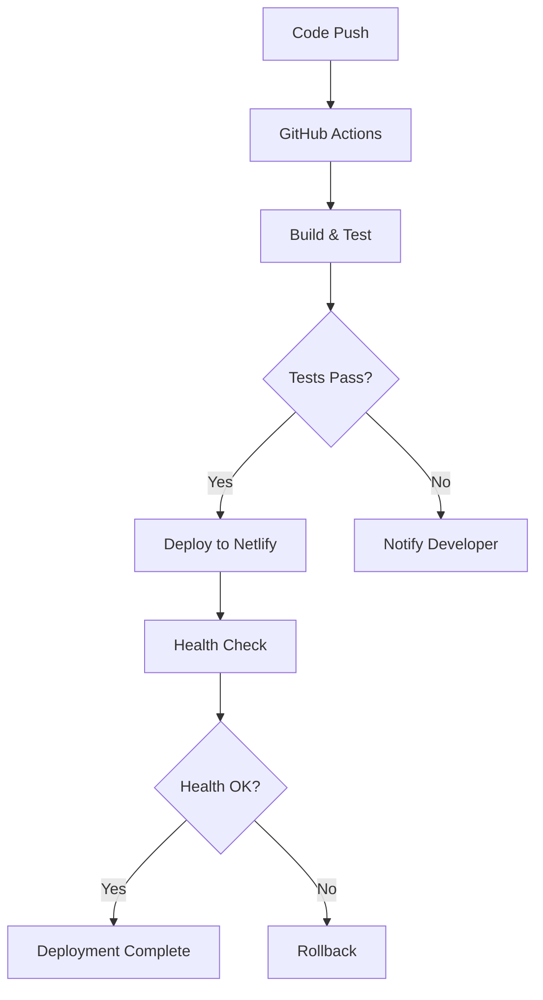

# 🚀 CI/CD 파이프라인 가이드 (Christmas Trading)

## 📋 개요

### 🎯 목표
- **자동화된 배포**: 코드 변경 시 자동 빌드 및 배포
- **품질 보증**: 자동 테스트 및 코드 품질 검사
- **안정성**: 단계별 검증 및 롤백 기능
- **효율성**: 개발자 생산성 향상

### 🏗️ 아키텍처 개요
```
GitHub Repository
    ↓
GitHub Actions (CI)
    ↓
Build & Test
    ↓
Deploy to Staging
    ↓
Deploy to Production
```

## 🔄 현재 배포 프로세스

### 📱 프론트엔드 (Netlify)
```yaml
# 현재 상태: 자동 배포 설정됨
Source: GitHub (main branch)
Build Command: npm run build
Publish Directory: dist/
Environment: Production
URL: https://christmas-protocol.netlify.app/
```

### 🖥️ 백엔드 (Docker on Contabo)
```bash
# 현재 상태: 수동 배포
Server: 31.220.83.213
Method: SSH + Docker Compose
Process: Manual git pull + docker-compose up --build
```

## 🎯 목표 CI/CD 파이프라인

### Phase 1: 기본 자동화 (현재 구현 중)
```yaml
name: Christmas Trading CI/CD

on:
  push:
    branches: [ main, develop ]
  pull_request:
    branches: [ main ]

jobs:
  frontend-ci:
    runs-on: ubuntu-latest
    steps:
      - uses: actions/checkout@v3
      - name: Setup Node.js
        uses: actions/setup-node@v3
        with:
          node-version: '18'
      - name: Install dependencies
        run: cd web-dashboard && npm ci
      - name: Run tests
        run: cd web-dashboard && npm test
      - name: Build
        run: cd web-dashboard && npm run build
      - name: Deploy to Netlify
        if: github.ref == 'refs/heads/main'
        run: netlify deploy --prod --dir=web-dashboard/dist
```

### Phase 2: 백엔드 자동화 (계획)
```yaml
  backend-ci:
    runs-on: ubuntu-latest
    steps:
      - uses: actions/checkout@v3
      - name: Setup Node.js
        uses: actions/setup-node@v3
        with:
          node-version: '18'
      - name: Install dependencies
        run: cd backend && npm ci
      - name: Run tests
        run: cd backend && npm test
      - name: Build Docker image
        run: docker build -t christmas-backend ./backend
      - name: Deploy to server
        if: github.ref == 'refs/heads/main'
        run: |
          echo "${{ secrets.SERVER_SSH_KEY }}" > ssh_key
          chmod 600 ssh_key
          ssh -i ssh_key root@31.220.83.213 "cd /root/christmas-trading && git pull && docker-compose up -d --build"
```

## 🧪 테스트 전략

### 📊 테스트 피라미드
```
    E2E Tests (10%)
        ↑
  Integration Tests (20%)
        ↑
    Unit Tests (70%)
```

### 🔧 프론트엔드 테스트
```json
{
  "scripts": {
    "test": "vitest",
    "test:ui": "vitest --ui",
    "test:coverage": "vitest --coverage",
    "test:e2e": "playwright test"
  }
}
```

### 🖥️ 백엔드 테스트
```json
{
  "scripts": {
    "test": "jest",
    "test:watch": "jest --watch",
    "test:coverage": "jest --coverage",
    "test:integration": "jest --testPathPattern=integration"
  }
}
```

## 🌍 환경 관리

### 📋 환경 구분
1. **Development**: 로컬 개발 환경
2. **Staging**: 테스트 환경 (계획)
3. **Production**: 운영 환경

### 🔐 환경변수 관리
```yaml
# GitHub Secrets 설정 필요
SUPABASE_URL: ${{ secrets.SUPABASE_URL }}
SUPABASE_ANON_KEY: ${{ secrets.SUPABASE_ANON_KEY }}
SUPABASE_SERVICE_KEY: ${{ secrets.SUPABASE_SERVICE_KEY }}
SERVER_SSH_KEY: ${{ secrets.SERVER_SSH_KEY }}
NETLIFY_AUTH_TOKEN: ${{ secrets.NETLIFY_AUTH_TOKEN }}
```

## 🚀 배포 전략

### 🔄 배포 방식
1. **Blue-Green Deployment**: 무중단 배포 (목표)
2. **Rolling Deployment**: 점진적 배포
3. **Canary Deployment**: 일부 사용자 대상 테스트

### 📊 현재 배포 프로세스


## 🔍 모니터링 및 알림

### 📈 메트릭 수집
```yaml
# 모니터링 대상
- Build Success Rate
- Deployment Time
- Test Coverage
- Error Rate
- Response Time
```

### 🚨 알림 설정
```yaml
# Slack/Discord 알림
- Build Failure
- Deployment Success/Failure
- Test Coverage Drop
- Performance Degradation
```

## 🛠️ 도구 및 서비스

### 🔧 현재 사용 중
- **GitHub Actions**: CI/CD 파이프라인
- **Netlify**: 프론트엔드 배포
- **Docker**: 백엔드 컨테이너화
- **Supabase**: 데이터베이스 관리

### 📋 추가 도구 (계획)
- **SonarQube**: 코드 품질 분석
- **Sentry**: 에러 모니터링
- **Lighthouse CI**: 성능 모니터링
- **Dependabot**: 의존성 업데이트

## 📋 체크리스트

### ✅ 프론트엔드 배포 체크리스트
- [ ] 코드 리뷰 완료
- [ ] 단위 테스트 통과
- [ ] 빌드 성공
- [ ] 환경변수 설정 확인
- [ ] Netlify 배포 성공
- [ ] 프로덕션 환경 테스트

### ✅ 백엔드 배포 체크리스트
- [ ] 코드 리뷰 완료
- [ ] 단위 테스트 통과
- [ ] 통합 테스트 통과
- [ ] Docker 이미지 빌드 성공
- [ ] 환경변수 설정 확인
- [ ] 서버 배포 성공
- [ ] Health Check 통과
- [ ] API 엔드포인트 테스트

## 🚨 롤백 절차

### 📱 프론트엔드 롤백
```bash
# Netlify에서 이전 배포 버전으로 롤백
netlify sites:list
netlify api listSiteDeploys --data='{"site_id":"SITE_ID"}'
netlify api restoreSiteDeploy --data='{"deploy_id":"DEPLOY_ID"}'
```

### 🖥️ 백엔드 롤백
```bash
# 서버에서 이전 버전으로 롤백
ssh root@31.220.83.213
cd /root/christmas-trading
git log --oneline -5
git checkout <previous-commit-hash>
docker-compose up -d --build
```

## 📊 성능 지표

### 🎯 목표 지표
- **빌드 시간**: 5분 이하
- **배포 시간**: 3분 이하
- **테스트 실행 시간**: 2분 이하
- **배포 성공률**: 95% 이상

### 📈 현재 지표
- **프론트엔드 빌드**: 2분
- **프론트엔드 배포**: 1분
- **백엔드 배포**: 5분 (수동)
- **전체 배포 시간**: 8분

## 🔮 향후 개선 계획

### Phase 1: 기본 자동화 (1주일)
- GitHub Actions 워크플로우 설정
- 자동 테스트 실행
- Netlify 자동 배포 최적화

### Phase 2: 고급 기능 (2주일)
- 백엔드 자동 배포
- 스테이징 환경 구축
- 모니터링 시스템 구축

### Phase 3: 최적화 (1개월)
- Blue-Green 배포
- 성능 모니터링
- 자동 롤백 시스템

---
**📅 작성일**: 2025-05-27 01:20  
**👤 작성자**: PM AI Assistant  
**🔄 버전**: v1.0  
**📊 상태**: 계획 수립 완료 