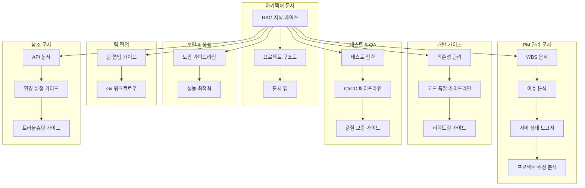

# 📚 Christmas Trading 문서 맵

## 📋 문서 체계 개요

이 문서는 Christmas Trading 프로젝트의 모든 문서를 체계적으로 정리하고 각 문서의 역할과 관계를 명확히 하는 가이드입니다.

## 🗂️ 문서 분류 체계

### 📊 1. PM 관리 문서 (Project Management)
프로젝트 관리, 진행 상황, 이슈 분석 관련 문서

| 문서명 | 경로 | 목적 | 상태 | 업데이트 주기 |
|--------|------|------|------|---------------|
| **WBS 문서** | `docs/WBS_Christmas_Trading_Migration.md` | 프로젝트 작업 분해 구조 | ✅ 활성 | 매일 |
| **현재 이슈 분석** | `docs/PM_Current_Issue_Analysis.md` | 긴급 이슈 분석 및 해결 방안 | ✅ 활성 | 이슈 발생시 |
| **서버 상태 보고서** | `docs/PM_Server_Status_Report.md` | 서버 진단 및 상태 보고 | ✅ 활성 | 매일 |
| **프로젝트 수정 분석** | `docs/PM_Project_Correction_Analysis.md` | 프로젝트 정보 수정 및 재분석 | ✅ 활성 | 필요시 |

### 🏗️ 2. 아키텍처 문서 (Architecture)
시스템 구조, 설계, 기술 스택 관련 문서

| 문서명 | 경로 | 목적 | 상태 | 업데이트 주기 |
|--------|------|------|------|---------------|
| **RAG 지식 베이스** | `docs/RAG_Knowledge_Base.md` | 프로젝트 전체 지식 통합 | ✅ 활성 | 주간 |
| **프로젝트 구조도** | `docs/Project_Structure_Map.md` | 시스템 아키텍처 및 구조 | ✅ 활성 | 월간 |
| **문서 맵** | `docs/Documentation_Map.md` | 이 문서 - 문서 체계 정리 | ✅ 활성 | 월간 |

### 🔧 3. 개발 가이드 문서 (Development)
개발 프로세스, 코딩 표준, 품질 관리 관련 문서

| 문서명 | 경로 | 목적 | 상태 | 업데이트 주기 |
|--------|------|------|------|---------------|
| **의존성 관리** | `docs/Dependency_Management.md` | 패키지 및 의존성 관리 | 🔄 계획 | 월간 |
| **코드 품질 가이드라인** | `docs/Code_Quality_Guidelines.md` | 코딩 표준 및 품질 기준 | 🔄 계획 | 분기 |
| **리팩토링 가이드** | `docs/Refactoring_Guide.md` | 코드 리팩토링 전략 | 🔄 계획 | 필요시 |

### 🧪 4. 테스트 및 품질 보증 (Testing & QA)
테스트 전략, 품질 보증, CI/CD 관련 문서

| 문서명 | 경로 | 목적 | 상태 | 업데이트 주기 |
|--------|------|------|------|---------------|
| **테스트 전략** | `docs/Test_Strategy.md` | 테스트 계획 및 전략 | 🔄 계획 | 분기 |
| **CI/CD 파이프라인** | `docs/CICD_Pipeline.md` | 배포 자동화 가이드 | 🔄 계획 | 월간 |
| **품질 보증 가이드** | `docs/Quality_Assurance.md` | QA 프로세스 및 체크리스트 | 🔄 계획 | 분기 |

### 🔒 5. 보안 및 성능 (Security & Performance)
보안 정책, 성능 최적화 관련 문서

| 문서명 | 경로 | 목적 | 상태 | 업데이트 주기 |
|--------|------|------|------|---------------|
| **보안 가이드라인** | `docs/Security_Guidelines.md` | 보안 정책 및 가이드라인 | 🔄 계획 | 분기 |
| **성능 최적화** | `docs/Performance_Optimization.md` | 성능 튜닝 가이드 | 🔄 계획 | 월간 |

### 👥 6. 팀 협업 (Team Collaboration)
팀 워크플로우, 협업 프로세스 관련 문서

| 문서명 | 경로 | 목적 | 상태 | 업데이트 주기 |
|--------|------|------|------|---------------|
| **팀 협업 가이드** | `docs/Team_Collaboration_Guide.md` | 팀 워크플로우 및 협업 규칙 | 🔄 계획 | 분기 |
| **Git 워크플로우** | `docs/Git_Workflow.md` | Git 브랜치 전략 및 커밋 규칙 | 🔄 계획 | 분기 |

### 📖 7. 참조 문서 (Reference)
API 문서, 설정 가이드, 트러블슈팅 관련 문서

| 문서명 | 경로 | 목적 | 상태 | 업데이트 주기 |
|--------|------|------|------|---------------|
| **API 문서** | `docs/API_Documentation.md` | REST API 명세서 | 🔄 계획 | 주간 |
| **환경 설정 가이드** | `docs/Environment_Setup.md` | 개발 환경 구축 가이드 | 🔄 계획 | 월간 |
| **트러블슈팅 가이드** | `docs/Troubleshooting_Guide.md` | 문제 해결 매뉴얼 | 🔄 계획 | 필요시 |

## 🔄 문서 관계도

## 📊 문서 상태 범례

| 상태 | 아이콘 | 설명 |
|------|--------|------|
| **활성** | ✅ | 작성 완료, 정기 업데이트 중 |
| **진행 중** | 🔄 | 작성 중 또는 업데이트 예정 |
| **계획** | 📋 | 작성 계획됨 |
| **보류** | ⏸️ | 일시 중단 |
| **완료** | ✔️ | 작성 완료, 업데이트 불필요 |

## 🎯 문서 우선순위

### 🔥 Critical (즉시 필요)
1. **WBS 문서** - 프로젝트 진행 관리
2. **RAG 지식 베이스** - 전체 지식 통합
3. **서버 상태 보고서** - 시스템 모니터링

### ⚡ High (단기 필요)
1. **의존성 관리 문서** - 개발 환경 안정화
2. **테스트 전략 문서** - 품질 보증
3. **보안 가이드라인** - 시스템 보안

### 📈 Medium (중기 필요)
1. **CI/CD 파이프라인** - 배포 자동화
2. **성능 최적화** - 시스템 성능
3. **팀 협업 가이드** - 워크플로우 표준화

### 📋 Low (장기 필요)
1. **API 문서** - 개발자 참조
2. **환경 설정 가이드** - 온보딩 지원
3. **Git 워크플로우** - 코드 관리

## 📝 문서 작성 가이드라인

### 📋 문서 구조 표준
1. **제목**: 명확하고 구체적인 제목
2. **개요**: 문서의 목적과 범위
3. **본문**: 체계적이고 논리적인 구성
4. **예시**: 실제 사용 가능한 예제
5. **참조**: 관련 문서 및 외부 링크
6. **메타데이터**: 작성일, 작성자, 버전, 상태

### 🎨 문서 스타일 가이드
- **이모지 사용**: 가독성 향상을 위한 적절한 이모지 활용
- **마크다운 문법**: 일관된 마크다운 문법 사용
- **코드 블록**: 언어별 구문 강조 적용
- **표 활용**: 정보 정리를 위한 표 적극 활용
- **다이어그램**: Mermaid를 활용한 시각적 표현

### 🔄 문서 업데이트 프로세스
1. **변경 사항 식별**: 업데이트가 필요한 내용 파악
2. **영향도 분석**: 다른 문서에 미치는 영향 검토
3. **업데이트 실행**: 문서 내용 수정
4. **검토 및 승인**: 내용 검토 후 승인
5. **배포**: Git 커밋 및 푸시
6. **알림**: 팀원들에게 업데이트 알림

## 📞 문서 관리 책임자

### 👤 PM (Project Manager)
- **담당 문서**: PM 관리 문서, 아키텍처 문서
- **역할**: 전체 문서 체계 관리, 품질 관리
- **업데이트 주기**: 매일 (이슈 발생시 즉시)

### 👨‍💻 개발팀 (Development Team)
- **담당 문서**: 개발 가이드, 테스트 문서, 참조 문서
- **역할**: 기술 문서 작성 및 유지보수
- **업데이트 주기**: 주간 (기능 추가시 즉시)

### 🔒 DevOps 팀
- **담당 문서**: 보안 가이드라인, 성능 최적화, CI/CD
- **역할**: 인프라 관련 문서 관리
- **업데이트 주기**: 월간 (시스템 변경시 즉시)

## 📈 문서 품질 메트릭

### 📊 측정 지표
- **완성도**: 계획 대비 작성 완료율
- **최신성**: 마지막 업데이트로부터 경과 시간
- **활용도**: 문서 조회 및 참조 빈도
- **정확성**: 내용의 정확성 및 유효성

### 🎯 품질 목표
- **완성도**: 90% 이상
- **최신성**: 1개월 이내 업데이트
- **활용도**: 주간 1회 이상 참조
- **정확성**: 오류 0건 유지

## 🔄 문서 백업 및 버전 관리

### 💾 백업 전략
- **Git 저장소**: 모든 문서 Git으로 버전 관리
- **자동 백업**: 매일 자동 백업 실행
- **클라우드 동기화**: GitHub 원격 저장소 동기화

### 📋 버전 관리
- **시맨틱 버저닝**: v1.0, v1.1, v2.0 형태
- **변경 로그**: 각 버전별 변경 사항 기록
- **태그 관리**: Git 태그를 활용한 버전 표시

---
**📅 최종 업데이트**: 2025-05-26 19:25  
**👤 작성자**: PM AI Assistant  
**🔄 버전**: v1.0  
**📊 상태**: 활성 - 지속 업데이트 중  
**📞 관리자**: PM AI Assistant 