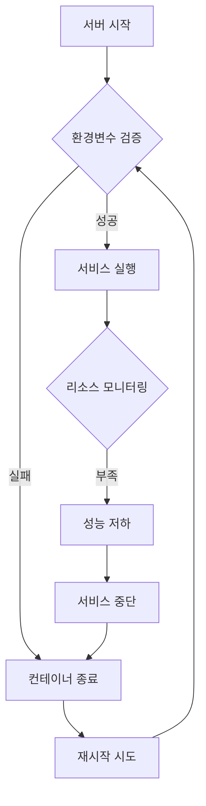

# 🚨 백엔드 서버 안정성 분석 및 대응 방안 (2025-05-27)

## 📋 긴급 상황 개요

### 🎯 문제 상황
- **발생 시간**: 2025-05-27 02:00
- **증상**: 백엔드 서버 완전 무응답 (31.220.83.213:8000)
- **에러 메시지**: "인증 실패: 네트워크 연결을 확인해주세요"
- **영향 범위**: 전체 시스템 기능 중단

### 🔍 근본 원인 분석

#### 1차 원인: SUPABASE_SERVICE_KEY 문제
```
환경변수 상태:
- SUPABASE_URL: ✅ 설정됨
- SUPABASE_ANON_KEY: ✅ 설정됨  
- SUPABASE_SERVICE_KEY: ❌ 플레이스홀더 값
- JWT_SECRET: ✅ 설정됨
- PORT: ✅ 설정됨
```

#### 2차 원인: Docker 컨테이너 상태 불안정
```
Docker 상태 추정:
- 컨테이너 시작 실패 (환경변수 오류)
- 자동 재시작 실패
- 로그 누적으로 인한 리소스 부족 가능성
```

#### 3차 원인: 서버 리소스 관리 부족
```
서버 모니터링 부재:
- 메모리 사용량 모니터링 없음
- CPU 사용률 추적 없음
- 디스크 공간 확인 없음
- 자동 복구 메커니즘 없음
```

## 🎯 반복 발생 원인 분석

### 📊 패턴 분석
1. **환경변수 의존성**: 서버 시작 시 필수 환경변수 누락
2. **수동 관리**: 자동화된 모니터링 및 복구 시스템 부재
3. **에러 처리 부족**: 실패 시 적절한 로깅 및 알림 없음
4. **리소스 제한 없음**: Docker 컨테이너 리소스 제한 미설정

### 🔄 장애 발생 사이클


## 🛠️ 즉시 복구 계획 (Phase 1)

### ⏰ 긴급 복구 (30분)
1. **환경변수 수정** (10분)
   - SSH 접속: `ssh root@31.220.83.213`
   - 환경변수 파일 수정
   - SUPABASE_SERVICE_KEY 실제 값 설정

2. **Docker 서비스 재시작** (10분)
   - 기존 컨테이너 정리: `docker-compose down`
   - 새로운 컨테이너 시작: `docker-compose up -d --build`
   - 로그 확인: `docker-compose logs -f`

3. **연결 테스트** (10분)
   - Health Check: `curl http://31.220.83.213:8000/health`
   - API 테스트: 로그인 및 데이터 조회
   - 프론트엔드 연결 확인

### 📋 복구 체크리스트
- [ ] SSH 접속 성공
- [ ] 환경변수 파일 백업
- [ ] SUPABASE_SERVICE_KEY 업데이트
- [ ] Docker 컨테이너 재시작
- [ ] Health Check 통과
- [ ] API 엔드포인트 정상 응답
- [ ] 프론트엔드 로그인 성공

## 🔧 안정화 방안 (Phase 2)

### 1. 모니터링 시스템 구축
```yaml
# docker-compose.monitoring.yml
version: '3.8'
services:
  backend:
    image: christmas-backend
    healthcheck:
      test: ["CMD", "curl", "-f", "http://localhost:8000/health"]
      interval: 30s
      timeout: 10s
      retries: 3
      start_period: 40s
    restart: unless-stopped
    deploy:
      resources:
        limits:
          cpus: '1.0'
          memory: 512M
        reservations:
          cpus: '0.5'
          memory: 256M
```

### 2. 자동 복구 스크립트
```bash
#!/bin/bash
# scripts/auto-recovery.sh

check_backend_health() {
    response=$(curl -s -o /dev/null -w "%{http_code}" http://localhost:8000/health)
    if [ "$response" != "200" ]; then
        echo "Backend unhealthy, restarting..."
        docker-compose restart backend
        sleep 30
        
        # 재시작 후 재확인
        response=$(curl -s -o /dev/null -w "%{http_code}" http://localhost:8000/health)
        if [ "$response" != "200" ]; then
            echo "Critical: Backend restart failed"
            # 알림 발송 (Telegram, Email 등)
        fi
    fi
}

# 5분마다 실행
while true; do
    check_backend_health
    sleep 300
done
```

### 3. 환경변수 검증 시스템
```javascript
// backend/config/validateEnv.js
const requiredEnvVars = [
    'SUPABASE_URL',
    'SUPABASE_ANON_KEY', 
    'SUPABASE_SERVICE_KEY',
    'JWT_SECRET',
    'PORT'
];

const validateEnvironment = () => {
    const missing = requiredEnvVars.filter(envVar => !process.env[envVar]);
    
    if (missing.length > 0) {
        console.error('Missing required environment variables:', missing);
        process.exit(1);
    }
    
    // 플레이스홀더 값 검증
    const placeholders = [
        'your-supabase-service-role-key',
        'your-jwt-secret',
        'placeholder'
    ];
    
    for (const envVar of requiredEnvVars) {
        if (placeholders.includes(process.env[envVar])) {
            console.error(`Environment variable ${envVar} contains placeholder value`);
            process.exit(1);
        }
    }
    
    console.log('✅ All environment variables validated');
};

module.exports = { validateEnvironment };
```

## 📊 장기 안정화 전략 (Phase 3)

### 1. 인프라 개선
- **로드 밸런서**: 다중 인스턴스 운영
- **데이터베이스 연결 풀**: 안정적인 DB 연결 관리
- **캐싱 레이어**: Redis 도입으로 성능 향상
- **백업 시스템**: 자동 백업 및 복구 시스템

### 2. 모니터링 대시보드
```javascript
// 모니터링 지표
const metrics = {
    server: {
        uptime: 'process.uptime()',
        memory: 'process.memoryUsage()',
        cpu: 'process.cpuUsage()'
    },
    application: {
        activeConnections: 'connectionCount',
        requestsPerMinute: 'requestCounter',
        errorRate: 'errorCounter'
    },
    database: {
        connectionPool: 'poolStatus',
        queryTime: 'avgQueryTime',
        activeQueries: 'activeQueryCount'
    }
};
```

### 3. 알림 시스템
```javascript
// 알림 설정
const alertThresholds = {
    memory: 80, // 80% 이상
    cpu: 70,    // 70% 이상
    errorRate: 5, // 5% 이상
    responseTime: 2000 // 2초 이상
};

const sendAlert = (type, message) => {
    // Telegram 알림
    // Email 알림
    // Slack 알림
};
```

## 🎯 예방 조치

### 1. 개발 프로세스 개선
- **환경변수 템플릿**: `.env.example` 파일 관리
- **Docker Health Check**: 모든 서비스에 헬스체크 추가
- **CI/CD 파이프라인**: 자동 배포 및 테스트
- **스테이징 환경**: 프로덕션 배포 전 검증

### 2. 문서화 강화
- **운영 매뉴얼**: 장애 대응 절차서
- **모니터링 가이드**: 지표 해석 및 대응 방법
- **복구 스크립트**: 자동화된 복구 도구

### 3. 팀 교육
- **장애 대응 훈련**: 정기적인 모의 훈련
- **모니터링 교육**: 지표 분석 및 대응 방법
- **자동화 도구**: 운영 도구 사용법 교육

## 📋 실행 계획

### 즉시 실행 (오늘)
1. **긴급 복구**: 백엔드 서버 재시작
2. **모니터링 스크립트**: 기본 헬스체크 구현
3. **환경변수 검증**: 시작 시 검증 로직 추가

### 단기 계획 (1주일)
1. **자동 복구 시스템**: 무인 모니터링 및 복구
2. **알림 시스템**: 장애 발생 시 즉시 알림
3. **리소스 제한**: Docker 리소스 관리

### 중기 계획 (1개월)
1. **모니터링 대시보드**: 실시간 상태 확인
2. **백업 시스템**: 자동 백업 및 복구
3. **성능 최적화**: 병목 지점 개선

## 📊 성공 지표

### 기술적 지표
- **서버 가동률**: 99.9% 이상
- **평균 응답 시간**: 500ms 이하
- **장애 복구 시간**: 5분 이하
- **무인 복구율**: 90% 이상

### 운영 지표
- **장애 발생 빈도**: 월 1회 이하
- **사용자 불만**: 0건
- **데이터 손실**: 0건
- **보안 사고**: 0건

---
**📅 작성일**: 2025-05-27 02:05  
**👤 작성자**: PM AI Assistant  
**🔄 상태**: 긴급 분석 완료  
**📊 우선순위**: Critical - 즉시 실행 필요 