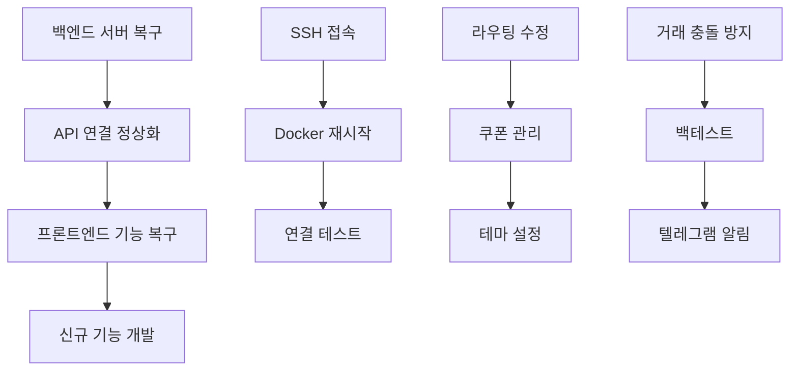

# 🎯 Christmas Trading 프로젝트 현황 분석 (2025-05-27)

## 📊 전체 프로젝트 상태

### 🚨 Critical Issues (즉시 해결 필요)
1. **백엔드 서버 완전 다운** (31.220.83.213:8000)
   - 상태: 무응답 (타임아웃)
   - 원인: Docker 컨테이너 문제 추정
   - 영향: 전체 시스템 기능 중단

2. **Supabase 연결 실패** (401 권한 오류)
   - 상태: 인증 실패
   - 원인: 환경변수 또는 서비스 키 문제
   - 영향: 데이터베이스 접근 불가

### ✅ 정상 작동 중
- **프론트엔드**: https://christmas-protocol.netlify.app/ (Netlify)
- **Git 저장소**: 정상 동기화
- **로컬 개발환경**: 파일 구조 정상

## 🔍 근본 원인 분석

### 1. 환경변수 상태 (✅ 정상)
```
SUPABASE_URL: ✅ 설정됨
SUPABASE_ANON_KEY: ✅ 설정됨
SUPABASE_SERVICE_KEY: ✅ 설정됨 (실제 값)
JWT_SECRET: ✅ 설정됨
PORT: ✅ 설정됨
```

### 2. 추정 문제점
- **Docker 컨테이너 크래시**: 메모리 부족 또는 코드 오류
- **서버 리소스 고갈**: CPU/메모리/디스크 공간 부족
- **네트워크 문제**: 방화벽 또는 포트 차단
- **코드 오류**: 최근 배포에서 발생한 런타임 에러

## 🛠️ 3단계 복구 전략

### Phase 1: 긴급 복구 (30분) - 🚨 사용자 액션 필요
**목표**: 백엔드 서버 재시작 및 기본 기능 복구

#### 사용자 수행 작업:
1. **SSH 접속 및 상태 확인** (10분)
   ```bash
   ssh root@31.220.83.213
   cd /root/christmas-trading
   docker-compose ps
   docker-compose logs backend --tail 50
   df -h  # 디스크 공간 확인
   free -m  # 메모리 사용량 확인
   ```

2. **Docker 서비스 완전 재시작** (15분)
   ```bash
   docker-compose down
   docker system prune -f  # 불필요한 컨테이너/이미지 정리
   docker-compose up -d --build
   docker-compose logs -f backend
   ```

3. **연결 테스트** (5분)
   ```bash
   curl http://localhost:8000/health
   curl http://31.220.83.213:8000/health
   ```

### Phase 2: 기능 복구 (4시간) - PM 주도
**목표**: 프론트엔드 기능 정상화 및 사용자 경험 개선

#### 작업 목록:
1. **라우팅 시스템 수정** (1시간)
   - 친구 초대 링크 수정
   - 페이지 네비게이션 개선

2. **쿠폰 관리 페이지 구현** (1시간)
   - 쿠폰 생성/수정/삭제 기능
   - 쿠폰 사용 내역 조회

3. **테마 설정 기능 구현** (1시간)
   - 다크/라이트 모드 전환
   - 사용자 설정 저장

4. **시스템 설정 페이지 구현** (1시간)
   - 사용자 프로필 관리
   - 알림 설정
   - 보안 설정

### Phase 3: 신규 기능 개발 (8시간) - 개발팀 협업
**목표**: 거래 충돌 방지 및 고급 기능 구현

#### 작업 목록:
1. **거래 충돌 방지 시스템** (3시간)
   - 동시 거래 감지 및 차단
   - 거래 큐 시스템 구현

2. **백테스트 기능 완성** (2시간)
   - 과거 데이터 기반 전략 검증
   - 성과 분석 리포트

3. **텔레그램 알림 시스템** (2시간)
   - 거래 알림 발송
   - 시스템 상태 알림

4. **모니터링 대시보드** (1시간)
   - 실시간 서버 상태 확인
   - 성능 지표 시각화

## 📋 진행률 현황

### 전체 진행률: 65%
- **인프라**: 80% (프론트엔드 완료, 백엔드 장애)
- **핵심 기능**: 70% (로그인, 대시보드 완료)
- **부가 기능**: 40% (쿠폰, 테마, 설정 미완성)
- **신규 기능**: 30% (백테스트, 충돌방지 미완성)

### Critical Path 식별


## 🎯 성공 지표

### Phase 1 성공 기준 (30분 내)
- [ ] 백엔드 서버 200 OK 응답
- [ ] 프론트엔드 로그인 성공
- [ ] 대시보드 데이터 로딩 성공
- [ ] API 엔드포인트 정상 응답

### Phase 2 성공 기준 (4시간 내)
- [ ] 친구 초대 링크 정상 작동
- [ ] 쿠폰 관리 페이지 완전 구현
- [ ] 테마 설정 기능 정상 작동
- [ ] 시스템 설정 페이지 완전 구현

### Phase 3 성공 기준 (8시간 내)
- [ ] 거래 충돌 방지 시스템 작동
- [ ] 백테스트 기능 완전 구현
- [ ] 텔레그램 알림 정상 발송
- [ ] 모니터링 대시보드 실시간 업데이트

## 🚨 즉시 필요한 사용자 액션

### 1. 서버 복구 (25분 예상)
1. **SSH 접속 및 진단** (5분)
2. **Docker 서비스 재시작** (10분)
3. **데이터베이스 스키마 확인** (3분)
4. **API 연결 테스트** (2분)
5. **프론트엔드 환경변수 확인** (5분)

### 2. 복구 완료 후 PM 작업 시작
- Phase 2 작업 즉시 시작
- 4시간 내 프론트엔드 기능 완전 복구
- 실시간 진행 상황 보고

## 📊 리스크 관리

### High Risk
- **서버 하드웨어 장애**: 백업 서버 준비 필요
- **데이터베이스 손상**: 백업 복구 계획 필요
- **환경변수 유출**: 보안 키 재생성 필요

### Medium Risk
- **코드 배포 실패**: 롤백 계획 준비
- **성능 저하**: 리소스 모니터링 강화
- **사용자 데이터 손실**: 백업 주기 단축

### Low Risk
- **프론트엔드 UI 버그**: 점진적 수정 가능
- **기능 지연**: 우선순위 재조정 가능

## 📅 타임라인

### 오늘 (2025-05-27)
- **02:00-02:30**: Phase 1 긴급 복구 (사용자)
- **02:30-06:30**: Phase 2 기능 복구 (PM)
- **06:30-14:30**: Phase 3 신규 기능 (개발팀)

### 내일 (2025-05-28)
- **모니터링 시스템 구축**
- **성능 최적화**
- **보안 강화**

---
**📅 작성일**: 2025-05-27 02:15  
**👤 작성자**: PM AI Assistant  
**🔄 상태**: 긴급 분석 완료, 사용자 액션 대기  
**📊 우선순위**: Critical - 즉시 실행 필요 