# 🏗️ Christmas Trading 프로젝트 구조도

## 📊 전체 시스템 아키텍처

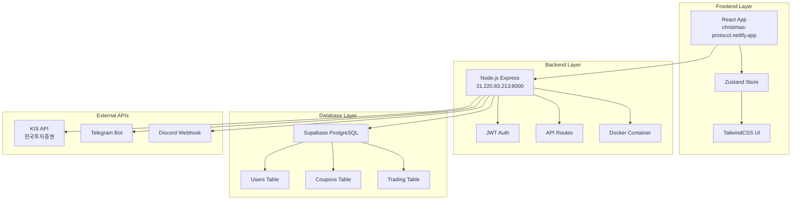

## 📁 디렉토리 구조 상세

```
christmas/
├── 📂 backend/                     # 백엔드 서버 (Node.js)
│   ├── 📄 .env                     # 환경변수 (실제 파일)
│   ├── 📄 env.txt                  # 환경변수 참조용
│   ├── 📄 package.json             # 백엔드 의존성
│   ├── 📄 server.js                # 메인 서버 파일
│   ├── 📂 src/
│   │   ├── 📂 routes/              # API 라우트
│   │   │   ├── 📄 auth.js          # 인증 API
│   │   │   ├── 📄 coupons.js       # 쿠폰 API
│   │   │   ├── 📄 trading.js       # 거래 API
│   │   │   └── 📄 referrals.js     # 리퍼럴 API
│   │   ├── 📂 middleware/          # 미들웨어
│   │   │   ├── 📄 auth.js          # 인증 미들웨어
│   │   │   └── 📄 cors.js          # CORS 설정
│   │   ├── 📂 services/            # 비즈니스 로직
│   │   │   ├── 📄 supabase.js      # Supabase 연결
│   │   │   ├── 📄 kis-api.js       # KIS API 연동
│   │   │   └── 📄 telegram.js      # 텔레그램 봇
│   │   └── 📂 utils/               # 유틸리티
│   │       ├── 📄 jwt.js           # JWT 토큰 관리
│   │       └── 📄 validation.js    # 입력 검증
│   └── 📄 Dockerfile               # Docker 설정
│
├── 📂 web-dashboard/               # 프론트엔드 (React)
│   ├── 📄 package.json             # 프론트엔드 의존성
│   ├── 📄 vite.config.js           # Vite 설정
│   ├── 📄 tailwind.config.js       # TailwindCSS 설정
│   ├── 📂 src/
│   │   ├── 📄 main.jsx             # 메인 엔트리
│   │   ├── 📄 App.jsx              # 메인 앱 컴포넌트
│   │   ├── 📂 components/          # React 컴포넌트
│   │   │   ├── 📄 Login.jsx        # 로그인 컴포넌트
│   │   │   ├── 📄 Dashboard.jsx    # 대시보드
│   │   │   ├── 📄 Trading.jsx      # 거래 화면
│   │   │   └── 📄 Coupons.jsx      # 쿠폰 관리
│   │   ├── 📂 stores/              # Zustand 스토어
│   │   │   ├── 📄 authStore.js     # 인증 상태
│   │   │   ├── 📄 tradingStore.js  # 거래 상태
│   │   │   └── 📄 couponStore.js   # 쿠폰 상태
│   │   ├── 📂 services/            # API 서비스
│   │   │   ├── 📄 api.js           # API 클라이언트
│   │   │   ├── 📄 auth.js          # 인증 서비스
│   │   │   └── 📄 trading.js       # 거래 서비스
│   │   └── 📂 styles/              # 스타일
│   │       └── 📄 globals.css      # 글로벌 CSS
│   └── 📂 dist/                    # 빌드 결과물
│
├── 📂 docs/                        # PM 문서 모음
│   ├── 📄 RAG_Knowledge_Base.md    # 지식 베이스
│   ├── 📄 WBS_Christmas_Trading_Migration.md  # WBS 문서
│   ├── 📄 PM_Current_Issue_Analysis.md        # 이슈 분석
│   ├── 📄 PM_Server_Status_Report.md          # 서버 상태
│   └── 📄 Project_Structure_Map.md             # 이 문서
│
├── 📂 scripts/                     # 자동화 스크립트
│   ├── 📄 fix-backend-server.ps1   # 서버 복구 가이드
│   ├── 📄 verify-backend-recovery.ps1  # 복구 검증
│   └── 📄 create-supabase-tables.sql   # DB 테이블 생성
│
├── 📂 supabase/                    # Supabase 설정
│   ├── 📄 config.toml              # Supabase 설정
│   └── 📂 migrations/              # DB 마이그레이션
│
├── 📂 monitoring/                  # 모니터링 설정
│   ├── 📄 prometheus.yml           # Prometheus 설정
│   └── 📄 grafana-dashboard.json   # Grafana 대시보드
│
├── 📂 nginx/                       # Nginx 설정
│   └── 📄 nginx.conf               # 리버스 프록시 설정
│
├── 📄 docker-compose.yml           # Docker Compose 설정
├── 📄 netlify.toml                 # Netlify 배포 설정
├── 📄 package.json                 # 루트 패키지 설정
└── 📄 README.md                    # 프로젝트 설명서
```

## 🔄 데이터 플로우

### 1. 사용자 인증 플로우
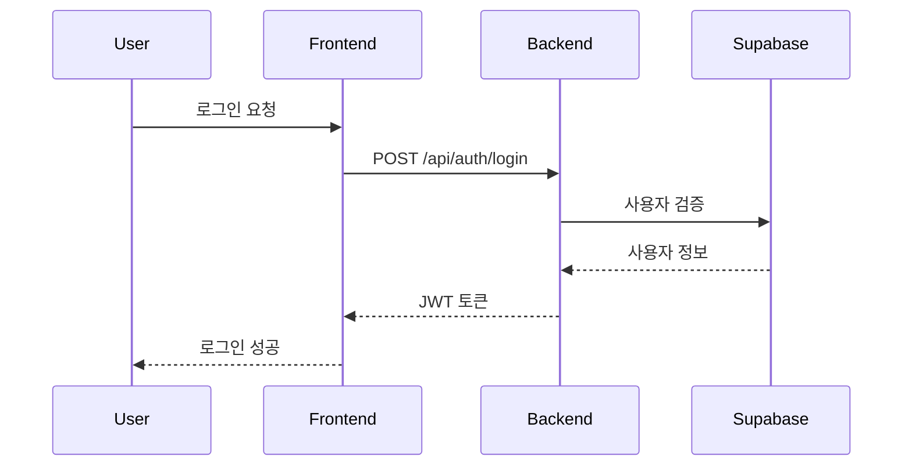

### 2. 거래 주문 플로우
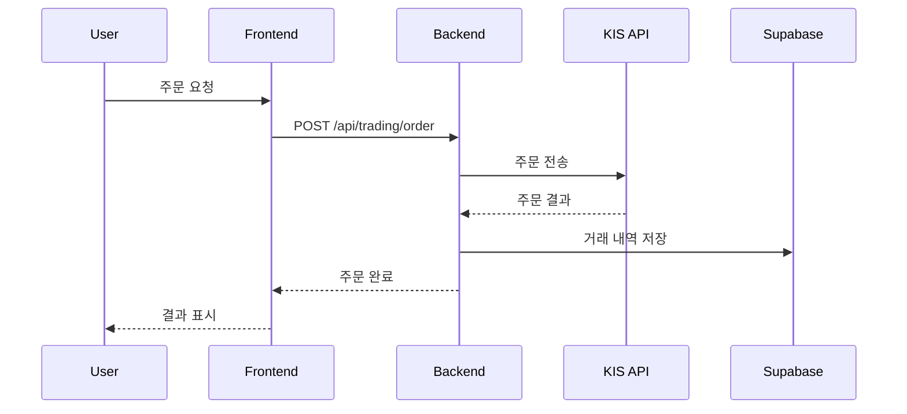

### 3. 쿠폰 사용 플로우
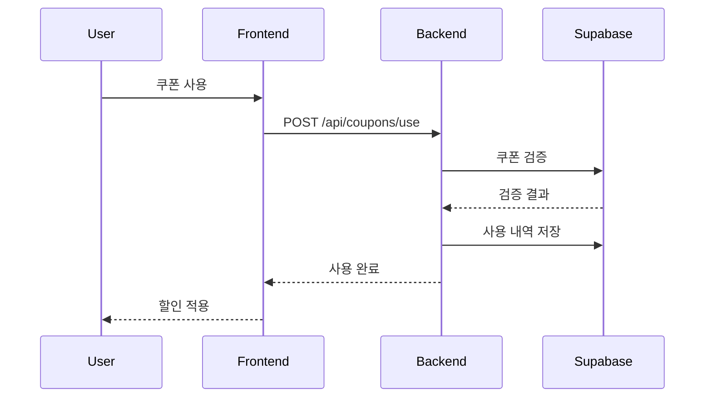

## 🌐 네트워크 아키텍처

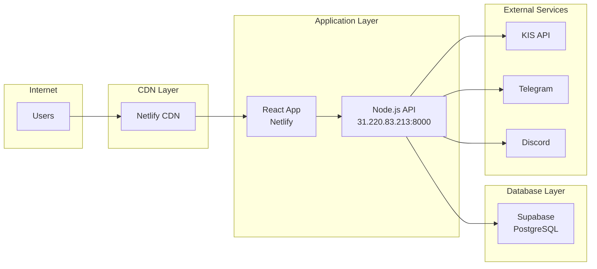

## 🔐 보안 아키텍처

### 인증 및 권한 관리
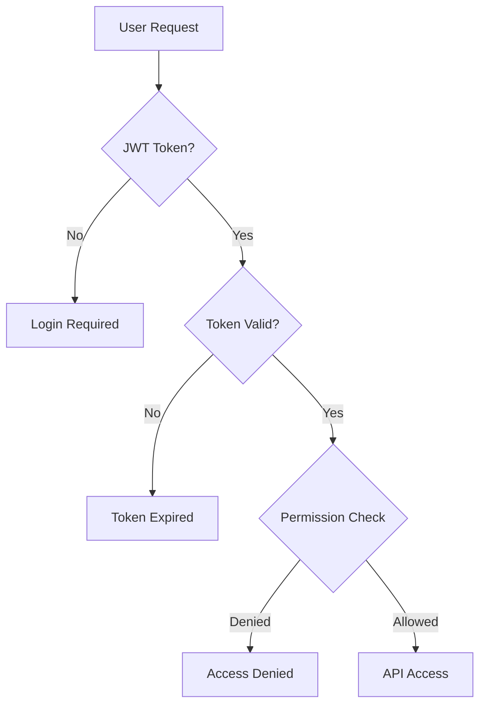

### 데이터 보안 계층
1. **전송 계층**: HTTPS/TLS 암호화
2. **인증 계층**: JWT 토큰 기반 인증
3. **권한 계층**: Role-based Access Control
4. **데이터 계층**: Supabase RLS (Row Level Security)

## 📊 성능 아키텍처

### 캐싱 전략
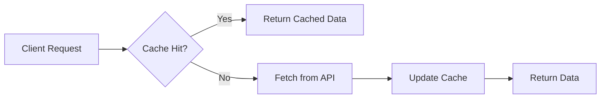

### 로드 밸런싱
- **프론트엔드**: Netlify CDN 자동 분산
- **백엔드**: 단일 서버 (향후 확장 예정)
- **데이터베이스**: Supabase 자동 스케일링

## 🔧 개발 환경 구성

### 로컬 개발 환경
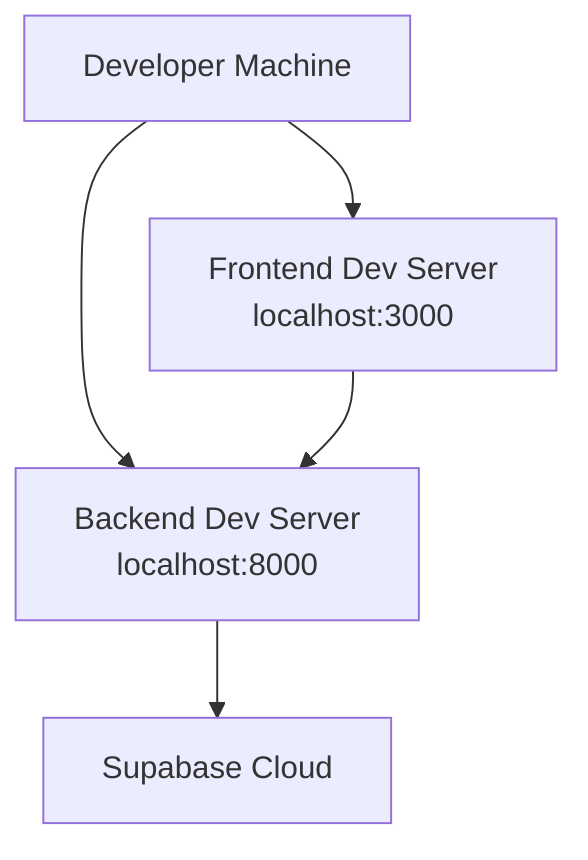

### 프로덕션 환경
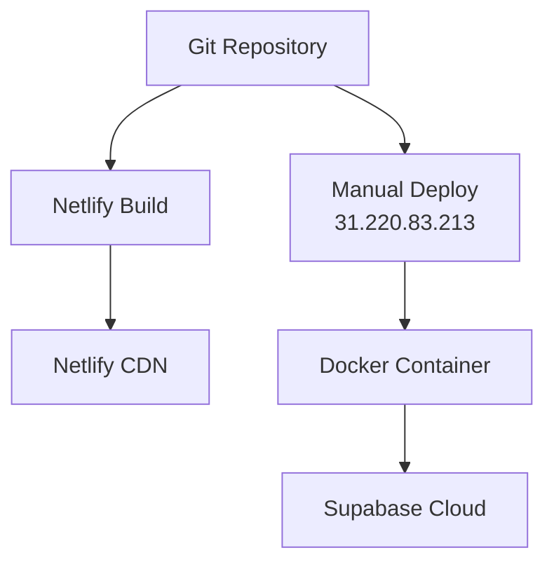

## 📈 모니터링 아키텍처

### 로그 수집 플로우
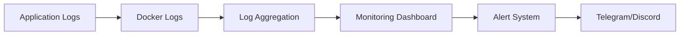

### 메트릭 수집
- **응답 시간**: API 엔드포인트별 측정
- **에러율**: HTTP 상태 코드 기반
- **사용자 활동**: 로그인, 거래 횟수
- **시스템 리소스**: CPU, 메모리, 디스크

## 🚀 배포 파이프라인

### 프론트엔드 배포
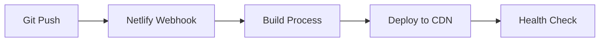

### 백엔드 배포
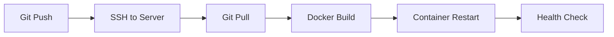

## 📞 서비스 의존성

### 외부 서비스 의존성
- **Supabase**: 데이터베이스 및 인증
- **KIS API**: 주식 거래 데이터
- **Netlify**: 프론트엔드 호스팅
- **Contabo VPS**: 백엔드 서버 호스팅
- **Telegram**: 알림 서비스
- **Discord**: 팀 커뮤니케이션

### 내부 서비스 의존성
- Frontend → Backend API
- Backend → Supabase Database
- Backend → KIS API
- Backend → Notification Services

---
**📅 최종 업데이트**: 2025-05-26 19:20  
**👤 작성자**: PM AI Assistant  
**🔄 버전**: v1.0  
**📊 상태**: 활성 - 지속 업데이트 중 