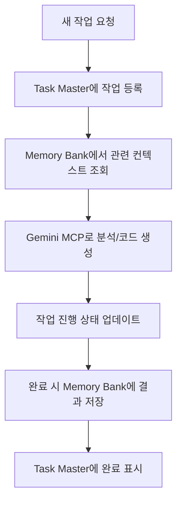

# 🔗 Christmas Trading - MCP 통합 가이드

## 📅 **작성일**: 2025-06-28 UTC
## 🎯 **상태**: Task Master & Memory Bank MCP 통합 완료

---

## 🎯 **MCP 통합 개요**

Christmas Trading 프로젝트는 체계적인 개발과 메모리 관리를 위해 다음 3개의 MCP 서버를 통합했습니다:

1. **Gemini MCP** - AI 분석 및 코드 생성
2. **Task Master MCP** - 체계적 작업 관리
3. **Memory Bank MCP** - 프로젝트 메모리 및 컨텍스트 관리

---

## 🏗️ **MCP 서버 구성**

### **1. Gemini MCP Server**
- **파일**: `gemini_mcp_server.py`
- **기능**: AI 기반 시장 분석, 거래 전략 최적화, 코드 생성
- **도구들**:
  - `analyze_market_data`: 시장 데이터 분석
  - `predict_stock_movement`: 주식/암호화폐 움직임 예측
  - `assess_investment_risk`: 투자 리스크 평가
  - `optimize_trading_strategy`: 거래 전략 최적화
  - `generate_trading_code`: 거래 코드 생성

### **2. Task Master MCP**
- **파일**: `task-master-integration.py`
- **데이터베이스**: `.task-master.db` (SQLite)
- **기능**: 체계적 작업 관리, 진행 상황 추적, 일일 보고서
- **주요 기능**:
  - 작업 생성/업데이트/상태 관리
  - 프로젝트 진행 상황 추적
  - 일일/주간 보고서 생성
  - 작업 우선순위 관리

### **3. Memory Bank MCP**
- **파일**: `memory-bank-integration.py`
- **데이터베이스**: `.memory-bank.db` (SQLite)
- **기능**: 프로젝트 메모리 관리, 기술적 결정사항 보존
- **카테고리**:
  - `technical`: 기술적 구현 사항
  - `decision`: 중요한 결정사항
  - `issue`: 문제 및 해결책
  - `solution`: 솔루션 기록
  - `context`: 프로젝트 컨텍스트

---

## 🔧 **설정 및 사용법**

### **환경 설정**
```bash
# MCP 설정 파일
cp mcp-config.json ~/.config/mcp/settings.json

# 환경 변수 설정
export GEMINI_API_KEY="your_gemini_api_key"
export GIT_REPOSITORY="/root/dev/christmas-trading"
export PROJECT_NAME="Christmas Trading"
```

### **Task Master 사용법**
```python
from task_master_integration import TaskMasterMCP

# Task Master 초기화
task_master = TaskMasterMCP()

# 프로젝트 상태 확인
status = task_master.get_project_status()

# 일일 보고서 생성
daily_report = task_master.get_daily_report()
```

### **Memory Bank 사용법**
```python
from memory_bank_integration import MemoryBankMCP

# Memory Bank 초기화
memory_bank = MemoryBankMCP()

# 메모리 검색
memories = memory_bank.search_memories("UI", "technical")

# 컨텍스트 보고서
context_report = memory_bank.generate_context_report()
```

---

## 📊 **현재 상태 (2025-06-28)**

### **Task Master 현황**
- **총 작업 수**: 4개
- **완료**: 1개 (Phase 3 문서 업데이트)
- **진행 중**: 1개 (MCP 통합)
- **대기**: 2개 (Gemini MCP 검증, Memory Bank 설정)
- **전체 진행률**: 45%

### **Memory Bank 현황**
- **총 메모리**: 5개
- **기술적 메모리**: 3개 (중요도 8-10)
- **결정사항**: 1개 (사용자 피드백 반영)
- **컨텍스트**: 1개 (MCP 통합 전략)
- **프로젝트 컨텍스트**: 5개

### **주요 보존된 메모리**
1. **Phase 3 UI 완료** - frontend.png 100% 구현
2. **바이낸스 API 연동** - Private API 완전 연동
3. **Vercel 배포 최적화** - 번들 분할 완료
4. **사용자 피드백 반영** - 체계적 접근 방식
5. **MCP 통합 전략** - Task Master & Memory Bank

---

## 🔄 **워크플로우 통합**

### **개발 워크플로우**


### **문서 업데이트 프로세스**
1. **Task Master**에서 문서 업데이트 작업 생성
2. **Memory Bank**에서 기존 결정사항 및 컨텍스트 확인
3. **Gemini MCP**로 문서 내용 최적화
4. **Memory Bank**에 업데이트 내용 기록
5. **Task Master**에서 완료 상태로 변경

---

## 📋 **MCP 도구 참조**

### **Gemini MCP 도구들**
| 도구명 | 용도 | 입력 파라미터 |
|--------|------|---------------|
| `analyze_market_data` | 시장 데이터 분석 | market_data, analysis_type |
| `predict_stock_movement` | 가격 움직임 예측 | symbol, indicators |
| `assess_investment_risk` | 리스크 평가 | investment_plan, market_conditions |
| `optimize_trading_strategy` | 전략 최적화 | strategy, performance |
| `generate_trading_code` | 코드 생성 | requirements, language, framework |

### **Task Master 메서드들**
| 메서드명 | 용도 | 반환값 |
|----------|------|--------|
| `create_task()` | 새 작업 생성 | boolean |
| `update_task_status()` | 작업 상태 업데이트 | boolean |
| `get_project_status()` | 프로젝트 전체 상태 | dict |
| `get_daily_report()` | 일일 보고서 생성 | dict |

### **Memory Bank 메서드들**
| 메서드명 | 용도 | 반환값 |
|----------|------|--------|
| `add_memory()` | 새 메모리 추가 | boolean |
| `search_memories()` | 메모리 검색 | list[dict] |
| `get_memory_summary()` | 메모리 요약 | dict |
| `generate_context_report()` | 컨텍스트 보고서 | dict |

---

## 🛡️ **보안 및 관리**

### **데이터베이스 보안**
- SQLite 데이터베이스는 로컬 파일시스템에 저장
- 민감한 정보는 환경 변수로 관리
- 정기적인 백업 권장

### **API 키 관리**
```bash
# Gemini API 키 (필수)
export GEMINI_API_KEY="your_gemini_api_key"

# 기타 환경 변수
export GIT_REPOSITORY="/root/dev/christmas-trading"
export PROJECT_NAME="Christmas Trading"
```

### **로그 관리**
- 모든 MCP 서버는 `/root/dev/christmas-trading/logs/` 디렉토리에 로그 저장
- 로그 레벨: INFO, ERROR
- 자동 로그 로테이션 권장

---

## 🔧 **문제 해결**

### **일반적인 문제들**

#### **1. Database is locked 오류**
```bash
# 해결방법: SQLite 연결 풀 관리
# task-master-integration.py에서 connection 관리 개선 필요
```

#### **2. Gemini API 키 오류**
```bash
# 확인사항
echo $GEMINI_API_KEY
# 키가 없으면 설정
export GEMINI_API_KEY="your_api_key_here"
```

#### **3. MCP 서버 연결 실패**
```bash
# MCP 서버 상태 확인
python gemini_mcp_server.py
python task-master-integration.py
python memory-bank-integration.py
```

---

## 📈 **성능 모니터링**

### **Task Master 메트릭스**
- 총 작업 수
- 완료율
- 평균 작업 소요 시간
- 우선순위별 분포

### **Memory Bank 메트릭스**
- 메모리 항목 수
- 카테고리별 분포
- 검색 빈도
- 컨텍스트 업데이트 빈도

### **Gemini MCP 메트릭스**
- API 호출 수
- 응답 시간
- 성공률
- 사용된 토큰 수

---

## 🚀 **다음 단계**

### **Phase 4: 고급 MCP 기능**
1. **실시간 협업**: MCP 서버 간 실시간 데이터 동기화
2. **지능형 작업 추천**: Memory Bank 기반 자동 작업 제안
3. **성능 최적화**: 메모리 캐싱 및 쿼리 최적화
4. **웹 인터페이스**: MCP 상태를 위한 웹 대시보드

### **통합 개선 사항**
- MCP 서버 간 의존성 관리
- 자동 백업 시스템
- 실시간 알림 시스템
- 성능 모니터링 대시보드

---

## 📚 **참조 문서**

- **[Gemini MCP Server](../../../gemini_mcp_server.py)** - AI 분석 서버
- **[Task Master Integration](../../../task-master-integration.py)** - 작업 관리 시스템
- **[Memory Bank Integration](../../../memory-bank-integration.py)** - 메모리 관리 시스템
- **[MCP Configuration](../../../mcp-config.json)** - MCP 설정 파일

---

**🎯 목표**: 체계적이고 지속 가능한 개발 환경 구축  
**📈 현재 상태**: Task Master & Memory Bank MCP 통합 완료  
**🔄 다음 단계**: Gemini MCP 검증 및 고급 기능 구현

*MCP 통합 완료: 2025-06-28 UTC*