# 🎄 Christmas Trading - PM 프로젝트 관리 보고서

## 📅 **보고서 작성일**: 2025-06-24 UTC

---

## 📊 **프로젝트 현황 분석 (Mermaid 차트)**

### **바이낸스 암호화폐 플랫폼 구조**

```mermaid
graph TB
    A[🎄 Christmas Trading - 바이낸스 플랫폼] --> B[Frontend - Vercel]
    A --> C[바이낸스 API 통합]
    A --> D[Database - Supabase]
    
    B --> B1[React 18 + TypeScript]
    B --> B2[Chart.js 암호화폐 차트]
    B --> B3[Dark/Light 모드]
    B --> B4[암호화폐 포트폴리오]
    
    C --> C1[바이낸스 REST API]
    C --> C2[바이낸스 WebSocket]
    C --> C3[HMAC SHA256 인증]
    C --> C4[Rate Limiting 관리]
    
    D --> D1[사용자 관리]
    D --> D2[암호화폐 포트폴리오]
    D --> D3[암호화폐 거래 내역]
    D --> D4[24/7 실시간 시세 데이터]
    
    style C fill:#fff3e0
    style C1 fill:#e8f5e8
    style C2 fill:#e8f5e8
```


### **바이낸스 전환 진행률**

```mermaid
gantt
    title 바이낸스 암호화폐 거래 플랫폼 완성도
    dateFormat  YYYY-MM-DD
    section Phase 1: 문서 구조
    레거시 백업          :done,    p1a, 2025-06-27, 2025-06-27
    바이낸스 가이드      :done,    p1b, 2025-06-27, 2025-06-27
    환경변수 재설계      :done,    p1c, 2025-06-27, 2025-06-27
    
    section Phase 2: API 통합
    binanceAPI.ts 구현   :done,    p2a, 2025-06-27, 2025-06-27
    메인넷 API 연동      :done,    p2b, 2025-06-27, 2025-06-28
    WebSocket 준비       :done,    p2c, 2025-06-27, 2025-06-28
    
    section Phase 3: UI 전환
    텍스트 암호화폐화    :active,  p3a, 2025-06-28, 2025-06-29
    차트 데이터 전환     :         p3b, 2025-06-29, 2025-06-30
    실시간 연동 완성     :         p3c, 2025-06-30, 2025-07-01
```


---

## 🎯 **핵심 이슈 및 해결 과제**

### **🚨 Critical Issues (즉시 해결 필요)**

#### **1. UI 텍스트 암호화폐 전환** ⭐ **진행 중**
- **현재 상태**: 백엔드는 바이낸스, UI는 여전히 한국주식
- **필요 작업**: "삼성전자" → "Bitcoin", "KOSPI" → "Crypto Index"
- **담당**: Frontend Team
- **기한**: 24시간 내

#### **2. 실시간 WebSocket 연결 활성화**
- **현재 상태**: binanceWebSocket 구현 완료, 활성화 대기
- **필요 작업**: 실시간 암호화폐 시세 연결
- **담당**: Integration Team
- **기한**: 48시간 내

### **⚡ High Priority Issues**

#### **3. UI 개선 작업**
- **요금제 안내**: 배경색/글자색 변경 필요
- **백테스트 버튼**: 실제 기능 연결 필요
- **친구초대/쿠폰**: 실제 유효성 구현 필요

#### **4. 투자 전략 구현**
- **공격형/중립형/방어형**: 실제 로직 구현
- **지표 적용**: RSI(14), MACD(12,26,9), 볼린저밴드(20σ±2)

### **🛡️ Critical Risk Management**

#### **암호화폐 동시 거래 방지 시스템**

```mermaid
flowchart TD
    A[암호화폐 거래 요청] --> B{심볼 중복 체크}
    B -->|중복 없음| C[바이낸스 주문 실행]
    B -->|중복 발견| D[대안 코인 추천]
    D --> E[다른 거래 쌍 제안]
    D --> F[타이밍 분산 권장]
    D --> G[변동성 경고 제공]
    
    C --> H[SPOT 거래 완료]
    E --> I[BTC → ETH 대안]
    F --> J[1분 지연 권장]
    G --> K[높은 변동성 알림]
    
    I --> H
    J --> H
    K --> H
    
    style C fill:#e8f5e8
    style H fill:#e8f5e8
    style G fill:#fff3e0
```


---

## 📋 **WBS (Work Breakdown Structure)**

### **Phase 1: 기반 인프라 점검 (1-2일)**
```
1.1 환경 설정 점검
  1.1.1 API 키 상태 확인
  1.1.2 환경 변수 검증
  1.1.3 Docker 서버 연결 테스트

1.2 백엔드 서버 검증
  1.2.1 31.220.83.213 서버 상태 점검
  1.2.2 API 엔드포인트 테스트
  1.2.3 데이터베이스 연결 확인
```

### **Phase 2: 핵심 기능 구현 (3-5일)**
```
2.1 한국투자증권 API 연동
  2.1.1 실시간 시세 조회
  2.1.2 주문 접수/체결 처리
  2.1.3 계좌 정보 조회

2.2 거래 로직 구현
  2.2.1 투자 전략별 로직 (공격/중립/방어)
  2.2.2 기술적 지표 연동
  2.2.3 리스크 관리 시스템

2.3 동시 거래 방지 시스템
  2.3.1 종목 중복 방지 로직
  2.3.2 타이밍 분산 알고리즘
  2.3.3 개별 AI 지표 시스템
```

### **Phase 3: UI/UX 완성 (2-3일)**
```
3.1 UI 개선 작업
  3.1.1 요금제 안내 색상 변경
  3.1.2 백테스트 버튼 기능 연결
  3.1.3 친구초대/쿠폰 시스템 구현

3.2 사용자 경험 최적화
  3.2.1 실시간 데이터 표시
  3.2.2 거래 피드백 UI
  3.2.3 포트폴리오 시각화 개선
```

---

## 📚 **필수 문서 체크리스트**

### **✅ 완료된 문서**
- [x] PROJECT_STATUS_SUMMARY.md
- [x] DEVELOPMENT_ROADMAP.md
- [x] SERVER_BACKEND_ARCHITECTURE.md
- [x] SUPABASE_DATABASE_SCHEMA.md
- [x] UNIFIED_PROJECT_VISION.md

### **🔄 작성 필요 문서**
- [ ] **WBS_DETAILED.md** - 상세 작업 분해 구조
- [ ] **API_INTEGRATION_GUIDE.md** - 한국투자증권 API 연동 가이드
- [ ] **RISK_MANAGEMENT_SPEC.md** - 동시 거래 방지 시스템 명세
- [ ] **CODE_QUALITY_GUIDELINES.md** - 코드 품질 가이드라인
- [ ] **TEST_STRATEGY.md** - 테스트 전략 문서
- [ ] **CI_CD_PIPELINE.md** - CI/CD 파이프라인 문서
- [ ] **SECURITY_GUIDELINES.md** - 보안 가이드라인
- [ ] **PERFORMANCE_OPTIMIZATION.md** - 성능 최적화 가이드
- [ ] **TEAM_COLLABORATION.md** - 팀 협업 가이드
- [ ] **DOCUMENT_MAP.md** - 문서 맵

---

## 🔧 **즉시 실행 계획**

### **Step 1: 현재 상태 진단 (30분)**
1. 백엔드 서버 31.220.83.213 연결 테스트
2. API 키 설정 상태 확인
3. Vercel 프론트엔드 상태 점검

### **Step 2: 환경 설정 복구 (1시간)**
1. 필요시 환경 변수 재설정
2. Docker 서비스 상태 점검
3. 데이터베이스 연결 복구

### **Step 3: 기능 구현 시작 (2-3시간)**
1. 한국투자증권 API 연동 테스트
2. 기본 거래 로직 구현
3. UI 개선 작업 시작

---

## 🤝 **Gemini MCP 협업 계획**

### **Task Master MCP 역할**
- WBS 기반 작업 스케줄링
- 진행률 실시간 추적
- 블로커 이슈 자동 감지

### **Memory Bank MCP 역할**
- 기술 스펙 지식 관리
- API 설정 정보 보관
- 의사결정 히스토리 저장

### **검증 절차**
1. 각 Phase 완료 후 기능 테스트
2. 코드 리뷰 및 품질 검증
3. 성능 및 보안 점검
4. 문서 업데이트

---

**🎯 목표: 2주 내 완전한 트레이딩 플랫폼 완성**  
**📊 현재 진행률: 70% → 100% 목표**  
**🚀 다음 단계: 환경 진단 및 API 연동 테스트**

*PM 보고서 작성: 2025-06-24 UTC*