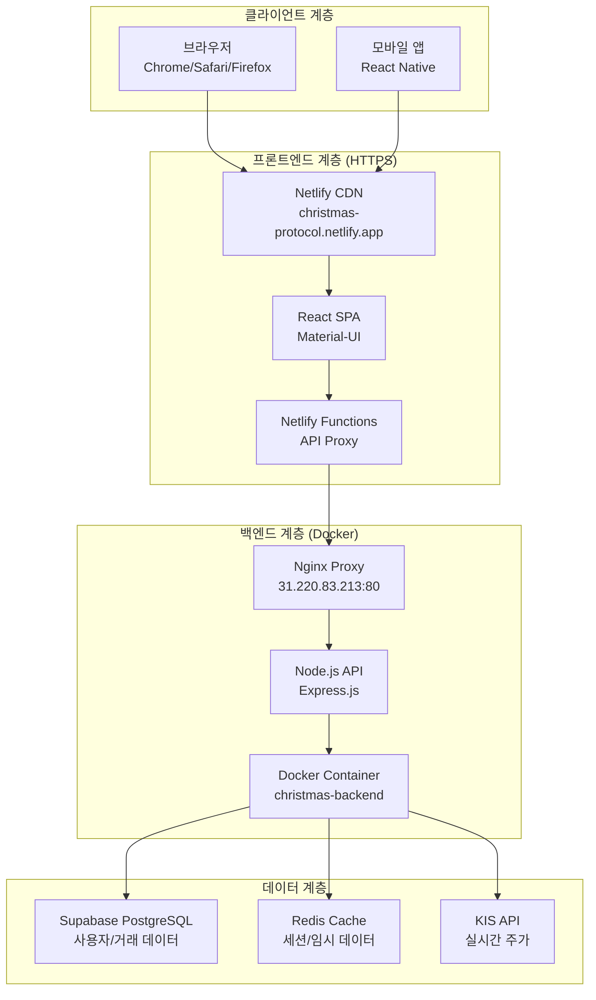

# 🏗️ Christmas Trading System - 프로젝트 아키텍처

**날짜**: 2025-05-30  
**버전**: 2.1.0  
**상태**: ✅ 안정적 운영 중

## 🌐 **시스템 아키텍처 개요**



## 🔄 **데이터 플로우**

### **1. 사용자 인증 플로우**
```
브라우저 → Netlify → Supabase Auth → JWT Token → 로컬 저장
```

### **2. API 호출 플로우 (Mixed Content 해결)**
```
React App → /api/proxy/* → Netlify Functions → HTTP 백엔드 → 응답
     ↓            ↓              ↓               ↓           ↓
   HTTPS       HTTPS          서버리스         HTTP      JSON
```

### **3. 거래 데이터 플로우**
```
KIS API → 백엔드 → Redis Cache → Supabase → 프론트엔드 → 사용자
```

## 🏗️ **기술 스택**

### **Frontend (Netlify)**
- **프레임워크**: React 18.2.0
- **UI 라이브러리**: Material-UI 5.15.0
- **상태 관리**: React Hooks + Context
- **빌드 도구**: Vite 5.4.19
- **배포**: Netlify Serverless
- **도메인**: https://christmas-protocol.netlify.app

### **Backend (Docker)**
- **런타임**: Node.js 18 LTS
- **프레임워크**: Express.js 4.18.0
- **컨테이너**: Docker + Docker Compose
- **프록시**: Nginx (포트 80 → 8000)
- **서버**: 31.220.83.213 (Ubuntu 22.04)

### **Database & External APIs**
- **주 데이터베이스**: Supabase PostgreSQL
- **캐시**: Redis 7-alpine
- **실시간 데이터**: KIS API (한국투자증권)
- **인증**: Supabase Auth (JWT)

### **DevOps & Monitoring**
- **CI/CD**: Netlify Build + Git Integration
- **컨테이너 관리**: Docker Compose
- **모니터링**: Docker Health Checks
- **로그**: Docker Logs + Console

## 🔒 **보안 아키텍처**

### **1. 네트워크 보안**
- **HTTPS 강제**: Netlify CDN SSL/TLS
- **Mixed Content 해결**: Netlify Functions 프록시
- **CORS 설정**: 프론트엔드 도메인만 허용

### **2. 인증 & 권한**
- **사용자 인증**: Supabase Auth (OAuth, Email)
- **API 인증**: JWT Token 기반
- **세션 관리**: 브라우저 LocalStorage + Redis

### **3. 데이터 보안**
- **환경 변수**: Netlify Environment Variables
- **API 키 관리**: 백엔드 서버 측 저장
- **데이터 암호화**: Supabase 기본 암호화

## 📊 **성능 최적화**

### **1. 프론트엔드 최적화**
- **코드 분할**: Vite Dynamic Imports
- **번들 최적화**: vendor, mui, charts 청크 분리
- **CDN 활용**: Netlify Global CDN
- **캐싱**: Browser Cache + CDN Cache

### **2. 백엔드 최적화**
- **API 응답 캐싱**: Redis 활용
- **컨테이너 최적화**: Alpine Linux 기반
- **Health Check**: 자동 복구 메커니즘
- **로드 밸런싱**: Nginx 프록시

### **3. 데이터베이스 최적화**
- **인덱싱**: Supabase 자동 인덱스
- **쿼리 최적화**: 필요한 컬럼만 선택
- **연결 풀링**: Supabase Connection Pooling

## 🔧 **개발 환경**

### **로컬 개발 환경**
```bash
# Frontend
cd web-dashboard
npm run dev        # Vite Dev Server (localhost:3000)

# Backend
cd backend
npm run dev        # Express Dev Server (localhost:8000)
docker-compose up  # 전체 스택 실행
```

### **환경별 설정**
- **Development**: localhost 기반
- **Production**: 
  - Frontend: Netlify
  - Backend: 31.220.83.213 Docker
  - Database: Supabase Cloud

## 📈 **확장성 고려사항**

### **수평 확장**
- **프론트엔드**: Netlify 자동 스케일링
- **백엔드**: Docker Swarm/Kubernetes 준비
- **데이터베이스**: Supabase 자동 스케일링

### **수직 확장**
- **서버 리소스**: CPU/Memory 증설 가능
- **네트워크**: 대역폭 확장 가능
- **스토리지**: SSD 기반 확장 가능

## 🔗 **외부 서비스 의존성**

### **필수 서비스**
1. **Netlify**: 프론트엔드 호스팅 및 Functions
2. **Supabase**: 데이터베이스 및 인증
3. **KIS API**: 실시간 주가 데이터

### **선택적 서비스**
1. **Toss Payments**: 결제 시스템 (구현 예정)
2. **Telegram Bot API**: 알림 시스템
3. **Google Analytics**: 사용자 분석 (구현 예정)

## 📋 **운영 체크리스트**

### **일일 점검**
- [ ] 백엔드 서버 상태 확인
- [ ] API 응답 시간 모니터링
- [ ] 에러 로그 검토
- [ ] 사용자 피드백 확인

### **주간 점검**
- [ ] 시스템 리소스 사용량 분석
- [ ] 보안 업데이트 적용
- [ ] 백업 상태 확인
- [ ] 성능 지표 리뷰

---
**마지막 업데이트**: 2025-05-30 12:20 KST  
**담당자**: DevOps Team  
**다음 리뷰**: 2025-06-06 