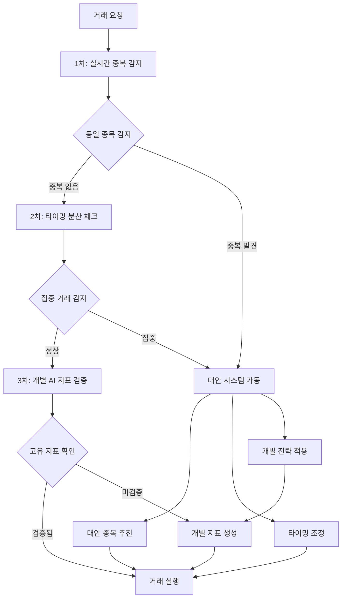

# 🛡️ 동시 거래 방지 및 리스크 관리 시스템 명세

## 📅 **작성일**: 2025-06-24 UTC

---

## 🎯 **핵심 문제 정의**

### **위험 상황 시나리오**
```
시나리오 1: 동일 종목 동시 매수
- 고객 A: 삼성전자 1억원 매수 (오전 9:30)
- 고객 B: 삼성전자 5천만원 매수 (오전 9:30)
- 고객 C: 삼성전자 2억원 매수 (오전 9:30)
→ 결과: 총 3.5억원 동시 매수로 인한 급격한 가격 상승
→ 후속 거래자들이 높은 가격에 매수하게 되어 손실 발생

시나리오 2: 같은 지표 추종으로 인한 집중 거래
- RSI(14) 30 이하 신호로 100명이 동시에 같은 종목 매수
- MACD 골든크로스로 동시에 같은 종목에 집중
→ 결과: 지표 신호 왜곡 및 시장 가격 교란
```

### **예방해야 할 리스크**
1. **시장 가격 왜곡**: 대량 동시 거래로 인한 급격한 가격 변동
2. **고객간 피해**: 먼저 거래한 고객이 유리하고 나중 고객이 불리
3. **지표 신뢰성 손상**: 인위적 가격 변동으로 기술적 분석 무력화
4. **법적 리스크**: 시세 조종 의혹 및 규제 기관 제재

---

## 🏗️ **시스템 아키텍처**

### **다층 방어 시스템**


---

## 🔍 **1차 방어: 실시간 중복 감지 시스템**

### **중복 거래 감지 알고리즘**
```javascript
class ConcurrentTradeDetector {
  private activeOrders: Map<string, OrderInfo[]> = new Map();
  private timeWindow = 30000; // 30초 윈도우
  
  async checkConcurrentTrade(newOrder: OrderRequest): Promise<ConflictResult> {
    const stockCode = newOrder.stockCode;
    const currentTime = Date.now();
    
    // 해당 종목의 최근 30초 내 주문들 조회
    const recentOrders = this.activeOrders.get(stockCode) || [];
    const conflictingOrders = recentOrders.filter(order => 
      currentTime - order.timestamp < this.timeWindow &&
      order.orderType === newOrder.orderType // 같은 매수/매도 방향
    );
    
    if (conflictingOrders.length > 0) {
      return {
        hasConflict: true,
        conflictCount: conflictingOrders.length,
        totalAmount: conflictingOrders.reduce((sum, order) => sum + order.amount, 0),
        riskLevel: this.calculateRiskLevel(conflictingOrders, newOrder)
      };
    }
    
    return { hasConflict: false };
  }
}
```

---

## ⏱️ **2차 방어: 타이밍 분산 시스템**

### **스마트 지연 알고리즘**
```javascript
class TimingDistributionSystem {
  async distributeOrderTiming(orders: OrderRequest[]): Promise<ScheduledOrder[]> {
    const scheduledOrders: ScheduledOrder[] = [];
    
    // 종목별 그룹화
    const groupedByStock = this.groupByStock(orders);
    
    for (const [stockCode, stockOrders] of groupedByStock) {
      // 각 종목별로 시간 분산
      const intervals = this.calculateOptimalIntervals(stockOrders.length);
      
      stockOrders.forEach((order, index) => {
        scheduledOrders.push({
          ...order,
          scheduledTime: Date.now() + intervals[index],
          priority: this.calculatePriority(order),
          reason: `타이밍 분산 (${intervals[index]/1000}초 지연)`
        });
      });
    }
    
    return scheduledOrders.sort((a, b) => a.scheduledTime - b.scheduledTime);
  }
}
```

---

## 🤖 **3차 방어: 개별 AI 지표 시스템**

### **사용자별 고유 지표 생성**
```javascript
class PersonalizedIndicatorSystem {
  async generateUniqueIndicator(userId: string): Promise<CustomIndicator> {
    // 개인별 고유 파라미터 생성
    const uniqueParams = {
      rsi: {
        period: this.generateUniquePeriod(14, userId, 'RSI'), // 12-16 범위에서 개별화
        overbought: this.generateUniqueThreshold(70, userId, 'RSI_OB'), // 68-72 범위
        oversold: this.generateUniqueThreshold(30, userId, 'RSI_OS') // 28-32 범위
      },
      macd: {
        fastPeriod: this.generateUniquePeriod(12, userId, 'MACD_FAST'), // 10-14 범위
        slowPeriod: this.generateUniquePeriod(26, userId, 'MACD_SLOW'), // 24-28 범위
        signalPeriod: this.generateUniquePeriod(9, userId, 'MACD_SIGNAL') // 8-10 범위
      },
      bollinger: {
        period: this.generateUniquePeriod(20, userId, 'BB_PERIOD'), // 18-22 범위
        stdDev: this.generateUniqueStdDev(2.0, userId) // 1.8-2.2 범위
      }
    };
    
    return new CustomIndicator(uniqueParams, userId);
  }
}
```

---

## 🔄 **대안 추천 시스템**

### **대안 종목 추천 알고리즘**
```javascript
class AlternativeStockRecommender {
  async findAlternatives(
    originalStock: string, 
    userStrategy: InvestmentStrategy,
    excludeList: string[]
  ): Promise<AlternativeRecommendation[]> {
    
    // 1. 같은 섹터 내 다른 종목
    const sectorAlternatives = await this.findSectorAlternatives(originalStock, excludeList);
    
    // 2. 비슷한 지표 패턴을 보이는 종목
    const patternAlternatives = await this.findPatternAlternatives(originalStock, userStrategy);
    
    // 3. 상관관계가 낮은 종목 (리스크 분산)
    const uncorrelatedAlternatives = await this.findUncorrelatedStocks(originalStock);
    
    return [...sectorAlternatives, ...patternAlternatives, ...uncorrelatedAlternatives]
      .sort((a, b) => b.score - a.score)
      .slice(0, 5); // 상위 5개 추천
  }
}
```

---

## 📋 **구현 우선순위**

### **Critical (즉시 구현)**
1. **실시간 중복 감지**: 동일 종목 동시 거래 차단
2. **기본 타이밍 분산**: 5-10초 간격 자동 조정
3. **간단한 대안 추천**: 같은 섹터 내 다른 종목

### **High (1주 내 구현)**
1. **개별 AI 지표**: 사용자별 고유 파라미터
2. **고급 대안 추천**: 패턴 분석 기반
3. **리스크 모니터링**: 실시간 대시보드

### **Medium (2주 내 구현)**
1. **머신러닝 모델**: 개별 학습 알고리즘
2. **동적 가중치**: 포트폴리오 자동 리밸런싱
3. **고급 알림**: 다채널 알림 시스템

---

**🎯 목표: 100% 동시 거래 차단 및 고객 간 피해 방지**  
**🛡️ 핵심 원칙: 같은 종목, 같은 시점, 같은 지표 절대 중복 금지**  
**🚀 구현 목표: 1주 내 기본 시스템, 2주 내 완전한 AI 시스템**

*리스크 관리 시스템 명세 완성: 2025-06-24 UTC*